**version: 8.0.x**


#### 요약

- DDL(Data Definition Language)은 **데이터베이스와 테이블의 구조를 정의하거나 변경하는 SQL 명령어**다.  
- 주로 스키마 설계, 컬럼 추가·삭제, 제약조건 정의, 기본키 설정 등에 사용된다.  
- 실행 시 자동 커밋(Autocommit)이 수행되며 **트랜잭션 복구 불가(rollback 불가)** 하다는 점이 특징이다.  

> DDL 명령은 MySQL 구조의 “설계도”를 정의하는 핵심 명령이다.
> 데이터베이스 생성 → 테이블 정의 → 제약조건 설정 → 구조 변경
> 이 흐름을 익히면, 애플리케이션 설계의 기반이 되는 **스키마 설계 능력**을 확보할 수 있다.


**핵심 명령**
1. `CREATE DATABASE` / `DROP DATABASE`  
2. `CREATE TABLE` / `ALTER TABLE` / `DROP TABLE`  
3. `TRUNCATE TABLE` / `RENAME TABLE`  
4. 제약조건: `PRIMARY KEY`, `AUTO_INCREMENT`, `NOT NULL`, `DEFAULT`


##### 참고자료  
- [공식 문서: MySQL CREATE TABLE Syntax](https://dev.mysql.com/doc/refman/8.0/en/create-table.html)  

---

#### 1. DDL 개요

| 항목 | 설명 |
|------|------|
| **DDL 정의** | 데이터 구조(스키마) 정의를 위한 명령 집합 |
| **적용 범위** | 데이터베이스, 테이블, 컬럼, 제약조건 |
| **특징** | 자동 커밋, 롤백 불가, 구조 중심 |
| **대표 명령** | CREATE, ALTER, DROP, TRUNCATE, RENAME |

---

#### 2. 데이터베이스 생성 / 삭제

```sql
-- 데이터베이스 생성
create database addrdb character set utf8mb4 collate utf8mb4_general_ci;

-- 사용
use addrdb;

-- 확인
show databases;

-- 삭제
drop database addrdb;
```

> ⚠️ `drop database` 는 모든 테이블 및 데이터가 함께 삭제됨.
> 백업(`mysqldump`) 후 실행 권장.

---

#### 3. 테이블 생성

```sql
create table tb1k (
  number varchar(5) not null,
  name   varchar(20) not null,
  age    int default 0,
  primary key (number)
);
```

| 컬럼명    | 타입          | 제약조건      | 설명     |
| ------ | ----------- | --------- | ------ |
| number | varchar(5)  | PK        | 고유 식별자 |
| name   | varchar(20) | NOT NULL  | 이름     |
| age    | int         | DEFAULT 0 | 나이     |

---

#### 4. 제약조건(Constraints)

| 제약조건           | 의미           | 예시                                          |
| -------------- | ------------ | ------------------------------------------- |
| PRIMARY KEY    | 기본키 (고유 식별자) | `primary key(number)`                       |
| AUTO_INCREMENT | 자동 증가        | `id int auto_increment`                     |
| NOT NULL       | NULL 값 불가    | `name varchar(10) not null`                 |
| DEFAULT        | 기본값 지정       | `age int default 20`                        |
| UNIQUE         | 중복 불가        | `unique(email)`                             |
| FOREIGN KEY    | 참조 제약        | `foreign key (dept_id) references dept(id)` |

---

#### 5. 테이블 수정 (ALTER TABLE)

```sql
-- 컬럼 추가
alter table tb1k add address varchar(50);

-- 컬럼 삭제
alter table tb1k drop column address;

-- 컬럼 타입 변경
alter table tb1k modify age smallint;

-- 컬럼명 변경
alter table tb1k change name fullname varchar(20);
```

> 💡 `modify` 는 데이터 타입만 변경,
> `change` 는 컬럼명과 타입을 동시에 변경한다.

---

#### 6. 테이블 이름 변경 및 초기화

```sql
-- 이름 변경
rename table tb1k to tb_member;

-- 모든 데이터 삭제 (구조 유지)
truncate table tb_member;
```

| 명령어              | 특징                    |
| ---------------- | --------------------- |
| `DROP TABLE`     | 구조 + 데이터 모두 삭제        |
| `TRUNCATE TABLE` | 구조 유지, 데이터 초기화        |
| `DELETE`         | 데이터만 삭제 (WHERE 조건 가능) |

---

#### 7. 구조 확인 및 백업

```sql
desc tb1k;
show create table tb1k\G
```

결과 예시:

```
*************************** 1. row ***************************
Table: tb1k
Create Table: CREATE TABLE `tb1k` (
  `number` varchar(5) NOT NULL,
  `name` varchar(10) DEFAULT NULL,
  `age` int DEFAULT NULL,
  PRIMARY KEY (`number`)
) ENGINE=InnoDB DEFAULT CHARSET=utf8mb4
```

---

#### 8. 구조 변경 흐름도 (Mermaid)

```mermaid
flowchart LR
    A[기존 테이블 구조 확인] --> B[ALTER TABLE로 컬럼 추가/수정]
    B --> C[데이터 검증 및 SELECT 확인]
    C --> D{문제 발생?}
    D -- No --> E[COMMIT / 저장]
    D -- Yes --> F[DDL 로그 점검 / 백업 복원]
```



---

#### 9. 실습 예제

```sql
-- 실습 1: 테이블 생성
create table rightnow (
  id int auto_increment primary key,
  current_time datetime
);

-- 실습 2: 데이터 삽입
insert into rightnow (current_time) values (now());

-- 실습 3: 구조 확인
desc rightnow;
```


