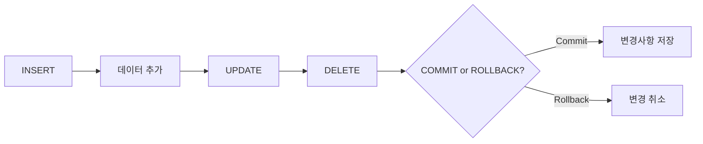

**version: 8.0.x**

#### 요약

- DML(Data Manipulation Language)은 **테이블 내 데이터를 조작(삽입·수정·삭제)** 하기 위한 SQL 명령어이다.  
- 트랜잭션의 영향을 받으며, `commit` 또는 `rollback` 으로 결과를 확정하거나 되돌릴 수 있다.  
- 본 문서는 `INSERT`, `UPDATE`, `DELETE` 명령의 사용법, 예시, 주의사항을 정리한다.  

> DML은 “데이터 조작”의 핵심으로,
> 삽입(INSERT) → 수정(UPDATE) → 삭제(DELETE)의 세 축으로 구성된다.
> 항상 **WHERE 검증 → 트랜잭션 관리 → 커밋**의 순서로 실행하여
> 안정적이고 복구 가능한 데이터 작업 습관을 유지하자.


**핵심 포인트**
1. INSERT — 데이터 삽입  
2. UPDATE — 데이터 수정  
3. DELETE — 데이터 삭제  
4. 안전 실행을 위한 트랜잭션 관리  

---

##### 참고자료  
- [공식 문서: MySQL INSERT / UPDATE / DELETE Syntax](https://dev.mysql.com/doc/refman/8.0/en/sql-statements.html)  


---

#### 1. DML 개요

| 구분 | 명령어 | 주요 기능 |
|------|----------|-------------|
| 삽입 | INSERT | 데이터 추가 |
| 수정 | UPDATE | 데이터 변경 |
| 삭제 | DELETE | 데이터 제거 |

> ⚙️ 모든 DML 명령은 트랜잭션 내부에서 수행되며,  
> autocommit=1(기본값) 상태에서는 즉시 커밋됨.

---

#### 2. INSERT — 데이터 삽입

```sql
-- 전체 컬럼 삽입
insert into tb1k values('A101', '강신우', 40);

-- 일부 컬럼만 삽입
insert into tb1k (number, name) values('A102', '김기덕');

-- DEFAULT / NULL 허용 시 생략 가능
insert into tb1k (name) values('문소리');

-- 다중 행 삽입
insert into tb1k (number, name, age)
values
('A103', '박문수', 33),
('A104', '유재석', 41);
```

| 구분        | 설명                    |
| --------- | --------------------- |
| `VALUES`  | 삽입할 데이터 지정            |
| `DEFAULT` | 미입력 시 기본값 삽입          |
| `NULL`    | 값 없음 허용 (제약조건에 따라 제한) |

> 💡 삽입 전 `desc tb1k;` 로 NOT NULL 컬럼을 확인하는 습관을 들이자.

---

#### 3. UPDATE — 데이터 수정

```sql
-- 단일 컬럼 수정
update tb1k set age = 35 where number = 'A101';

-- 다중 컬럼 수정
update tb1k
set name = '이순신',
    age = 45
where number = 'A104';

-- 수식 사용
update tb1k set age = age + 1 where age < 40;
```

| 항목              | 주의사항        |
| --------------- | ----------- |
| WHERE 절 생략 시    | 모든 행이 수정됨   |
| 트랜잭션 중단 시       | rollback 가능 |
| safe-updates 모드 | PK 조건 필요    |

> ⚠️ `WHERE` 누락은 **모든 데이터 수정 위험**이 있으므로
> 반드시 `select` 문으로 조건 검증 후 실행.

---

#### 4. DELETE — 데이터 삭제

```sql
-- 조건부 삭제
delete from tb1k where number = 'A102';

-- 나이 25 미만 삭제
delete from tb1k where age < 25;

-- 전체 삭제 (주의)
delete from tb1k;

-- 구조 유지하면서 전체 초기화
truncate table tb1k;
```

| 명령           | 차이점                |
| ------------ | ------------------ |
| `DELETE`     | 트랜잭션 대상, WHERE 가능  |
| `TRUNCATE`   | 구조 유지, 롤백 불가 (DDL) |
| `DROP TABLE` | 구조 삭제 (DDL)        |

---

#### 5. DML 실행 흐름 (Mermaid)



---

#### 6. 트랜잭션 기반 실행 예시

```sql
set autocommit = 0;

insert into tb1k values('A110', '하정우', 39);
update tb1k set age = 42 where number = 'A101';

rollback;  -- 변경 취소
commit;    -- 확정 저장
```

> ✅ DML 실행 시에는 `autocommit=0` 상태로 변경 후
> 작업 단위를 명확히 관리하는 것이 안전하다.

---

#### 7. 오류 및 제약조건

| 오류 코드 | 원인                   | 해결 방법            |
| ----- | -------------------- | ---------------- |
| 1048  | NOT NULL 컬럼에 NULL 삽입 | 기본값 또는 유효 데이터 지정 |
| 1062  | UNIQUE 중복키           | PK 중복 여부 확인      |
| 1452  | FOREIGN KEY 제약 위반    | 참조 대상 존재 확인      |

---

#### 8. DML 성능 팁

1. 다중 `insert` 시 한 번에 여러 행 삽입하여 네트워크 부하 감소
2. `update` 시 인덱스 컬럼을 조건으로 사용하면 I/O 효율 상승
3. 대량 삭제 시 `truncate` 후 `auto_increment` 리셋 병행

```sql
alter table tb1k auto_increment = 1;
```

---

#### 9. 예제 결과

```sql
select * from tb1k;
```

| number | name | age |
| ------ | ---- | --- |
| A101   | 강신우  | 40  |
| A103   | 박문수  | 33  |
| A104   | 유재석  | 41  |

---