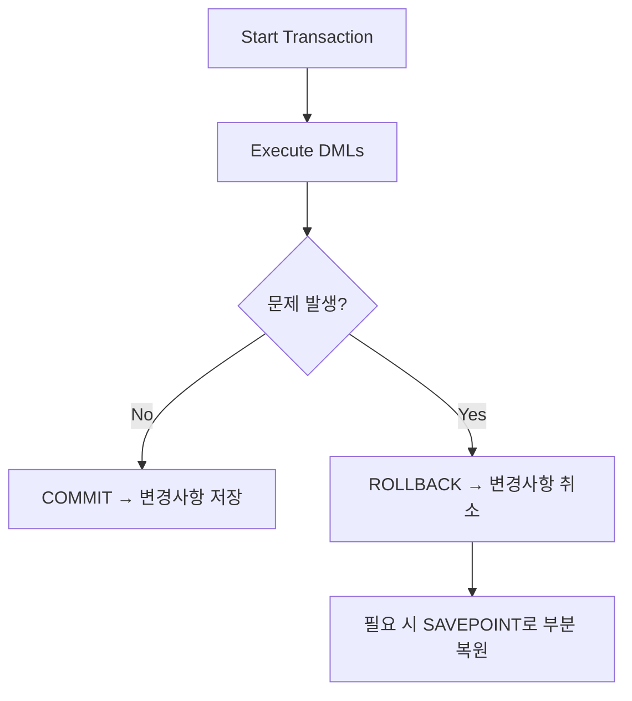

**version: 8.0.x**

---

#### 요약

- TCL(Transaction Control Language)은 **트랜잭션 단위로 데이터 변경 작업을 제어**하는 SQL 명령어 집합이다.  
- `COMMIT`, `ROLLBACK`, `SAVEPOINT` 등을 통해 DML 작업의 변경사항을 확정하거나 되돌릴 수 있다.  
- InnoDB 스토리지 엔진에서만 적용되며, MyISAM은 트랜잭션을 지원하지 않는다.  

> TCL은 데이터 일관성과 신뢰성을 보장하기 위한 핵심 제어 계층이다.
> 특히 DML 작업 시 “변경 → 검증 → 확정(commit)”의 3단계를 명확히 분리하면,
> 예기치 못한 장애나 오류 발생 시 데이터를 안전하게 보호할 수 있다.


**핵심 명령**
1. `SET AUTOCOMMIT` — 자동 커밋 설정/해제  
2. `START TRANSACTION` — 명시적 트랜잭션 시작  
3. `COMMIT` — 변경사항 확정  
4. `ROLLBACK` — 변경사항 취소  
5. `SAVEPOINT` / `ROLLBACK TO` — 특정 시점으로 되돌리기  

---

##### 참고자료  
- [공식 문서: MySQL Transaction Statements](https://dev.mysql.com/doc/refman/8.0/en/commit.html)  


---

#### 1. 트랜잭션 개념

| 항목 | 설명 |
|------|------|
| **트랜잭션(Transaction)** | 데이터 변경 작업의 논리적 단위 |
| **ACID** | Atomicity, Consistency, Isolation, Durability |
| **적용 범위** | DML(INSERT, UPDATE, DELETE)에 한함 |
| **지원 엔진** | InnoDB (✅), MyISAM (❌) |

> 💡 트랜잭션은 “모두 수행되거나(All) 전혀 수행되지 않아야(None)” 한다는 원자성(Atomicity)을 보장한다.

---

#### 2. 자동 커밋 (Autocommit)

MySQL은 기본적으로 `autocommit=1` 상태로 실행되어  
각 쿼리 실행 후 즉시 저장된다.

```sql
select @@autocommit;  -- 1: 자동커밋 활성, 0: 비활성

-- 자동 커밋 해제
set autocommit = 0;
```

---

#### 3. 명시적 트랜잭션 시작

```sql
start transaction;

insert into tb1k values('A201', '유재석', 41);
update tb1k set age = 45 where number = 'A101';

-- 트랜잭션 내에서는 commit 전까지 실제 반영되지 않음
```

> ⚠️ `start transaction;` 또는 `begin;` 모두 사용 가능하지만
> 명확한 의도를 위해 `start transaction;` 권장.

---

#### 4. COMMIT — 변경사항 확정

```sql
commit;
```

* DML 작업 후 데이터 변경을 **영구 반영**한다.
* 트랜잭션 종료 후 다시 autocommit 모드로 복귀.

---

#### 5. ROLLBACK — 변경사항 취소

```sql
rollback;
```

* 트랜잭션 내 변경사항을 **이전 상태로 되돌린다.**
* commit 이후에는 rollback 불가능.

예시:

```sql
start transaction;
update tb1k set age = 50 where number = 'A104';
rollback;   -- age 값 원래대로 복구
```

---

#### 6. SAVEPOINT / ROLLBACK TO

```sql
start transaction;

update tb1k set age = 20 where number = 'A101';
savepoint step1;

update tb1k set age = 60 where number = 'A102';
rollback to step1;

commit;
```

| 명령어                       | 설명              |
| ------------------------- | --------------- |
| `SAVEPOINT step1`         | 트랜잭션 내 특정 지점 저장 |
| `ROLLBACK TO step1`       | 지정한 지점까지 되돌림    |
| `RELEASE SAVEPOINT step1` | 세이브포인트 제거       |

---

#### 7. TCL 명령 흐름 (Mermaid)



---

#### 8. 트랜잭션 격리 수준 (Isolation Level)

```sql
select @@transaction_isolation;
set session transaction isolation level read committed;
```

| 수준                    | 설명                  | Dirty Read | Non-Repeatable | Phantom |
| --------------------- | ------------------- | ---------- | -------------- | ------- |
| READ UNCOMMITTED      | 커밋되지 않은 데이터 접근 허용   | ✅          | ✅              | ✅       |
| READ COMMITTED        | 커밋된 데이터만 읽기         | ❌          | ✅              | ✅       |
| REPEATABLE READ (기본값) | 동일 트랜잭션 내 일관된 조회    | ❌          | ❌              | ✅       |
| SERIALIZABLE          | 완전 직렬화 (동시성↓, 일관성↑) | ❌          | ❌              | ❌       |

> ⚙️ `show variables like 'transaction_isolation';` 로 현재 수준 확인 가능.

---

#### 9. 실습 예시

```sql
set autocommit = 0;

start transaction;
insert into tb1k values('A300', '하정우', 39);
update tb1k set age = 44 where number = 'A101';
rollback;

start transaction;
update tb1k set age = 46 where number = 'A101';
commit;
```

---

#### 10. 트랜잭션 상태 모니터링

```sql
show engine innodb status\G
```

> `LATEST DETECTED DEADLOCK` 섹션에서 교착상태(Deadlock) 확인 가능.

---

#### 11. 주의사항

1. DDL (CREATE, DROP, ALTER)은 자동 커밋되어 rollback 불가
2. autocommit=0 상태에서 DDL 실행 시 즉시 commit됨
3. 트랜잭션 중단 시에는 rollback 실행 후 재시작
4. 다중 세션 환경에서는 isolation level에 따른 동시성 이슈 주의

---

