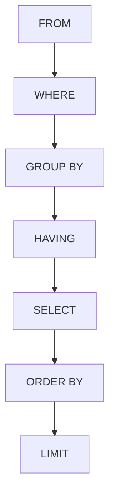

**version: 8.0.x**

---

#### 요약

- DQL(Data Query Language)은 **데이터를 조회(SELECT)** 하는 SQL 명령어 집합이다.  
- 테이블 내 데이터를 읽고 분석하기 위해 사용되며,  
  `WHERE`, `ORDER BY`, `GROUP BY`, `HAVING`, `LIMIT` 등의 절과 함께 활용된다.  
- DQL은 데이터 검색과 보고서 생성의 기반이며, **데이터 조작 없이 읽기 전용**이다.  
  
> DQL은 데이터 조회의 출발점이자 분석의 핵심이다.
> SELECT 구문 하나로 **필터링, 정렬, 그룹화, 요약**까지 수행할 수 있으며,
> 쿼리의 효율성은 WHERE 조건과 인덱스 설계에 의해 결정된다.
> “SELECT 문을 이해하는 것은 SQL의 70%를 이해하는 것”이라는 말처럼,
> 실행 순서와 집계 로직을 명확히 이해해야 한다.


**핵심 포인트**
1. SELECT 기본 구문 및 별칭 사용  
2. WHERE 조건식 / LIKE / BETWEEN / IN / IS NULL  
3. ORDER BY / LIMIT / OFFSET  
4. GROUP BY / HAVING / 집계 함수  
5. 서브쿼리(Subquery)와 실무 예제

---

##### 참고자료  
- [공식 문서: MySQL SELECT Syntax](https://dev.mysql.com/doc/refman/8.0/en/select.html)  

---

#### 1. DQL 개요

| 항목 | 설명 |
|------|------|
| **주요 목적** | 데이터 조회 및 분석 |
| **대표 명령** | SELECT |
| **결과** | 테이블 형식 (Result Set) |
| **데이터 수정 여부** | ❌ 없음 |
| **트랜잭션 영향** | 없음 (읽기 전용) |

---

#### 2. SELECT 기본 구문

```sql
select 컬럼명 from 테이블명;
select * from tb1k;
select name, age from tb1k;
```

별칭 사용:

```sql
select concat(number, ' ', name) as 고객정보 from tb1k;
```

| 키워드      | 설명           |
| -------- | ------------ |
| `select` | 조회할 컬럼 지정    |
| `from`   | 대상 테이블 지정    |
| `as`     | 결과 컬럼의 별칭 지정 |
| `*`      | 모든 컬럼 선택     |

---

#### 3. WHERE 절 — 조건 조회

```sql
select * from tb where sales >= 200;
select * from tb where month in (4, 5);
select * from tb where sales between 50 and 100;
select * from tb where name like '%김%';
select * from tb where age is null;
```

| 연산자                     | 설명         |
| ----------------------- | ---------- |
| `=`                     | 같음         |
| `<>`, `!=`              | 다름         |
| `>` `<` `>=` `<=`       | 비교         |
| `between A and B`       | 범위 검색      |
| `like '%값%'`            | 부분 문자열 검색  |
| `is null / is not null` | NULL 여부 검사 |

> ⚙️ `AND` / `OR` 혼용 시 괄호로 명확히 구분해 우선순위를 제어해야 한다.

---

#### 4. ORDER BY — 정렬

```sql
select * from tb order by sales desc;
select name, age from tb1k order by age asc;
```

| 옵션     | 설명         |
| ------ | ---------- |
| `asc`  | 오름차순 (기본값) |
| `desc` | 내림차순       |

> 문자열 리터럴(`'합계'`)을 정렬 기준으로 사용하는 경우 의미 없는 결과가 나올 수 있다.
> 반드시 **컬럼명이나 함수 결과**를 기준으로 정렬한다.

---

#### 5. LIMIT / OFFSET — 결과 제한

```sql
select * from tb limit 5;          -- 상위 5건
select * from tb limit 5 offset 2; -- 3번째부터 5건
```

> 💡 LIMIT은 페이징(Pageination) 처리에 유용하다.

---

#### 6. GROUP BY / HAVING — 그룹 집계

```sql
select number, sum(sales) as 합계
from tb
group by number
having sum(sales) >= 200
order by 합계 desc;
```

| 키워드        | 설명           |
| ---------- | ------------ |
| `group by` | 동일 그룹 단위로 묶기 |
| `having`   | 그룹 결과에 조건 적용 |
| `order by` | 정렬 기준 지정     |

**집계 함수 예시**

| 함수                      | 설명     |
| ----------------------- | ------ |
| `sum(col)`              | 합계     |
| `avg(col)`              | 평균     |
| `count(col)`            | 행 개수   |
| `min(col)` / `max(col)` | 최소·최대값 |

> ⚠️ `where` 는 그룹 전 필터링, `having` 은 그룹 후 필터링에 사용된다.

---

#### 7. 서브쿼리(Subquery)

```sql
-- 평균 이상 매출 조회
select * from tb
where sales > (select avg(sales) from tb);

-- 특정 사용자 이름 조회
select name from tb1k
where number in (select number from tb where sales >= 200);
```

| 유형       | 설명             |
| -------- | -------------- |
| 스칼라 서브쿼리 | 단일 값 반환        |
| 인라인 서브쿼리 | in() 조건 내 다중 값 |
| 상관 서브쿼리  | 외부 쿼리와 연동      |

---

#### 8. DQL 실행 순서 (Mermaid)



> SQL 문은 코드 작성 순서가 아닌 **논리적 실행 순서**에 따라 처리된다.
> 따라서 `FROM → WHERE → GROUP BY → HAVING → SELECT → ORDER BY` 순서를 이해해야 한다.

---

#### 9. 실습 예제

```sql
-- 1️⃣ 특정 월(5월) 매출 내림차순
select * from tb where month = 5 order by sales desc;

-- 2️⃣ 이름에 '김' 포함된 고객 목록
select number, name from tb1k where name like '%김%';

-- 3️⃣ 평균 매출 이상인 번호별 합계
select number, sum(sales) as 총합
from tb
group by number
having sum(sales) >= (select avg(sales) from tb);
```

---

#### 10. 출력 예시

| number | sales | month |
| ------ | ----- | ----- |
| A101   | 300   | 5     |
| A102   | 205   | 6     |
| A104   | 181   | 4     |

---

#### 11. 성능 최적화 팁

1. WHERE 절에서 인덱스 컬럼 우선 사용
2. 불필요한 `select *` 대신 필요한 컬럼만 지정
3. `group by`와 `order by`는 인덱스 설계와 함께 고려
4. 서브쿼리보다 JOIN을 통한 조회가 일반적으로 빠름

예시:

```sql
select t1.name, t2.sales
from tb1k t1
join tb t2 on t1.number = t2.number;
```
---

