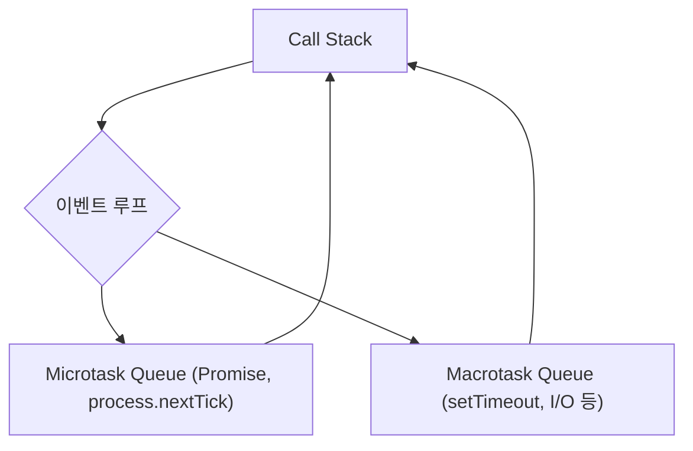

#### 요약
> Node.js는 Chrome V8 엔진 위에서 동작하는 JavaScript 런타임으로, 싱글 스레드 이벤트 루프 구조를 통해 **비동기 논블로킹 I/O**를 처리한다.

- 핵심 구성: **V8 + libuv + 이벤트 루프**
- **싱글 스레드** 기반의 **논블로킹 I/O 모델**
- 비동기 처리: **Callback → Promise → async/await**
- CPU 바운드보다는 I/O 중심 서비스에 적합

##### 참고자료
- [Node.js 공식 문서](https://nodejs.org/en/docs)
- [libuv Design](https://docs.libuv.org/en/v1.x/design.html)
- [Node.js Release Schedule](https://nodejs.org/en/about/releases)

---

#### 1. Node.js란 무엇인가
Node.js는 **브라우저 밖에서도 JavaScript를 실행할 수 있도록 설계된 런타임 환경**이다.  
V8 엔진으로 JS 코드를 기계어로 컴파일하고, libuv 라이브러리를 통해 이벤트 루프 기반의 비동기 I/O를 지원한다.  

| 구성 요소 | 설명 |
|------------|------|
| **V8 Engine** | 자바스크립트 코드를 실행하는 엔진 |
| **libuv** | 이벤트 루프, Thread Pool, I/O 처리 담당 |
| **Bindings** | JS와 C++ API 연결 계층 |
| **Core Modules** | fs, http, events 등 기본 제공 모듈 |

---

#### Node.js 버전 구조

Node.js는 **“LTS(Long-Term Support)”** 와 **“Current(최신 기능)”** 두 가지 채널로 관리된다.  
LTS 버전은 안정성과 호환성을 중시하며, 기업·운영 환경에서 사용하기 적합하다.  
반면 Current 버전은 최신 기능과 실험적 API를 포함한다.

| 구분 | 의미 | 릴리즈 주기 | 주요 용도 |
|------|------|-------------|-----------|
| **LTS (Long-Term Support)** | 장기 지원 안정 버전 | 30개월 지원 | 프로덕션 운영 환경 |
| **Current** | 최신 기능 포함 버전 | 6개월마다 갱신 | 테스트 및 개발 환경 |
| **Maintenance** | 지원 종료 전 안정 유지 | 보안 패치만 반영 | 기존 서비스 유지용 |

```bash
# 현재 Node.js 버전 확인
$ node -v
v20.15.1

# 설치된 버전 목록 확인 (nvm 사용 시)
$ nvm list
->     v20.15.1
       v18.19.0
default -> v20.15.1 (-> N/A)

# LTS 채널로 전환
$ nvm use --lts
```

> 💡 **Tip:**
> Node.js는 버전 20부터 권장 LTS 버전이며, 보안·성능·모듈 호환성을 위해
> 항상 LTS 트랙을 사용하는 것이 좋다.

---

#### 2. 동기 vs 비동기 처리

| 구분    | 동기 (Synchronous) | 비동기 (Asynchronous) |
| ----- | ---------------- | ------------------ |
| 실행 방식 | 순차적으로 한 줄씩 실행    | 병렬적 I/O 요청 가능      |
| 특징    | 이전 작업 완료까지 대기    | 다음 코드 즉시 실행        |
| 예시    | 파일 읽기 후 출력       | 콜백 등록 후 바로 진행      |

```js
// 동기 방식
const fs = require('fs');
const data = fs.readFileSync('data.txt', 'utf8');
console.log('Sync:', data);

// 비동기 방식
fs.readFile('data.txt', 'utf8', (err, data) => {
  console.log('Async:', data);
});
console.log('다음 코드 실행');
```

---

#### 3. 이벤트 루프 (Event Loop)

> 이벤트 루프는 Node.js의 비동기 처리를 담당하는 핵심 메커니즘이다.



* **Microtask**가 **Macrotask**보다 우선 실행된다.
* 모든 비동기 함수는 완료 후 큐에 콜백을 등록한다.
* Call Stack이 비면 이벤트 루프가 큐에서 다음 작업을 가져온다.

---

#### 4. 주요 내장 객체

| 객체             | 설명             | 예시                           |
| -------------- | -------------- | ---------------------------- |
| `process`      | 실행 중인 프로세스 정보  | `process.env`, `process.pid` |
| `Buffer`       | 이진 데이터 처리      | 파일, 네트워크 데이터                 |
| `require()`    | CommonJS 모듈 로더 | `const fs = require('fs')`   |
| `EventEmitter` | 이벤트 기반 통신      | `emitter.on('data', fn)`     |

---

#### 5. 비동기 처리의 핵심 — Promise / async-await

```js
// Promise 예제
function fetchData() {
  return new Promise((resolve) => {
    setTimeout(() => resolve('데이터 수신 완료'), 1000);
  });
}

fetchData().then(console.log);

// async/await 예제
async function main() {
  const data = await fetchData();
  console.log(data);
}
main();
```

* Promise는 비동기 결과를 표현하는 객체이다.
* async 함수는 항상 Promise를 반환한다.
* await은 Promise가 처리될 때까지 실행을 일시 정지한다.

---

#### 6. Node.js의 장점과 한계

| 구분     | 장점               | 한계                 |
| ------ | ---------------- | ------------------ |
| I/O 처리 | 논블로킹 구조로 고성능     | CPU 바운드에 비효율적      |
| 생산성    | JS 풀스택 가능        | 타입 안전성 부족 (TS로 보완) |
| 생태계    | npm 기반의 광대한 오픈소스 | 종속성 취약점 관리 필요      |

---

#### 7. 결론

Node.js는 단순한 런타임을 넘어 **비동기·이벤트 중심 서버 아키텍처의 핵심 플랫폼**이다.
V8 엔진과 libuv 구조, 그리고 버전 정책을 이해하는 것이
안정적인 서비스 운영과 성능 최적화의 출발점이다.

