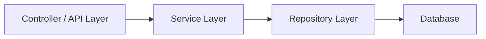
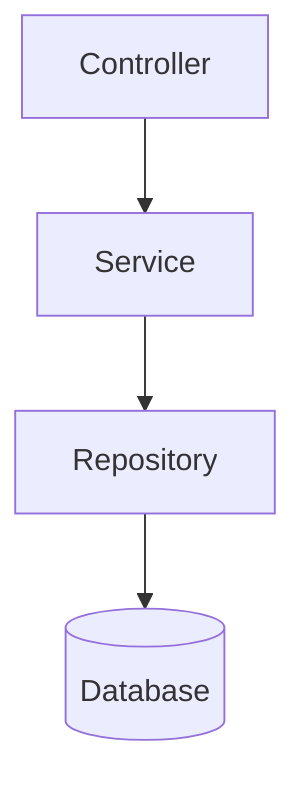
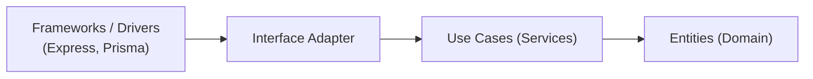

#### 요약
> Node.js 애플리케이션은 규모가 커질수록 모듈화와 계층 분리가 중요하다.  
> MVC, Service Layer, Clean Architecture, Domain-Driven Design(DDD) 같은 패턴을 활용하면  
> 유지보수성과 테스트 효율을 크게 향상시킬 수 있다.

- MVC 패턴: Controller 중심의 구조적 분리
- Service Layer: 비즈니스 로직 분리
- Clean Architecture: 의존성 방향 통제
- DDD(Domain-Driven Design): 도메인 모델 중심 설계

> **요약:**
> 아키텍처는 “복잡성을 제어하는 구조”다.
> 코드보다 중요한 것은 **의존성의 방향과 경계의 명확성**이다.

##### 참고자료
- [Clean Architecture — Uncle Bob](https://blog.cleancoder.com/)
- [DDD Reference — Eric Evans](https://domainlanguage.com/ddd/)
- [Node.js Architecture Best Practices](https://github.com/goldbergyoni/nodebestpractices)

---

#### 1. 아키텍처 패턴 개요

Node.js는 자유도가 높은 환경이기 때문에  
프로젝트 규모가 커질수록 일관된 아키텍처 패턴이 필요하다.

| 패턴 | 설명 | 적용 규모 |
|------|------|------------|
| **MVC** | 전통적 구조 (Model, View, Controller) | 소규모~중간 규모 |
| **Service Layer** | 비즈니스 로직 분리 | 중간 규모 이상 |
| **Clean Architecture** | 의존성 역전 구조 | 대규모 서비스 |
| **DDD (Domain-Driven Design)** | 도메인 모델 중심 설계 | 복잡한 도메인 기반 시스템 |



---

#### 2. MVC 패턴 (Model-View-Controller)

> MVC는 Node.js 서버의 기본 구조로, 라우팅·뷰·데이터 처리를 명확히 분리한다.

| 구성요소           | 역할                      |
| -------------- | ----------------------- |
| **Model**      | 데이터 및 비즈니스 로직 관리        |
| **View**       | 사용자 인터페이스 렌더링           |
| **Controller** | 요청 수신 및 Model ↔ View 연결 |

##### Express 예시

```js
// controller/userController.js
export const getUser = (req, res) => {
  const user = { id: 1, name: 'Ingeun' };
  res.json(user);
};

// routes/user.js
import express from 'express';
import { getUser } from '../controller/userController.js';
const router = express.Router();
router.get('/:id', getUser);
export default router;
```

---

#### 3. Service Layer 패턴

Service Layer는 Controller에서 비즈니스 로직을 분리하여
각 계층의 역할을 명확히 구분한다.



##### 구조 예시

```
src/
 ├── controllers/
 ├── services/
 ├── repositories/
 ├── models/
 └── routes/
```

##### 코드 예시

```ts
// services/userService.ts
import { userRepository } from '../repositories/userRepository';

export async function getUserById(id: number) {
  return await userRepository.findById(id);
}
```

> **장점:** 테스트 용이성, 관심사 분리, 유지보수성 향상
> **단점:** 초기 설계 복잡도 증가

---

#### 4. Clean Architecture

> Clean Architecture는 “의존성은 항상 내부로 향해야 한다(Dependency Rule)”는 원칙을 기반으로 한다.

| 계층                     | 역할                    | 예시                         |
| ---------------------- | --------------------- | -------------------------- |
| **Entity**             | 핵심 비즈니스 규칙            | User, Order 등              |
| **Use Case (Service)** | 애플리케이션 규칙             | createUser(), placeOrder() |
| **Interface Adapter**  | Controller, Presenter | Express Controller         |
| **Framework/Driver**   | DB, Web, UI 등 외부 모듈   | Prisma, Redis, API         |



##### 의존성 방향 예시

```
Controller -> Service -> Repository -> Prisma
      ↑                            ↓
     Express Framework <----------- 외부
```

> **핵심 개념:**
>
> * 도메인(Entity)은 외부 기술에 의존하지 않는다.
> * DB, 프레임워크, UI는 언제든 교체 가능해야 한다.

---

#### 5. Repository 패턴

> Repository는 데이터 접근 로직을 추상화하여
> DB 교체나 ORM 변경 시 서비스 코드 변경을 최소화한다.

##### 예시 (Prisma 기반)

```ts
// repositories/userRepository.ts
import { PrismaClient } from '@prisma/client';
const prisma = new PrismaClient();

export const userRepository = {
  findById: async (id: number) => prisma.user.findUnique({ where: { id } }),
  create: async (data) => prisma.user.create({ data }),
};
```

##### 서비스와의 결합 예시

```ts
// services/userService.ts
import { userRepository } from '../repositories/userRepository';
export const userService = {
  getUser: (id) => userRepository.findById(id),
};
```

> 💡 Repository를 사용하면 ORM(Prisma → TypeORM 등) 교체 시 서비스 코드 변경이 최소화된다.

---

#### 6. Domain-Driven Design (DDD)

DDD는 **도메인 모델 중심 설계**로 복잡한 비즈니스 로직을 체계적으로 관리한다.
핵심은 **도메인 계층의 독립성**이다.

| 구성요소             | 역할                        |
| ---------------- | ------------------------- |
| **Entity**       | 고유 식별자(ID)를 가진 핵심 객체      |
| **Value Object** | 불변 객체 (예: Email, Address) |
| **Aggregate**    | 관련 엔티티 집합의 루트             |
| **Repository**   | Aggregate 저장 및 조회         |
| **Service**      | 도메인 행위(비즈니스 규칙) 정의        |

##### 예시

```ts
// domain/user.ts
export class User {
  constructor(private id: number, private name: string) {}
  rename(newName: string) {
    if (newName.length < 2) throw new Error('이름은 2자 이상이어야 합니다.');
    this.name = newName;
  }
}
```

---

#### 7. 아키텍처 비교 요약

| 항목      | MVC   | Service Layer | Clean Architecture | DDD       |
| ------- | ----- | ------------- | ------------------ | --------- |
| 구조 단순성  | ✅     | ✅             | ⚙️                 | ⚙️        |
| 유지보수성   | 중     | 높음            | 매우 높음              | 매우 높음     |
| 의존성 제어  | 낮음    | 중간            | 높음                 | 매우 높음     |
| 테스트 용이성 | 중     | 높음            | 높음                 | 최고        |
| 적용 규모   | 소형~중형 | 중형            | 대형                 | 대형~도메인 중심 |

> **권장 조합:**
>
> * 소규모: MVC
> * 중간 규모: Service Layer
> * 대규모 / 복잡 도메인: Clean Architecture + DDD 혼합 적용

---

#### 8. Express + Prisma Clean Architecture 예시 구조

```bash
src/
 ├── domain/
 │    ├── user.ts
 │    └── post.ts
 ├── use-cases/
 │    └── user/
 │         ├── getUser.ts
 │         └── createUser.ts
 ├── infrastructure/
 │    ├── prisma/
 │    │    └── client.ts
 │    └── repositories/
 ├── interfaces/
 │    ├── http/
 │    │    ├── routes/
 │    │    └── controllers/
 └── app.ts
```

> 이 구조는 도메인 로직을 완전히 독립시켜
> Express나 Prisma를 교체하더라도 서비스 핵심 로직이 영향을 받지 않게 한다.

---

#### 9. 결론

Node.js 서비스의 아키텍처는 **규모와 복잡도**에 따라 달라진다.
MVC에서 시작해 Service Layer → Clean Architecture → DDD로 확장해 나가면
기술 부채를 최소화하면서 유지보수성과 확장성을 모두 확보할 수 있다.

