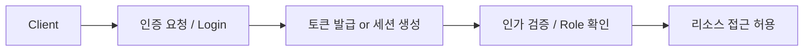
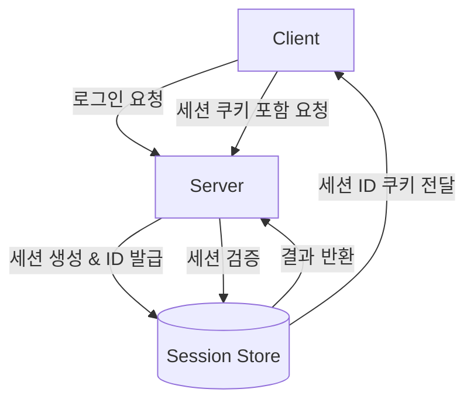
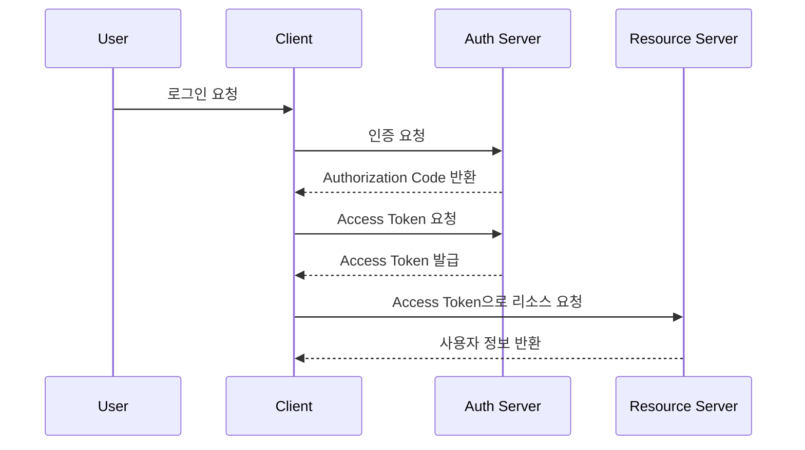
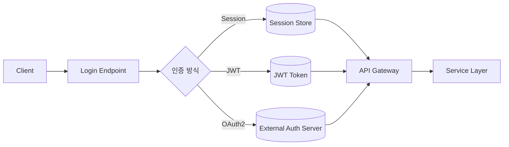

#### 요약
> 인증(Authentication)은 사용자의 신원을 확인하는 절차이며,  
> 인가(Authorization)는 인증된 사용자의 권한을 검증하는 과정이다.  
> Node.js에서는 세션(Session), JWT(JSON Web Token), OAuth2 기반 인증이 가장 널리 사용된다.

Node.js 환경에서의 인증 체계는
**Session → JWT → OAuth2**로 진화해왔다.
현대 백엔드 서비스에서는 **JWT 기반 API 인증**과
**OAuth2 소셜 인증**을 병행 적용하는 것이 일반적이다.

> 인증은 단순 로그인 기능이 아니라
> **보안·확장성·운영 전략을 아우르는 시스템 설계의 핵심 축**이다.

- **인증**: 사용자 신원 검증 (로그인)
- **인가**: 접근 권한 검증 (리소스 제한)
- **Session vs JWT**: 서버 저장 vs 클라이언트 저장
- **OAuth2**: 외부 서비스 위임 인증 (Google, GitHub 등)

##### 참고자료
- [../06-prisma.md](../06-prisma.md)
- [../08-security.md](../08-security.md)
- [JWT RFC 7519](https://datatracker.ietf.org/doc/html/rfc7519)
- [OAuth2.0 Spec (RFC 6749)](https://datatracker.ietf.org/doc/html/rfc6749)

---

#### 1. 인증(Authentication)과 인가(Authorization)

| 구분 | 정의 | 예시 |
|------|------|------|
| **인증 (AuthN)** | 사용자의 신원을 확인 | 로그인, 토큰 발급 |
| **인가 (AuthZ)** | 인증된 사용자의 권한을 검증 | 관리자 접근, API 권한 |



---

#### 2. Session 기반 인증

세션(Session)은 서버에 사용자 상태를 저장하는 전통적인 인증 방식이다.
서버는 세션 ID를 쿠키에 담아 클라이언트에게 전달하고,
요청 시마다 해당 ID를 통해 인증 상태를 검증한다.

##### 예시 구조



##### Express 예시

```js
import express from 'express';
import session from 'express-session';

const app = express();
app.use(session({
  secret: 'secret-key',
  resave: false,
  saveUninitialized: false,
  cookie: { secure: false, maxAge: 60000 }
}));

app.get('/login', (req, res) => {
  req.session.user = { id: 1, name: 'Ingeun' };
  res.send('로그인 완료');
});

app.get('/profile', (req, res) => {
  if (!req.session.user) return res.status(401).send('로그인 필요');
  res.json(req.session.user);
});
```

> **장점:** 서버에서 세션 관리 → 강력한 보안
> **단점:** 서버 확장 시 세션 공유 문제 발생 (Redis 등 외부 스토리지 필요)

---

#### 3. JWT 기반 인증

JWT(JSON Web Token)는 서버가 아닌 클라이언트 측에 인증 상태를 저장하는 **무상태(Stateless)** 인증 방식이다.
토큰은 세 부분(Header.Payload.Signature)으로 구성되어 있으며,
Base64로 인코딩되어 클라이언트에 전달된다.

##### JWT 구조

```
xxxxx.yyyyy.zzzzz
Header.Payload.Signature
```

| 구성요소      | 설명              | 예시                                   |
| --------- | --------------- | ------------------------------------ |
| Header    | 알고리즘, 타입        | `{ "alg": "HS256", "typ": "JWT" }`   |
| Payload   | 실제 데이터 (Claims) | `{ "userId": 1, "role": "admin" }`   |
| Signature | 위조 방지용 서명       | HMACSHA256(header + payload, secret) |

##### Express 예시

```js
import jwt from 'jsonwebtoken';

const secretKey = 'jwt-secret';

const token = jwt.sign({ id: 1, name: 'Ingeun' }, secretKey, { expiresIn: '1h' });
console.log('Access Token:', token);

try {
  const decoded = jwt.verify(token, secretKey);
  console.log('Decoded:', decoded);
} catch (err) {
  console.error('Invalid token');
}
```

##### 요청 인증 미들웨어

```js
function authenticateToken(req, res, next) {
  const authHeader = req.headers['authorization'];
  const token = authHeader?.split(' ')[1];
  if (!token) return res.sendStatus(401);

  jwt.verify(token, secretKey, (err, user) => {
    if (err) return res.sendStatus(403);
    req.user = user;
    next();
  });
}
```

> **장점:** 서버 확장성 우수, 세션 공유 필요 없음
> **단점:** 토큰 탈취 시 보안 취약, 수동 만료 처리 필요

---

#### 4. Refresh Token 전략

Access Token은 유효 기간이 짧기 때문에,
장기 인증을 위해 Refresh Token을 함께 발급한다.

| 토큰 종류             | 수명         | 저장 위치                | 역할               |
| ----------------- | ---------- | -------------------- | ---------------- |
| **Access Token**  | 짧음 (5~30분) | 메모리                  | API 요청 시 인증      |
| **Refresh Token** | 김 (1~2주)   | DB / HttpOnly Cookie | Access Token 재발급 |

##### 예시

```js
const refreshTokens = [];

app.post('/token', (req, res) => {
  const refreshToken = req.body.token;
  if (!refreshTokens.includes(refreshToken)) return res.sendStatus(403);
  const accessToken = jwt.sign({ name: 'Ingeun' }, secretKey, { expiresIn: '15m' });
  res.json({ accessToken });
});
```

> 💡 **Tip:** Refresh Token은 DB 또는 Redis에 저장하여 관리해야 한다.
> 클라이언트 저장 시 `HttpOnly` 쿠키를 사용하는 것이 안전하다.

---

#### 5. OAuth 2.0

OAuth2는 외부 서비스의 사용자 정보를 **비밀번호 없이 안전하게 인증 위임**하는 표준 프로토콜이다.

| 역할                   | 설명             |
| -------------------- | -------------- |
| Resource Owner       | 사용자            |
| Client               | 인증을 요청하는 앱     |
| Authorization Server | 인증을 수행하고 토큰 발급 |
| Resource Server      | 사용자 데이터 API 서버 |

##### 인증 흐름



##### 예시 (Google OAuth)

```js
const { OAuth2Client } = require('google-auth-library');
const client = new OAuth2Client(CLIENT_ID);
async function verify(token) {
  const ticket = await client.verifyIdToken({ idToken: token, audience: CLIENT_ID });
  return ticket.getPayload();
}
```

> **OAuth2 인증 절차**
>
> 1. 사용자가 Google 로그인 → Authorization Code 발급
> 2. 서버가 Code를 이용해 Access Token 요청
> 3. Access Token으로 사용자 정보 조회

---

#### 6. 인증 방식 비교

| 항목     | Session      | JWT             | OAuth2   |
| ------ | ------------ | --------------- | -------- |
| 상태 관리  | 서버 저장        | 클라이언트 저장        | 외부 인증 위임 |
| 확장성    | 낮음           | 높음              | 매우 높음    |
| 보안성    | 높음           | 중간              | 매우 높음    |
| 만료 관리  | 자동 (세션 타임아웃) | 수동 (Refresh 필요) | 외부 서버 관리 |
| 대표 사용처 | 웹 애플리케이션     | REST API        | 소셜 로그인   |

---

#### 7. Express/Fastify 통합 구조



> 인증 방식은 서비스 요구사항에 따라 병행 사용이 가능하다.
> 예: OAuth2 + JWT 조합 (소셜 로그인 후 자체 토큰 발급)

---


