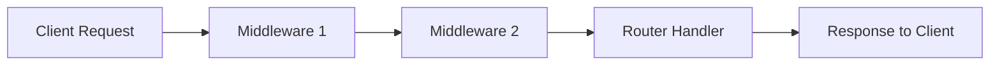

#### 요약
> Express.js는 Node.js의 대표적인 웹 프레임워크로,  
> 미들웨어(Middleware) 기반 구조를 통해 HTTP 요청·응답 흐름을 단순하고 유연하게 관리한다.

- Node.js 웹 서버의 사실상 표준 프레임워크
- 라우팅, 미들웨어, 템플릿 렌더링 지원
- RESTful API 및 MVC 아키텍처 기반 설계 용이
- 경량 구조로 빠른 프로토타이핑 가능

##### 참고자료
- [Express 공식 문서](https://expressjs.com/)
- [Node.js HTTP 모듈 문서](https://nodejs.org/api/http.html)

---

#### 1. Express.js란 무엇인가

Express는 Node.js의 기본 `http` 모듈을 확장한 **경량 웹 애플리케이션 프레임워크**이다.  
라우팅(Routing), 미들웨어(Middleware), 요청/응답 객체, 템플릿 렌더링 등의 기능을 제공하여  
서버 구축 과정을 단순화한다.

| 항목 | Express.js | Node.js (http 모듈 직접 사용) |
|------|-------------|-------------------------------|
| 코드 길이 | 짧고 직관적 | 길고 복잡함 |
| 라우팅 | 내장 기능 | 직접 구현 필요 |
| 미들웨어 | 공식 지원 | 별도 구현 필요 |
| 생산성 | 매우 높음 | 낮음 |

---

#### 2. Express 설치 및 실행

```bash
# 설치
$ npm install express

# 실행 파일 생성 (app.js)
$ touch app.js
```

##### app.js 예시

```js
const express = require('express');
const app = express();

// 기본 라우트
app.get('/', (req, res) => {
  res.send('Hello, Express!');
});

// 서버 실행
app.listen(3000, () => {
  console.log('✅ Server running on http://localhost:3000');
});
```

> Express는 HTTP 서버의 생명주기를 관리하며,
> 요청(Request)과 응답(Response)을 `app` 인스턴스가 처리한다.

---

#### 3. 미들웨어(Middleware) 구조

> 미들웨어는 요청(Request)과 응답(Response) 사이에서 동작하는 함수 체인이다.
> 모든 요청은 최소 한 개 이상의 미들웨어를 거친다.



##### 예시

```js
// 커스텀 미들웨어
app.use((req, res, next) => {
  console.log(`[${new Date().toISOString()}] ${req.method} ${req.url}`);
  next(); // 다음 미들웨어로 이동
});
```

**내장 미들웨어 예시**

| 미들웨어                   | 설명                 |
| ---------------------- | ------------------ |
| `express.json()`       | JSON 요청 파싱         |
| `express.urlencoded()` | URL-encoded 데이터 파싱 |
| `express.static()`     | 정적 파일 제공           |
| `cors()`               | CORS 처리 (외부 패키지)   |

---

#### 4. 라우팅(Routing)

라우팅은 URL 경로 및 HTTP 메서드에 따라 요청을 분기 처리하는 기능이다.

```js
app.get('/users', (req, res) => {
  res.send('사용자 목록');
});

app.post('/users', (req, res) => {
  res.send('새 사용자 등록');
});

app.put('/users/:id', (req, res) => {
  res.send(`사용자 ${req.params.id} 수정`);
});

app.delete('/users/:id', (req, res) => {
  res.send(`사용자 ${req.params.id} 삭제`);
});
```

> 라우트는 **HTTP 메서드**와 **URL 패턴**의 조합으로 정의되며,
> Express는 RESTful API 설계에 최적화되어 있다.

---

#### 5. 라우터 모듈 분리

대규모 프로젝트에서는 라우트를 모듈로 분리하는 것이 일반적이다.

##### routes/index.js

```js
const express = require('express');
const router = express.Router();

router.get('/', (req, res) => {
  res.send('홈 페이지');
});

router.get('/about', (req, res) => {
  res.send('소개 페이지');
});

module.exports = router;
```

##### app.js

```js
const express = require('express');
const app = express();
const indexRouter = require('./routes/index');

app.use('/', indexRouter);
app.listen(3000);
```

---

#### 6. 에러 핸들링

> Express에서는 에러 처리 미들웨어를 통해 모든 오류를 중앙에서 관리할 수 있다.

```js
app.use((err, req, res, next) => {
  console.error(err.stack);
  res.status(500).json({ error: '서버 오류 발생' });
});
```

> 💡 **Tip:**
> 에러 미들웨어는 **4개의 매개변수** `(err, req, res, next)` 를 반드시 포함해야 한다.

---

#### 7. 템플릿 엔진 설정

Express는 다양한 템플릿 엔진을 지원한다.
(EJS, Pug, Handlebars 등)

##### EJS 예시

```bash
$ npm install ejs
```

```js
app.set('view engine', 'ejs');
app.set('views', './views');

app.get('/', (req, res) => {
  res.render('index', { title: '홈 페이지', message: '환영합니다!' });
});
```

---

#### 8. Express 프로젝트 구조 예시

```bash
project/
 ├── app.js
 ├── routes/
 │    ├── index.js
 │    └── users.js
 ├── views/
 │    └── index.ejs
 ├── public/
 │    └── css/
 └── package.json
```

---

#### 9. RESTful API 서버 구성 요약

| 기능    | 라우트 예시           | 메서드    |
| ----- | ---------------- | ------ |
| 목록 조회 | `/api/users`     | GET    |
| 단일 조회 | `/api/users/:id` | GET    |
| 등록    | `/api/users`     | POST   |
| 수정    | `/api/users/:id` | PUT    |
| 삭제    | `/api/users/:id` | DELETE |

> Express는 단일 책임 원칙(SRP)을 기반으로,
> 라우터 → 컨트롤러 → 서비스 계층을 명확히 분리하는 MVC 패턴에 잘 어울린다.

---

#### 10. 결론

Express.js는 Node.js의 기본 웹 서버 프레임워크로서
**간결함·유연성·확장성**을 동시에 제공한다.
미들웨어와 라우팅 구조를 이해하는 것은 RESTful API, MVC, 또는 GraphQL 서버를 구축하는 출발점이다.

