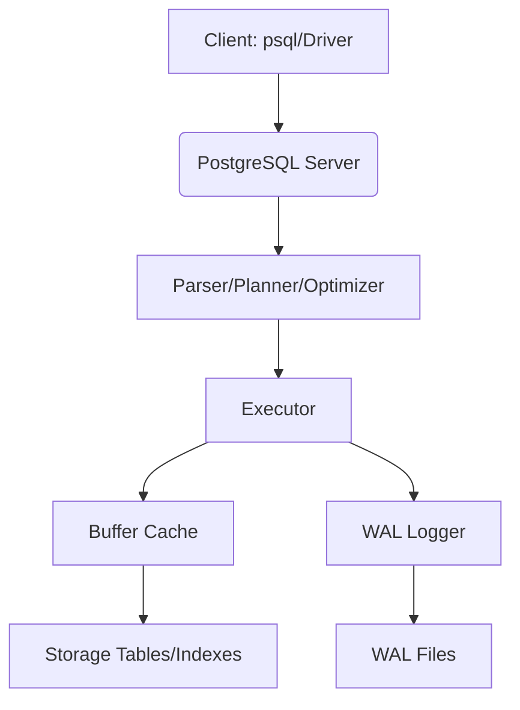

#### 요약 (핵심 + 리스트 + 정리문단)

- 본 문서는 PostgreSQL 실무 기준으로 작성되었습니다.
- 예제는 PostgreSQL 16 기준이며, `psql` 사용 예시를 제공합니다.

##### MySQL 대비 차이

| 항목 | MySQL | PostgreSQL |
|---|---|---|
| 자동 증가 | AUTO_INCREMENT | SERIAL/IDENTITY |
| 문자열 연결 | CONCAT() | `||` |
| 페이징 | LIMIT n, OFFSET m (혼용 허용) | LIMIT n OFFSET m |
| 그룹 규칙 | 느슨(기본 허용) | 표준 엄격(비집계 컬럼 명시 필수) |

##### 참고자료 (내부 링크 포함)

- (https://www.postgresql.org/docs/current/)

#### 1. 서문

이 문서는 GitBook 용도로 작성되었으며, 팀/프로젝트 구성원이 **빠르게 학습 → 일관되게 적용 → 안전하게 운영**할 수 있도록
**표준 템플릿** 형식을 유지합니다.

#### 2. PostgreSQL 한눈에 보기

| 구분 | 설명 |
|---|---|
| 라이선스 | PostgreSQL License (BSD 유사) |
| 저장 구조 | MVCC, WAL |
| 확장성 | 확장 모듈/타입/함수/FDW 지원 |
| 주요 장점 | 표준 SQL 준수, 강력한 트랜잭션/잠금, 풍부한 함수 |

#### 3. 아키텍처 개요 (Mermaid)

#### 4. MVCC 핵심

- 각 트랜잭션은 스냅샷을 바탕으로 **동시성 제어**를 수행합니다.
- 변경은 **WAL**에 기록 후 데이터 파일 반영.
- 진공(autovacuum)으로 불필요한 오래된 튜플 정리.
