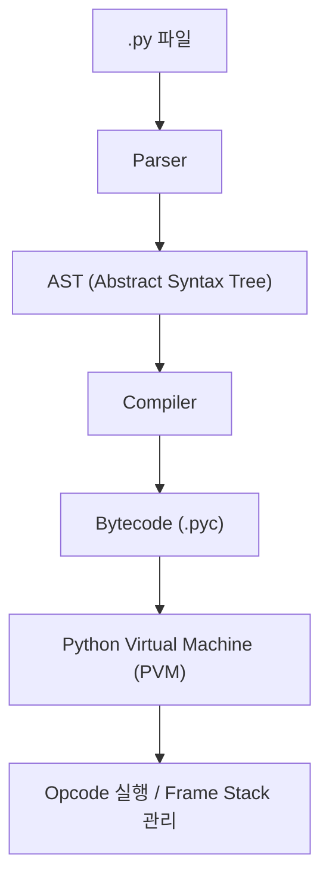

#### 요약
- 본 문서는 Python 프로그램이 실행되는 내부 구조와 **인터프리터 동작 원리**를 설명한다.  
- 코드가 실행되기까지의 단계(파싱 → 바이트코드 변환 → PVM 실행),  
  메모리 관리(참조 카운팅, 가비지 컬렉션), GIL(Global Interpreter Lock)의 역할을 다룬다.  
- 목표는 **Python의 동작 메커니즘을 명확히 이해하여 성능 최적화와 디버깅 역량을 향상**시키는 것이다.

##### 참고자료
- [Python 공식 문서 - Execution Model](https://docs.python.org/3/reference/executionmodel.html)
- [Python Internals - CPython VM Overview](https://realpython.com/cpython-internals-guide/)
- [PEP 703 – Making the Global Interpreter Lock Optional](https://peps.python.org/pep-0703/)

---

#### 1. 개요
Python은 **인터프리터 기반 언어**로,  
소스 코드가 바로 실행되는 것처럼 보이지만 실제로는 여러 단계를 거친다.

| 단계 | 설명 |
|------|------|
| **Parsing** | 소스 코드를 AST(Abstract Syntax Tree)로 변환 |
| **Compilation** | AST를 바이트코드(Bytecode)로 변환 (`.pyc`) |
| **Execution** | Python Virtual Machine(PVM)이 바이트코드 실행 |

```plaintext
Source Code (.py)
   ↓
Parser → Abstract Syntax Tree (AST)
   ↓
Compiler → Bytecode (.pyc)
   ↓
Python Virtual Machine (PVM)
```

---

#### 2. 파싱과 컴파일

##### (1) AST 생성 과정

Python은 실행 전에 **구문 분석(Parser)** 을 수행하여
코드를 **추상 구문 트리(AST)** 형태로 변환한다.

```python
import ast
tree = ast.parse("a = 10 + 20")
print(ast.dump(tree, indent=2))
```

출력 예시:

```plaintext
Module(
  body=[
    Assign(
      targets=[Name(id='a', ctx=Store())],
      value=BinOp(
        left=Constant(value=10),
        op=Add(),
        right=Constant(value=20)
      )
    )
  ]
)
```

> 💡 AST는 코드의 **구조적 의미**를 표현하며,
> Linter, Formatter, Static Analyzer(예: Black, Mypy)도 AST 기반으로 작동한다.

##### (2) 바이트코드 생성

```python
import dis

def add(x, y):
    return x + y

dis.dis(add)
```

출력:

```plaintext
  2           0 LOAD_FAST                0 (x)
              2 LOAD_FAST                1 (y)
              4 BINARY_ADD
              6 RETURN_VALUE
```

> Python은 실행 전에 **Bytecode(.pyc)** 로 컴파일되어
> 인터프리터(PVM)에 의해 실행된다.

---

#### 3. Python Virtual Machine (PVM)

| 구성 요소                 | 설명                  |
| --------------------- | ------------------- |
| **Bytecode Executor** | 바이트코드를 한 줄씩 실행      |
| **Frame Stack**       | 함수 호출 및 지역 변수 저장    |
| **Evaluation Loop**   | Opcode 단위로 실행 흐름 제어 |
| **Exception Handler** | 예외 발생 시 스택 프레임 복구   |



> ⚙️ PVM은 실제 실행 엔진이며,
> CPU 명령으로 변환하지 않고 **소프트웨어 레벨의 가상 스택 머신**으로 동작한다.

---

#### 4. 메모리 관리 구조

Python의 메모리는 **Heap 영역 기반 + 참조 카운팅(Reference Counting)** 으로 관리된다.

| 메커니즘                       | 설명                     |
| -------------------------- | ---------------------- |
| **Reference Counting**     | 객체 참조 횟수로 메모리 해제 시점 결정 |
| **Garbage Collector (gc)** | 순환 참조 탐지 및 정리          |
| **Heap Memory**            | 모든 객체가 저장되는 영역         |
| **Stack Frame**            | 함수 호출 시 지역 변수 관리 영역    |

##### (1) 참조 카운팅 예시

```python
import sys
a = []
b = a
print(sys.getrefcount(a))  # 3 (a, b, getrefcount 내부)
```

##### (2) 가비지 컬렉터 수동 실행

```python
import gc
gc.collect()  # 미사용 객체 강제 해제
```

> 💡 Python은 **자동 메모리 관리 언어**이지만,
> 순환 참조나 전역 객체의 누수가 발생하면 GC가 필요하다.

---

#### 5. GIL(Global Interpreter Lock)

##### (1) 개념

GIL은 CPython 인터프리터에서 **한 번에 하나의 스레드만 바이트코드 실행을 허용하는 전역 락**이다.

```plaintext
Thread-1 ─┐
           ├── [GIL 획득] → Bytecode 실행
Thread-2 ─┘
```

##### (2) 장점

* 인터프리터 내부의 **메모리 안정성 보장**
* 구현 단순화로 **C 확장 모듈**과 호환성 유지

##### (3) 단점

* **CPU-bound 작업**(수학 계산, 압축 등)에서 병렬성 제약
* 스레드가 많을수록 오히려 느려질 수 있음

##### (4) 해결 방법

| 방식                  | 설명                     |
| ------------------- | ---------------------- |
| **Multiprocessing** | 프로세스 단위 병렬 처리 (GIL 우회) |
| **AsyncIO**         | I/O 중심 비동기 동시성 확보      |
| **Cython, Numba**   | C 레벨에서 병렬화             |

> ⚡ Python 3.13부터 **No-GIL 빌드**가 실험적으로 도입되어
> 멀티코어 활용성이 크게 향상될 예정이다.

---

#### 6. 예외 처리와 실행 프레임

```python
def func():
    print("실행 중")
    raise ValueError("에러 발생")

try:
    func()
except Exception as e:
    print(f"예외: {e}")
```

Python은 함수 호출마다 **Frame Stack**을 생성하고,
예외 발생 시 **스택 언와인딩(Unwinding)** 으로 상위 호출 프레임까지 탐색한다.

> ✅ 스택 추적(traceback)은 이 과정에서 생성되며,
> 디버깅 시 예외의 “원인 함수”를 추적할 수 있는 핵심 정보이다.

---

#### 7. 실행 성능 관련 내부 요소

| 요소                          | 설명                        | 최적화 방법                                 |
| --------------------------- | ------------------------- | -------------------------------------- |
| **Opcode Interpreter Loop** | Bytecode 실행 속도에 직접 영향     | CPython 3.11+에서 Faster CPython 프로젝트 진행 |
| **Caching**                 | 최근 실행 Opcode 캐싱           | Frame Stack 재사용                        |
| **JIT Compilation(PyPy)**   | Bytecode → Native Code 변환 | 런타임 컴파일로 속도 향상                         |
| **No-GIL Branch**           | 병렬성 향상                    | Python 3.13 이후 도입 예정                   |

---

#### 8. 결론

* Python은 **“AST → Bytecode → PVM”** 흐름을 기반으로 동작하는 인터프리터 언어다.
* 메모리 관리는 참조 카운팅 + GC의 2중 구조이며,
  실행 중 안정성을 위해 GIL을 유지한다.
* 이러한 구조를 이해하면
  **성능 튜닝(Async, Multiprocessing, Cython)** 및
  **디버깅(traceback 분석)** 시 훨씬 효율적으로 문제를 해결할 수 있다.

