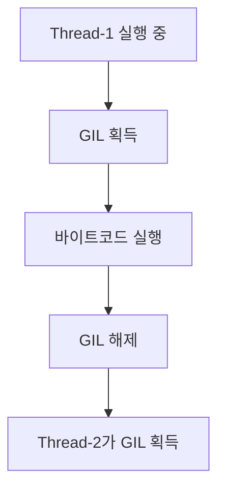
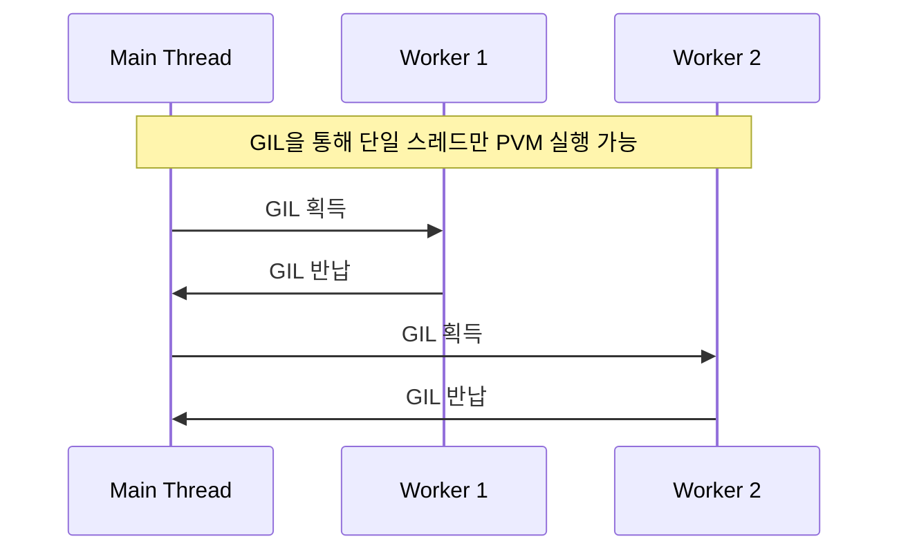
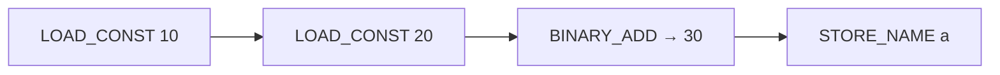

#### 요약
- 본 문서는 Python의 **내부 실행 구조와 런타임 동작 원리**를 상세히 설명한다.  
- 인터프리터 구조, 바이트코드(Bytecode), GIL(Global Interpreter Lock),  
  스레드 모델, 실행 프레임과 메모리 관리 흐름을 포함한다.  
- 목표는 “**Python 코드가 실제로 어떻게 실행되고 관리되는지 이해**”하는 것이다.  

##### 참고자료
- [CPython Internals — Python Docs](https://docs.python.org/3/c-api/index.html)
- [Disassembling Python Bytecode — dis module](https://docs.python.org/3/library/dis.html)
- [PEP 703 — Making the Global Interpreter Lock Optional in CPython](https://peps.python.org/pep-0703/)

---

#### 1. Python 실행 구조 개요

Python은 **인터프리터 언어(Interpreter Language)** 로,  
코드를 한 줄씩 읽고 **바이트코드(Bytecode)** 로 변환하여 실행한다.


| 단계                  | 설명                  |
| ------------------- | ------------------- |
| **1️⃣ Parsing**     | 구문 분석 (AST 생성)      |
| **2️⃣ Compilation** | 바이트코드로 변환 (`.pyc`)  |
| **3️⃣ Execution**   | Python VM(PVM)에서 실행 |

> ⚙️ 바이트코드는 플랫폼 독립적인 중간 코드이며,
> PVM은 이를 인터프리터 방식으로 실행한다.

---

#### 2. 인터프리터 구조 (CPython 기준)

CPython은 가장 널리 사용되는 Python 구현체이다.

| 구성 요소               | 설명                            |
| ------------------- | ----------------------------- |
| **Parser**          | 코드를 토큰 단위로 분석하여 구문 트리(AST) 생성 |
| **Compiler**        | AST를 바이트코드로 변환                |
| **Evaluator (PVM)** | 스택 기반 가상 머신으로 바이트코드 실행        |
| **Memory Manager**  | 참조 카운트 및 GC 수행                |
| **GIL Manager**     | 스레드 간 인터프리터 접근 제어             |

> ✅ CPython은 C로 구현되어 있으며,
> 인터프리터와 런타임 모두 단일 스레드 기반으로 동작한다.

---

#### 3. 바이트코드 (Bytecode)

Python은 실행 전 `.py` 파일을 **바이트코드(.pyc)** 로 컴파일한다.

```python
def add(x, y):
    return x + y
```

```python
import dis
dis.dis(add)
```

출력:

```
  2           0 LOAD_FAST                0 (x)
              2 LOAD_FAST                1 (y)
              4 BINARY_ADD
              6 RETURN_VALUE
```

| 바이트코드 명령어      | 설명          |
| -------------- | ----------- |
| `LOAD_FAST`    | 지역 변수 스택 적재 |
| `BINARY_ADD`   | 산술 연산 수행    |
| `RETURN_VALUE` | 결과 반환       |

> 💡 Python은 “**스택 기반 가상 머신(Stack-based VM)**” 구조를 사용한다.
> 즉, 모든 연산은 스택에서 이루어진다.

---

#### 4. GIL (Global Interpreter Lock)

Python은 메모리 안정성을 위해 **GIL(Global Interpreter Lock)** 을 도입했다.
이 락은 한 번에 하나의 스레드만 바이트코드를 실행하도록 제한한다.



| 장점            | 단점           |
| ------------- | ------------ |
| 메모리 안정성 보장    | CPU 병렬 처리 불가 |
| 단일 스레드 환경 단순화 | 멀티코어 활용 제약   |

> ⚙️ I/O-bound 작업은 GIL의 영향을 받지 않지만,
> **CPU-bound 연산**은 멀티스레드로 성능 향상을 기대하기 어렵다.

---

#### 5. GIL 우회 방법

| 방법                       | 설명                   |
| ------------------------ | -------------------- |
| **multiprocessing**      | 프로세스별 별도 인터프리터 실행    |
| **C 확장 (Cython, Numba)** | C 코드 영역에서 GIL 해제     |
| **asyncio**              | I/O 병렬성으로 GIL 영향 최소화 |

##### 예시: multiprocessing

```python
from multiprocessing import Pool

def square(x): return x*x

if __name__ == "__main__":
    with Pool(4) as p:
        print(p.map(square, [1,2,3,4]))
```

> ✅ 프로세스는 별도의 GIL을 갖기 때문에 CPU 병렬 처리가 가능하다.

---

#### 6. 실행 프레임 (Execution Frame)

Python은 함수 호출 시 **Frame 객체**를 생성하여 실행 상태를 저장한다.

| 구성 요소                  | 설명                     |
| ---------------------- | ---------------------- |
| **Code Object**        | 컴파일된 바이트코드 (`co_code`) |
| **Local Variables**    | 지역 변수                  |
| **Globals / Builtins** | 전역 스코프                 |
| **Stack**              | 연산 중간값 저장              |
| **Return Address**     | 호출 위치 복귀 포인터           |

```python
import inspect

def foo(a, b):
    frame = inspect.currentframe()
    print(frame.f_code.co_name, frame.f_locals)

foo(1, 2)
# 출력: foo {'a': 1, 'b': 2}
```

> ⚙️ Frame은 호출 스택(Call Stack)에 쌓이며,
> 함수 실행이 끝나면 자동으로 해제된다.

---

#### 7. 스레드 모델과 GIL 동작 순서



> 💡 GIL은 약 5ms마다 컨텍스트 스위칭을 수행한다.
> 즉, 스레드는 교대로 실행되지만 **진정한 병렬 처리(parallelism)** 은 아니다.

---

#### 8. 런타임 중 객체 수명 주기

| 단계                         | 설명             |
| -------------------------- | -------------- |
| ① 객체 생성 (`__new__`)        | 메모리 공간 할당      |
| ② 초기화 (`__init__`)         | 속성 값 설정        |
| ③ 참조 유지                    | 변수/컨테이너에 의해 참조 |
| ④ 참조 해제 (`del` / scope 종료) | 참조 카운트 감소      |
| ⑤ 가비지 컬렉션                  | 0이 되면 메모리 해제   |

```python
class Demo:
    def __del__(self):
        print("객체 해제됨")

d = Demo()
del d
```

> ✅ `__del__()`은 객체가 GC로 회수될 때 호출되지만,
> 즉각적인 실행은 보장되지 않는다.

---

#### 9. 인터프리터 캐시 메커니즘

Python은 성능을 위해 다양한 캐싱 전략을 사용한다.

| 항목                   | 설명                               |
| -------------------- | -------------------------------- |
| **Integer Cache**    | `[-5, 256]` 범위는 재사용              |
| **String Interning** | 동일 문자열은 동일 객체로 참조                |
| **Function Cache**   | `functools.lru_cache()` 로 결과 재사용 |
| **Bytecode Cache**   | `.pyc` 파일에 바이트코드 저장              |

> ⚡ 캐시 메커니즘은 Python의 느린 실행을 보완하는 핵심 장치이다.

---

#### 10. 인터프리터 동작 예시 (한 줄 실행 흐름)

```python
a = 10 + 20
```

| 단계  | 내부 동작                                       |
| --- | ------------------------------------------- |
| 1️⃣ | `LOAD_CONST 10`, `LOAD_CONST 20` → 스택에 값 적재 |
| 2️⃣ | `BINARY_ADD` → 두 값을 더하고 결과를 스택에 푸시          |
| 3️⃣ | `STORE_NAME 'a'` → 결과를 이름 공간에 저장            |



> 💡 모든 연산은 PVM 스택 기반에서 수행되며,
> 결과는 지역 네임스페이스(Local Namespace)에 저장된다.

---

#### 11. 결론

* Python은 **“바이트코드 + 가상 머신(PVM)” 구조**로 실행된다.
* GIL은 스레드 안전성을 보장하지만, **멀티코어 활용 한계**가 있다.
* 프로세스 기반 병렬 처리와 C 확장을 통해 GIL 제약을 보완할 수 있다.
* 인터프리터 내부 구조를 이해하면,
  **성능 튜닝·디버깅·메모리 분석·멀티스레딩 설계**까지 한층 깊게 접근할 수 있다.

```
