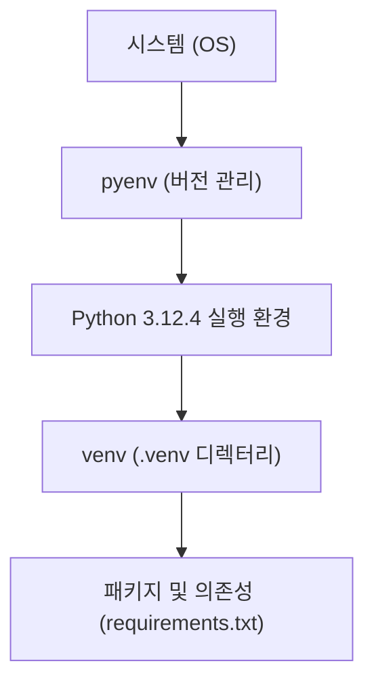

#### 요약
- 본 문서는 Python 개발 환경에서 **프로젝트별 독립 환경(venv)** 과  
  **시스템 전역 버전 관리(pyenv)** 를 함께 사용하는 방법을 다룬다.  
- 여러 프로젝트가 다른 Python 버전을 요구하거나,  
  테스트/운영 환경 간 버전 충돌이 발생하는 경우를 방지하기 위한 표준 절차를 설명한다.  
- 최종 목표는 **일관된 개발 환경 재현성(Reproducibility)** 확보이다.  

##### 참고자료
- [pyenv GitHub Repository](https://github.com/pyenv/pyenv)
- [Python venv Documentation](https://docs.python.org/3/library/venv.html)
- [Real Python – Managing Multiple Python Versions](https://realpython.com/intro-to-pyenv/)

---

#### 1. 개요
Python 프로젝트는 **전역 환경(global)** 에 직접 패키지를 설치하면  
버전 충돌, 의존성 깨짐, 빌드 불일치 등의 문제가 발생할 수 있다.  
이를 해결하기 위해 아래 두 가지 계층으로 환경을 분리한다.

| 계층 | 역할 | 주요 도구 |
|------|------|-----------|
| **전역 버전 관리** | OS 단위 Python 버전 관리 | pyenv |
| **프로젝트 격리 환경** | 프로젝트 단위 패키지 관리 | venv 또는 Poetry |

---

#### 2. pyenv를 이용한 버전 관리

##### (1) pyenv 설치 및 설정
```bash
# macOS / Linux
curl https://pyenv.run | bash

# 환경 변수 등록 (bash 기준)
echo 'export PATH="$HOME/.pyenv/bin:$PATH"' >> ~/.bashrc
echo 'eval "$(pyenv init -)"' >> ~/.bashrc
source ~/.bashrc
```

##### (2) Python 버전 설치 및 설정

```bash
# Python 3.12.4 설치
pyenv install 3.12.4

# 기본(global) 버전 설정
pyenv global 3.12.4

# 프로젝트(local) 버전 설정
cd ~/project/backend
pyenv local 3.12.4
```

> 📌 `.python-version` 파일이 생성되며,
> 해당 프로젝트에 진입 시 자동으로 지정된 버전이 적용된다.

##### (3) 설치된 버전 확인

```bash
pyenv versions
```

출력 예시:

```
* 3.12.4 (set by /home/user/project/.python-version)
  3.11.8
  3.10.14
```

---

#### 3. venv를 이용한 가상환경 관리

##### (1) 가상환경 생성 및 활성화

```bash
# 생성
python -m venv .venv

# 활성화
source .venv/bin/activate   # macOS/Linux
.\.venv\Scripts\activate    # Windows
```

##### (2) 패키지 설치 및 내보내기

```bash
pip install requests
pip freeze > requirements.txt
```

##### (3) 동일 환경 복원

```bash
pip install -r requirements.txt
```

##### (4) 비활성화

```bash
deactivate
```

---

#### 4. pyenv와 venv 병행 사용 구조



* pyenv는 **Python 실행 파일 버전**을 관리한다.
* venv는 **프로젝트 의존성 패키지**를 격리한다.
* 둘을 함께 사용하면 OS나 팀 간 충돌 없는 **완전 독립 개발 환경**을 구축할 수 있다.

---

#### 5. 환경 구성 시 권장 규칙

| 구분               | 권장 설정                      | 설명                |
| ---------------- | -------------------------- | ----------------- |
| **프로젝트 루트 구조**   | `/.venv`, `/src`, `/tests` | 가상환경은 루트에 배치      |
| **Python 버전 지정** | `.python-version`          | pyenv 로컬 설정 자동 인식 |
| **패키지 내보내기**     | `requirements.txt`         | 환경 복원 표준 포맷       |
| **가상환경 무시**      | `.gitignore`에 `.venv/` 추가  | 환경 디렉터리는 버전 관리 제외 |

---

#### 6. 환경 충돌 해결 팁

| 문제 상황                 | 원인            | 해결 방법                                            |
| --------------------- | ------------- | ------------------------------------------------ |
| `ModuleNotFoundError` | venv 미활성화     | `source .venv/bin/activate` 후 재실행                |
| Python 버전 불일치         | pyenv 미적용     | `pyenv local` 또는 `.python-version` 확인            |
| pip 캐시 문제             | 이전 버전 패키지 충돌  | `pip install --upgrade pip` 또는 `pip cache purge` |
| PATH 인식 오류            | Shell 초기화 미완료 | `exec $SHELL` 명령으로 재로드                           |

---

#### 7. 결론

* pyenv는 **Python 실행 버전**, venv는 **프로젝트 패키지 환경**을 관리한다.
* 두 도구를 함께 사용하면 팀, OS, CI 환경 간 차이를 최소화할 수 있다.
* 이러한 구성은 “한 번 설치로 어디서든 동일한 환경 재현”을 가능하게 하며,
  백엔드 서비스 개발의 **기본 운영 단위**로 필수적이다.


