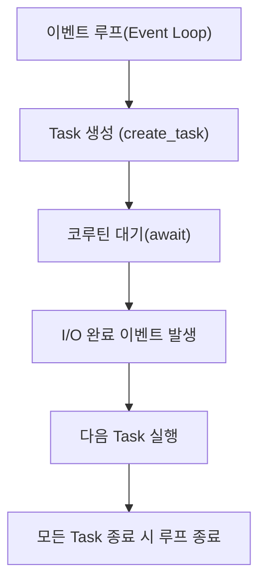

#### 요약
- 본 문서는 Python의 **비동기 처리(asyncio)** 와 **코루틴(Coroutine)** 동작 원리를 설명한다.  
- `async` / `await` 키워드 기반의 비동기 함수 구조, 이벤트 루프(Event Loop) 메커니즘,  
  태스크(Task)와 Future의 관계를 다룬다.  
- 목표는 “**병렬이 아닌 동시성(Concurrency)을 효율적으로 구현**”하는 것이다.  

##### 참고자료
- [asyncio — Python Docs](https://docs.python.org/3/library/asyncio.html)
- [PEP 492 – Coroutines with async/await syntax](https://peps.python.org/pep-0492/)
- [Real Python – Async IO in Python](https://realpython.com/async-io-python/)

---

#### 1. 동기 vs 비동기 개념 비교

| 구분 | 동기(Synchronous) | 비동기(Asynchronous) |
|------|--------------------|----------------------|
| 실행 방식 | 순차 실행 | I/O 대기 중 다른 작업 수행 가능 |
| 처리 흐름 | 블로킹(Blocking) | 논블로킹(Non-blocking) |
| CPU 활용 | 낮음 | 높음 (동시성 확보) |
| 사용 예시 | 파일 I/O, DB 요청, 네트워크 통신 | 비동기 웹 서버, API 요청 병렬 처리 |

```python
# 동기 처리
def fetch_data():
    data = slow_request()  # 완료될 때까지 대기
    return data
```

```python
# 비동기 처리
async def fetch_data():
    data = await slow_request()  # 다른 작업과 병렬 진행
    return data
```

> 💡 Python의 비동기는 멀티스레드/멀티프로세싱이 아닌,
> **싱글 스레드 기반의 협력적(concurrent) 실행 모델**이다.

---

#### 2. asyncio 기본 구조

Python의 비동기 처리는 `asyncio` 모듈을 기반으로 동작한다.

##### (1) 기본 예시

```python
import asyncio

async def say_hello():
    print("Hello...")
    await asyncio.sleep(1)
    print("...World!")

asyncio.run(say_hello())
```

출력:

```
Hello...
...World!
```

##### (2) 주요 키워드

| 키워드               | 설명                      |
| ----------------- | ----------------------- |
| `async def`       | 비동기 함수 정의               |
| `await`           | 코루틴 완료까지 대기             |
| `asyncio.run()`   | 이벤트 루프 실행 (Python 3.7+) |
| `asyncio.sleep()` | 비동기 타이머 대기 함수           |

---

#### 3. 이벤트 루프(Event Loop)

Python 비동기의 핵심은 **Event Loop** 이다.
이는 모든 코루틴의 실행 스케줄링을 담당한다.



> ⚙️ Event Loop은 **비동기 함수들을 하나의 큐에 등록하고,
> I/O 완료 시점을 기준으로 순차적으로 실행**한다.

---

#### 4. 동시 실행 (Task Scheduling)

여러 비동기 함수를 동시에 실행하려면 `asyncio.gather()`나 `create_task()`를 사용한다.

```python
import asyncio

async def work(id):
    print(f"작업 {id} 시작")
    await asyncio.sleep(1)
    print(f"작업 {id} 완료")
    return id

async def main():
    tasks = [work(i) for i in range(3)]
    results = await asyncio.gather(*tasks)
    print("결과:", results)

asyncio.run(main())
```

출력:

```
작업 0 시작
작업 1 시작
작업 2 시작
작업 0 완료
작업 1 완료
작업 2 완료
결과: [0, 1, 2]
```

> ✅ 모든 작업이 **병렬처럼 보이지만**, 실제로는 **I/O 대기 중 협력적 전환**이 일어나는 구조다.

---

#### 5. Task와 Future의 관계

| 구성 요소      | 설명                               |
| ---------- | -------------------------------- |
| **Future** | 비동기 연산의 결과를 나타내는 객체 (Promise 유사) |
| **Task**   | 코루틴을 Future로 감싸 실행 가능한 상태로 등록    |
| **await**  | Task 또는 Future의 완료를 기다림          |

```python
import asyncio

async def sample():
    await asyncio.sleep(1)
    return "done"

loop = asyncio.get_event_loop()
task = loop.create_task(sample())
loop.run_until_complete(task)
print(task.result())
```

> 💡 `asyncio.create_task()`는 내부적으로 `Future` 객체를 감싼 `Task`를 생성한다.

---

#### 6. async with / async for

##### (1) async with – 비동기 컨텍스트 매니저

```python
import aiofiles
import asyncio

async def read_file():
    async with aiofiles.open("sample.txt", "r", encoding="utf-8") as f:
        content = await f.read()
        print(content)

asyncio.run(read_file())
```

##### (2) async for – 비동기 반복

```python
import asyncio

async def gen():
    for i in range(3):
        await asyncio.sleep(1)
        yield i

async def main():
    async for value in gen():
        print(value)

asyncio.run(main())
```

> 💡 `async for`는 비동기 스트림(예: API 응답, 파일 청크)을 처리할 때 유용하다.

---

#### 7. 예외 처리와 취소 (Task Cancellation)

```python
import asyncio

async def risky():
    await asyncio.sleep(2)
    raise RuntimeError("작업 실패")

async def main():
    task = asyncio.create_task(risky())
    await asyncio.sleep(1)
    task.cancel()  # Task 취소 시도
    try:
        await task
    except asyncio.CancelledError:
        print("작업이 취소되었습니다.")

asyncio.run(main())
```

출력:

```
작업이 취소되었습니다.
```

| 예외               | 설명                         |
| ---------------- | -------------------------- |
| `CancelledError` | 태스크 강제 취소                  |
| `TimeoutError`   | `asyncio.wait_for()` 시간 초과 |
| `RuntimeError`   | 내부 실행 오류                   |

---

#### 8. 동기 코드와의 혼합 사용

비동기 함수는 일반 함수에서 직접 호출할 수 없으므로
**`asyncio.run()` 또는 이벤트 루프 내에서만 실행**해야 한다.

```python
# 잘못된 예시
async def fetch(): ...
fetch()  # TypeError 발생

# 올바른 예시
asyncio.run(fetch())
```

> ⚠️ `await`는 반드시 **비동기 함수 내부**에서만 사용 가능하다.

---

#### 9. 실무 적용 예시 (HTTP 요청 병렬 처리)

```python
import asyncio
import aiohttp

async def fetch(url):
    async with aiohttp.ClientSession() as session:
        async with session.get(url) as res:
            return await res.text()

async def main():
    urls = ["https://example.com"] * 3
    results = await asyncio.gather(*(fetch(u) for u in urls))
    print([len(r) for r in results])

asyncio.run(main())
```

> ✅ 네트워크 I/O 바운드 작업은 asyncio로 대폭 성능 향상 가능
> (예: API 크롤링, DB 쿼리, 파일 다운로드 등)

---

#### 10. 결론

* Python의 비동기는 **이벤트 루프 기반의 동시성 모델**로,
  CPU 병렬이 아닌 **I/O 효율 최적화**에 중점을 둔다.
* `async` / `await` 문법은 **비동기 흐름을 명시적으로 표현**하여 가독성을 높인다.
* `asyncio.gather()`로 여러 작업을 동시 처리하고,
  `async with` / `async for`로 자원 관리 및 스트림 처리를 단순화할 수 있다.
* 올바른 비동기 구조 설계는 Python 백엔드의 **성능과 확장성의 핵심 기반**이다.

```
