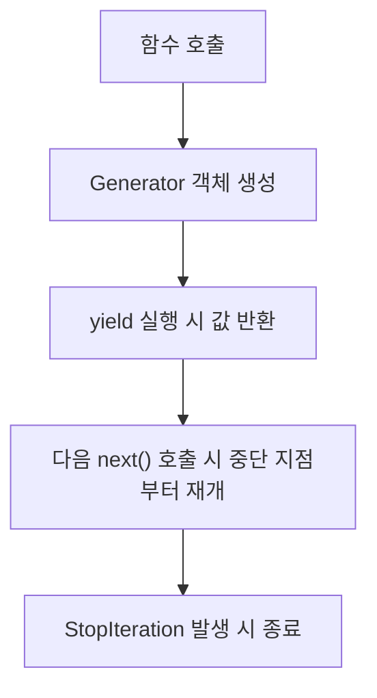

#### 요약
- 본 문서는 Python의 **이터레이터(iterator)** 와 **제너레이터(generator)** 동작 원리를 설명한다.  
- `__iter__`, `__next__`, `yield` 구문을 중심으로 **지연 평가(lazy evaluation)** 구조와 메모리 효율성을 다룬다.  
- 목표는 **대용량 데이터 처리 시 효율적인 순회 구조를 설계**하는 것이다.  

##### 참고자료
- [Python Iterator Protocol](https://docs.python.org/3/library/stdtypes.html#typeiter)
- [Generators — Python Docs](https://docs.python.org/3/tutorial/classes.html#iterators)
- [PEP 255 – Simple Generators](https://peps.python.org/pep-0255/)

---

#### 1. 이터러블(Iterable)과 이터레이터(Iterator)

##### (1) 기본 개념
- **Iterable**: `for`문으로 순회 가능한 객체 (list, tuple, dict 등)
- **Iterator**: `next()` 호출로 순차적으로 값을 반환하는 객체

```python
nums = [1, 2, 3]
it = iter(nums)
print(next(it))  # 1
print(next(it))  # 2
print(next(it))  # 3
```

| 개념       | 인터페이스        | 역할       |
| -------- | ------------ | -------- |
| Iterable | `__iter__()` | 이터레이터 반환 |
| Iterator | `__next__()` | 다음 요소 반환 |

> 💡 Python의 `for`문은 내부적으로 `iter()`와 `next()`를 자동 호출한다.

---

#### 2. 사용자 정의 이터레이터 클래스

```python
class CountDown:
    def __init__(self, start):
        self.current = start

    def __iter__(self):
        return self

    def __next__(self):
        if self.current <= 0:
            raise StopIteration
        self.current -= 1
        return self.current

for n in CountDown(5):
    print(n)
```

출력:

```
4
3
2
1
0
```

> ✅ 이터레이터는 **상태(state)** 를 내부에 저장하며,
> `StopIteration` 예외로 순회의 종료를 알린다.

---

#### 3. 제너레이터 (Generator)

##### (1) 기본 형태

```python
def countdown(n):
    while n > 0:
        yield n
        n -= 1

for i in countdown(3):
    print(i)
```

출력:

```
3
2
1
```

| 요소                  | 설명                     |
| ------------------- | ---------------------- |
| `yield`             | 값을 반환하고 함수 상태를 일시 중단   |
| **Lazy Evaluation** | 필요한 시점에만 값 생성 (메모리 절약) |
| **상태 보존**           | 다음 호출 시 이전 상태에서 이어서 실행 |

---

#### 4. 제너레이터의 내부 동작



> ⚙️ 제너레이터는 호출 즉시 실행되지 않고,
> `next()` 호출 시점에 한 단계씩 실행된다.

---

#### 5. send(), throw(), close() 메서드

```python
def echo():
    try:
        while True:
            value = yield
            print(f"입력값: {value}")
    except GeneratorExit:
        print("제너레이터 종료")

g = echo()
next(g)        # 초기화
g.send("Hi")   # 입력값: Hi
g.close()      # 제너레이터 종료
```

| 메서드           | 기능                            |
| ------------- | ----------------------------- |
| `send(value)` | 제너레이터 내부로 데이터 전달              |
| `throw(exc)`  | 지정한 예외를 제너레이터 내부로 전달          |
| `close()`     | 제너레이터 종료 (`GeneratorExit` 발생) |

> 💡 `yield`는 단순한 데이터 생산자가 아니라,
> **양방향 통신이 가능한 코루틴(coroutine)의 기초 구조**이다.

---

#### 6. 제너레이터 표현식

```python
squares = (x ** 2 for x in range(5))
print(next(squares))  # 0
print(list(squares))  # [1, 4, 9, 16]
```

| 구문                           | 설명                 |
| ---------------------------- | ------------------ |
| `(expr for var in iterable)` | 제너레이터 객체 생성        |
| `[expr for var in iterable]` | 리스트 즉시 생성 (메모리 사용) |

> ✅ 제너레이터 표현식은 **리스트 컴프리헨션보다 메모리 효율적**이다.

---

#### 7. 실무 예시: 대용량 로그 파일 처리

```python
def read_large_file(path: str):
    with open(path, "r", encoding="utf-8") as f:
        for line in f:
            yield line.strip()

for log in read_large_file("access.log"):
    if "ERROR" in log:
        print(log)
```

> ⚡ 한 줄씩 읽어 `yield`로 반환하므로,
> 수 GB 크기의 파일도 메모리 과부하 없이 처리할 수 있다.

---

#### 8. itertools 모듈 활용

Python의 `itertools`는 반복 관련 고성능 도구 모음이다.

```python
import itertools

data = [1, 2, 3]
for x in itertools.cycle(data):
    print(x)  # 무한 순환
```

| 함수                          | 설명         |
| --------------------------- | ---------- |
| `count(start, step)`        | 무한 증가 시퀀스  |
| `cycle(iterable)`           | 반복 순환      |
| `repeat(obj, n)`            | 객체 반복      |
| `chain(a, b, ...)`          | 여러 이터러블 연결 |
| `islice(iterable, n)`       | 슬라이싱       |
| `compress(data, selectors)` | 조건부 필터링    |

> 💡 `itertools`는 **데이터 파이프라인 처리, 스트리밍, ETL**에 자주 활용된다.

---

#### 9. Lazy Evaluation (지연 평가)

* 제너레이터는 **필요할 때만 값을 계산**하므로 메모리 사용이 최소화된다.
* 특히 **대규모 리스트 변환, 파일 스트리밍, 네트워크 응답 처리**에서 효과적이다.

```python
def numbers():
    for i in range(1_000_000):
        yield i

total = sum(numbers())  # 메모리 과부하 없이 계산
```

> ✅ Lazy evaluation은 Python에서 **함수형 프로그래밍(Functional Programming)** 의 핵심 개념 중 하나이다.

---

#### 10. 결론

* 이터레이터는 `__iter__()`와 `__next__()`로 순회 상태를 제어하고,
  제너레이터는 이를 간결하게 구현한 **함수 기반 이터레이터**이다.
* `yield`는 **지연 평가(Lazy Evaluation)** 를 가능하게 하여
  대용량 데이터 처리의 메모리 효율을 극대화한다.
* `itertools`, `send()`, `close()` 등 고급 기능을 익히면
  Python의 데이터 순회 구조를 더욱 유연하게 설계할 수 있다.

```
