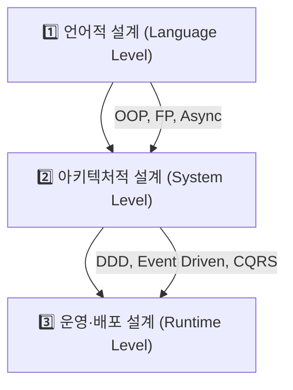
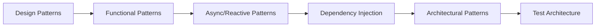

#### 요약
- 본 문서는 Python 백엔드 개발자를 위한 **고급 아키텍처 및 설계 패턴(Advanced Patterns)** 시리즈의 서문이다.  
- Python의 언어적 특성과 객체 모델 위에서 **디자인 패턴, 비동기 패턴, 데이터 파이프라인, 테스트·DI·모듈 설계 기법**을 확장적으로 다룬다.  
- 목표는 “**대규모 Python 서비스 구조를 설계·유지보수·확장할 수 있는 수준**”으로 개발자의 사고를 전환하는 것이다.

##### 참고자료
- [Design Patterns in Python (Refactoring.Guru)](https://refactoring.guru/design-patterns/python)
- [Architecture Patterns with Python (Percival & Gregory)](https://www.oreilly.com/library/view/architecture-patterns-with/9781492052197/)
- [Clean Architecture (Robert C. Martin)](https://www.oreilly.com/library/view/clean-architecture/9780134494272/)
- [Asyncio Patterns Guide](https://docs.python.org/3/library/asyncio-task.html)

---

#### 1. 시리즈 개요

본 섹션은 “언어 코어를 마스터한 개발자”를 대상으로 한다.  
`02-language-core`에서 다룬 문법·OOP·메모리 구조를 기반으로  
실제 서비스 구조 설계 및 패턴 적용을 체계적으로 확장한다.

| 구분 | 주요 내용 | 키워드 |
|------|------------|--------|
| **설계 패턴 (Design Patterns)** | 객체지향 기반 구조 재사용 | Factory, Strategy, Singleton |
| **비동기 패턴 (Async Patterns)** | asyncio, Producer-Consumer, Reactor | Queue, Stream, Event Loop |
| **데이터 파이프라인 (Dataflow)** | Generator, Coroutine 기반 파이프라인 | yield, send, pipeline |
| **테스트 아키텍처 (Test Architecture)** | 의존성 주입, Mocking, Layered Test | pytest, fixture, CI |
| **모듈 및 인터페이스 설계** | 확장 가능한 코드 구조 | Adapter, Port-Driven Design |

---

#### 2. Python에서의 패턴 적용 철학

| 개념 | Java 등 전통 언어 | Python적 접근 |
|------|--------------------|----------------|
| 클래스 중심 설계 | 강한 타입, 상속 기반 | Duck Typing, 다형성 중심 |
| 의존성 주입(DI) | 인터페이스/컨테이너 기반 | 함수형 + 동적 주입 |
| 싱글톤(Singleton) | static 객체 관리 | 모듈 레벨 전역 상태로 대체 |
| 팩토리(Factory) | 클래스 인스턴스화 캡슐화 | callable 객체·클로저 사용 |
| 옵저버(Observer) | 이벤트 핸들러 | async callback, asyncio.Queue |

> ✅ Python은 “패턴을 구현하는 언어”가 아니라,  
> “**패턴이 자연스럽게 표현되는 언어**”라는 점이 다르다.

---

#### 3. 고급 구조 설계의 3계층 모델

| 계층           | 설명                  | 주요 개념                         |
| ------------ | ------------------- | ----------------------------- |
| **언어적 설계**   | 함수·클래스·OOP/FP 하이브리드 | OOP, Generator, Decorator     |
| **아키텍처적 설계** | 모듈 간 결합도/응집도 제어     | Repository, Service, EventBus |
| **운영 설계**    | 배포·테스트·관찰성          | CI/CD, Logging, Observability |

> 💡 본 시리즈는 “코드 작성법”이 아닌 “**구조 설계 사고법**”을 다룬다.

---

#### 4. 주요 학습 주제

| 범주                             | 주제                                     | 설명               |
| ------------------------------ | -------------------------------------- | ---------------- |
| **01. Design Patterns**        | 싱글톤, 전략, 팩토리, 옵저버, 어댑터, 파사드            | 객체 재사용과 유지보수성 중심 |
| **02. Functional & Reactive**  | 일급함수, 고차함수, 클로저, 스트림 처리                | 함수형 패러다임 실무화     |
| **03. Async & Concurrency**    | 프로듀서-컨슈머, 파이프라인, 태스크 패턴                | 비동기 워크플로우 구축     |
| **04. Dependency Injection**   | IoC 컨테이너, Lazy Load, Mock 주입           | 테스트 친화형 구조 설계    |
| **05. Architectural Patterns** | Layered, Hexagonal, CQRS, Event Driven | 대규모 서비스 구조 설계    |
| **06. Test & Maintainability** | Unit/Integration 분리, Layer 테스트         | 지속 가능한 구조 검증     |

---

#### 5. 이 시리즈의 학습 흐름

> ⚙️ 각 챕터는 독립적으로 학습 가능하지만,
> 순서대로 진행하면 “언어 → 구조 → 운영”의 자연스러운 확장 흐름을 따른다.

---

#### 6. 실무 적용 예시

| 분야                | 패턴                        | 적용 예시           |
| ----------------- | ------------------------- | --------------- |
| **웹 서버**          | Factory + Strategy        | 요청 라우팅 및 핸들러 선택 |
| **비동기 큐**         | Producer-Consumer         | 데이터 파이프라인       |
| **DB Repository** | Repository + Unit of Work | 트랜잭션 관리         |
| **RPA/배치 작업**     | Command + Observer        | 이벤트 기반 실행       |
| **테스트 구조**        | Mock + Fixture            | 외부 의존성 격리       |

> ✅ 패턴의 목적은 “복잡도를 숨기되, 명확성을 유지하는 것”이다.

---

#### 7. 결론

* 고급 패턴 학습은 문법의 응용이 아니라 **시스템 사고(System Thinking)** 이다.
* Python은 클래스·함수·비동기·데코레이터 등 **언어적 유연성**을 통해
  다양한 설계 패턴을 **간결하고 직관적으로 구현**할 수 있다.
* 본 시리즈를 통해 “작동하는 코드”에서 “**설계가 살아있는 코드**”로 발전하자.

> 🎯 **핵심 문장:**
> “Pythonic한 패턴은 코드가 아니라 사고방식이다.”

