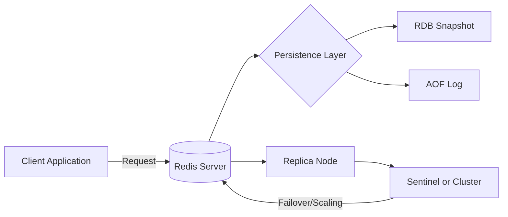

#### 요약

- **Redis**는 인메모리 기반의 Key-Value 데이터 저장소로,  
  초고속 데이터 접근과 다양한 자료구조를 지원한다.  
- 데이터베이스(DB), 캐시(Cache), 메시지 브로커(Message Broker) 등  
  다양한 형태로 활용 가능하다.  
- 단일 노드에서 분산 클러스터까지 확장성이 높으며,  
  **백엔드 서비스의 성능과 안정성을 향상시키는 핵심 컴포넌트**로 자리잡았다.


Redis는 단순한 캐시 서버가 아니라
**“인메모리 데이터 플랫폼”**으로 진화한 시스템이다.
성능, 확장성, 안정성, 개발 편의성 측면에서
현대 백엔드 아키텍처의 **필수 구성요소**로 자리 잡았다.


**핵심 요약**
1. In-Memory Key-Value Store  
2. 자료구조 다양성 (String, Hash, List, Set, ZSet, Stream 등)  
3. Persistence 옵션 (RDB, AOF, Hybrid)  
4. 고가용성(HA) 및 클러스터 구성 가능  
5. 캐시, 세션, 랭킹, 메시징 등 실무 활용도 높음  

##### Redis 아키텍처 개요 (Mermaid 다이어그램)



---

##### 참고자료  
- [Redis 공식 문서](https://redis.io/documentation)  
- [Spring Data Redis Reference](https://docs.spring.io/spring-data/redis/docs/current/reference/html/)  
- [Node.js ioredis GitHub](https://github.com/luin/ioredis)  
---

#### 1. Redis란 무엇인가

Redis(REmote DIctionary Server)는 **인메모리 데이터 구조 저장소**다.  
데이터를 메모리에 유지함으로써 **마이크로초(μs) 단위 응답 속도**를 제공하며,  
단순 캐시뿐 아니라 실시간 랭킹, 세션, 스트림 등 다양한 서비스 로직에 사용된다.

| 항목 | 설명 |
|------|------|
| **데이터 저장 방식** | 인메모리 기반 (옵션: RDB, AOF로 디스크 백업 가능) |
| **지원 구조체** | String, Hash, List, Set, Sorted Set, Stream 등 |
| **응답 속도** | 평균 1ms 이하 (I/O 병목 거의 없음) |
| **사용 사례** | 캐싱, 세션, 카운터, 메시지 브로커, 스트림 처리 |

---

#### 2. Redis의 주요 특징

1. **In-Memory 저장소**  
   - 모든 데이터를 메모리에 저장하여 읽기/쓰기 속도가 매우 빠르다.  
   - 디스크 I/O가 최소화되어 실시간 응답에 최적화되어 있음.

2. **다양한 자료구조 지원**  
   - 단순한 key-value뿐 아니라, `Hash`, `Set`, `Sorted Set`, `Stream` 등 복잡한 구조 지원.  
   - 다양한 백엔드 시나리오(예: 랭킹, 팔로우 관계, 메시지 큐)에 직접 사용 가능.

3. **Persistence(영속성) 지원**  
   - **RDB (Snapshotting)**: 주기적 전체 저장  
   - **AOF (Append Only File)**: 모든 명령을 로그로 저장  
   - 두 방식을 혼합한 Hybrid Persistence 가능.

4. **확장성과 고가용성(HA)**  
   - **Master-Replica 복제**로 읽기 부하 분산  
   - **Sentinel**을 통한 장애 감지 및 자동 Failover  
   - **Cluster** 구성으로 데이터 샤딩 및 수평 확장 가능.

---

#### 3. Redis와 RDBMS의 차이

| 비교 항목 | Redis | RDBMS (예: MySQL, PostgreSQL) |
|------------|--------|-------------------------------|
| **저장 위치** | 메모리 중심 (옵션: 디스크 백업) | 디스크 중심 |
| **데이터 구조** | Key-Value + 다양한 자료형 | 테이블/행/열 기반 |
| **성능** | 매우 빠름 (μs ~ ms) | 상대적으로 느림 (ms ~ sec) |
| **트랜잭션** | MULTI/EXEC, Lua Script | ACID 보장 트랜잭션 |
| **확장성** | 샤딩/클러스터 내장 | 주로 수직 확장 |
| **주요 용도** | 캐시, 세션, 카운터, MQ | 영구 저장, 관계형 데이터 |

---

#### 4. 실무 활용 예시

##### (1) 캐싱
```python
# FastAPI 예시
import aioredis, asyncio
async def cache_user():
    redis = await aioredis.from_url("redis://localhost")
    await redis.set("user:1:name", "Ingeun", ex=60)
    print(await redis.get("user:1:name"))
asyncio.run(cache_user())
```

##### (2) 세션 관리

```java
// Spring Boot (Gradle)
@Configuration
@EnableRedisHttpSession
public class RedisSessionConfig {
    @Bean
    public LettuceConnectionFactory connectionFactory() {
        return new LettuceConnectionFactory();
    }
}
```

##### (3) 큐(Queue) 처리

```js
// Node.js (NestJS, ioredis)
import { Redis } from 'ioredis';
const redis = new Redis();
await redis.lpush('queue:email', JSON.stringify({ to: "user@example.com" }));
```

---

