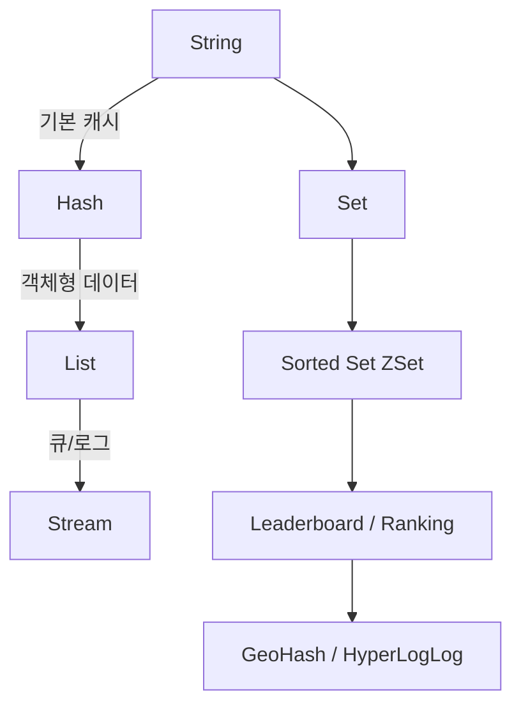

#### 요약

- Redis는 단순한 Key-Value 저장소가 아닌,  
  **다양한 자료구조(String, Hash, List, Set, Sorted Set, Stream 등)** 를 지원하는 인메모리 데이터베이스다.  
- 각 자료구조는 서로 다른 **시간 복잡도, 메모리 효율, 사용 패턴**을 가진다.  
- 실무에서는 **캐싱, 세션, 랭킹, 큐, 메시징, 집계 통계** 등 다양한 형태로 활용된다.

Redis의 자료구조는 단순한 Key-Value를 넘어,
**데이터 패턴 자체를 메모리에서 즉시 처리**할 수 있게 한다.
효율적인 자료구조 선택은 성능 향상뿐 아니라
데이터 모델링의 단순화에도 큰 영향을 준다.

서비스 요구사항에 맞는 구조(String, Hash, Set, Stream 등)를
적절히 조합하는 것이 Redis 실무 활용의 핵심이다.


**핵심 요약**
1. 주요 자료구조: String, Hash, List, Set, ZSet, Stream  
2. 고급 자료구조: Bitmap, HyperLogLog, GeoHash  
3. 각 구조별 CRUD 명령어와 시간 복잡도  
4. 실무 예시: 카운터, 랭킹, 팔로우 관계, 메시지 스트림  

##### 참고자료  
- [Redis Data Types](https://redis.io/docs/data-types/)  
- [Redis Commands Reference](https://redis.io/commands/)  


##### Redis 자료구조 관계 다이어그램



---


#### 1. Redis의 자료구조 개요

| 자료구조 | 설명 | 대표 명령어 | 주요 사용 사례 |
|-----------|------|--------------|----------------|
| **String** | 기본 Key-Value 문자열 | `SET`, `GET`, `INCR` | 캐시, 카운터 |
| **Hash** | 필드-값 구조체 | `HSET`, `HGET`, `HDEL` | 사용자 정보, 객체 저장 |
| **List** | 순서가 있는 큐(Queue) | `LPUSH`, `RPUSH`, `LPOP`, `BRPOP` | 작업 큐, 로그 |
| **Set** | 중복 없는 집합 | `SADD`, `SMEMBERS`, `SINTER` | 팔로우 관계, 추천 |
| **Sorted Set (ZSet)** | 점수 기반 정렬된 집합 | `ZADD`, `ZRANGE`, `ZREVRANK` | 랭킹, 점수 시스템 |
| **Stream** | 메시지 큐, 로그 스트림 | `XADD`, `XREADGROUP` | 이벤트 처리, 실시간 데이터 |

---

#### 2. String

##### 기본 명령어
```bash
SET user:1:name "Ingeun"
GET user:1:name
INCR user:1:login_count
```

##### 예시 (FastAPI)

```python
await redis.set("page:view", 0)
await redis.incr("page:view")
```

##### 특징

* 단일 Key에 최대 512MB까지 저장 가능
* 카운터, 플래그, 캐시 등에서 가장 많이 사용됨

---

#### 3. Hash

##### 기본 명령어

```bash
HSET user:1 name "Ingeun" age 30
HGET user:1 name
HGETALL user:1
```

##### 예시 (Spring Boot)

```java
redisTemplate.opsForHash().put("user:1", "email", "user@example.com");
redisTemplate.opsForHash().entries("user:1");
```

##### 특징

* 필드 단위로 접근 가능 (JSON 형태 대체 가능)
* 객체형 데이터 저장 시 유용

---

#### 4. List

##### 기본 명령어

```bash
LPUSH queue:email "user1"
RPUSH queue:email "user2"
LPOP queue:email
```

##### 예시 (Node.js)

```js
await redis.lpush("queue:mail", JSON.stringify({ to: "user@site.com" }));
const job = await redis.rpop("queue:mail");
```

##### 특징

* **FIFO/LIFO** 큐 구현에 적합
* 블로킹 명령(`BRPOP`)으로 실시간 큐 가능

---

#### 5. Set

##### 기본 명령어

```bash
SADD follow:user1 user2 user3
SMEMBERS follow:user1
SINTER follow:user1 follow:user2
```

##### 예시 (NestJS)

```ts
await this.redis.sadd("follow:1001", "1002", "1003");
const friends = await this.redis.smembers("follow:1001");
```

##### 특징

* 중복 제거 자동 처리
* 교집합(`SINTER`) 기반 추천 시스템 구현 가능

---

#### 6. Sorted Set (ZSet)

##### 기본 명령어

```bash
ZADD ranking 100 "Ingeun" 250 "Somi" 300 "Taeyang"
ZRANGE ranking 0 -1 WITHSCORES
ZREVRANK ranking "Somi"
```

##### 예시 (Spring Boot)

```java
redisTemplate.opsForZSet().add("ranking", "player1", 150);
Set<ZSetOperations.TypedTuple<Object>> rank = redisTemplate.opsForZSet().reverseRangeWithScores("ranking", 0, 9);
```

##### 특징

* 점수를 기준으로 자동 정렬
* 랭킹, 점수판, 인기글 순위 등에 활용

---

#### 7. Stream

##### 기본 명령어

```bash
XADD mystream * sensor-id 1234 temperature 19.8
XREAD COUNT 2 STREAMS mystream 0
XGROUP CREATE mystream groupA $
```

##### 예시 (FastAPI)

```python
await redis.xadd("event:log", {"user": "ingeun", "action": "login"})
entries = await redis.xread({"event:log": "0-0"})
```

##### 특징

* 메시지 큐와 유사한 **비동기 데이터 스트림**
* 소비자 그룹(`Consumer Group`) 기반 분산 처리 가능
* Kafka 대체용으로 경량 실시간 처리에 적합

---

#### 8. 고급 자료구조

| 자료구조            | 명령어                              | 설명              | 활용 사례            |
| --------------- | -------------------------------- | --------------- | ---------------- |
| **Bitmap**      | `SETBIT`, `GETBIT`, `BITCOUNT`   | 비트 단위 데이터 저장    | 출석 체크, 플래그 저장    |
| **HyperLogLog** | `PFADD`, `PFCOUNT`               | 중복 제거된 고유 수 카운트 | 방문자 수, Unique 집계 |
| **GeoHash**     | `GEOADD`, `GEODIST`, `GEORADIUS` | 위경도 좌표 데이터 관리   | 위치 기반 서비스        |

---

#### 9. 실무 활용 예시

##### (1) 사용자 활동 카운터

```python
await redis.incr("visit:page:home")
```

##### (2) 랭킹 시스템

```bash
ZINCRBY ranking 10 "player1"
ZREVRANGE ranking 0 2 WITHSCORES
```

##### (3) 팔로우 관계 저장

```bash
SADD follow:1001 1002 1003
```

##### (4) 실시간 이벤트 스트림

```bash
XADD event:login * user "ingeun" time "2025-10-27T15:00"
```

---

