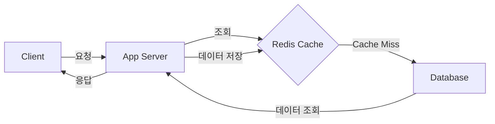
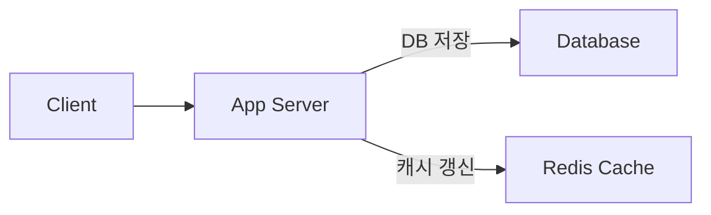
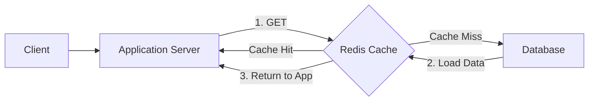

#### 요약

- Redis는 **초고속 캐싱 계층(Cache Layer)** 으로 가장 널리 활용된다.  
- 주요 전략은 **Cache-Aside, Write-Through, Write-Behind** 방식으로 구분되며,  
  TTL(만료 시간)과 Eviction(삭제 정책)을 함께 구성해야 안정적인 캐시 관리가 가능하다.  
- 캐시 무효화(Cache Invalidation)와 데이터 일관성 관리가  
  실무 운영 품질을 결정짓는 핵심이다.

Redis 캐시는 단순한 “속도 향상 도구”를 넘어,
**데이터 일관성과 시스템 안정성을 좌우하는 핵심 계층**이다.
TTL, Eviction, 캐시 무효화 전략을 적절히 조합해야
성능 저하 없이 안정적인 시스템을 운영할 수 있다.

“**캐시 관리 전략은 성능보다 일관성을 먼저 고려해야 한다**”
— 실무에서는 캐시 적중률보다, 데이터 정확도가 더 중요하다.

**핵심 요약**
1. 캐싱 전략: Cache-Aside / Write-Through / Write-Behind  
2. TTL 설정과 만료 정책  
3. Eviction 정책 (LRU, LFU, Random 등)  
4. 데이터 일관성 문제 해결  
5. 프레임워크별 캐싱 구현 예시  

##### 참고자료  
- [Redis Caching Patterns](https://redis.io/docs/latest/develop/use/patterns/caching/)  
- [Spring Cache Abstraction](https://docs.spring.io/spring-framework/reference/integration/cache.html)  
- [NestJS CacheManager](https://docs.nestjs.com/techniques/caching)  
---

#### 1. Redis 캐싱의 필요성

Redis는 디스크 기반 DB와 달리,  
모든 데이터를 메모리에서 관리하기 때문에 **수 밀리초 단위의 응답 속도**를 제공한다.  
API 서버나 마이크로서비스의 **읽기 성능(Read Throughput)** 향상을 위해 캐시 계층으로 주로 사용된다.

| 항목 | 설명 |
|------|------|
| **읽기 성능 향상** | DB 부하 감소 및 지연시간 최소화 |
| **비용 효율성** | DB 스케일업보다 캐시 계층 확장이 저렴 |
| **유연한 구조** | TTL, Eviction 등 정책 기반 관리 가능 |
| **다양한 프레임워크 지원** | Spring, FastAPI, Express, NestJS 등 |

---

#### 2. 주요 캐싱 전략

##### (1) Cache-Aside (Lazy Loading)
> **가장 일반적인 방식**



* 캐시에 데이터가 없으면 DB 조회 후 캐시에 저장
* 장점: 필요한 데이터만 캐싱
* 단점: 최초 요청 시 캐시 미스(Cache Miss) 발생

##### 예시 (Spring Boot)

```java
@Cacheable(value = "userCache", key = "#id")
public User getUser(Long id) {
    return userRepository.findById(id).orElseThrow();
}
```

---

##### (2) Write-Through

> **쓰기 시점에 캐시를 함께 갱신하는 방식**



* DB에 쓰기 발생 시 캐시도 즉시 반영
* 장점: 데이터 일관성 우수
* 단점: 쓰기 부하 증가

##### 예시 (Node.js)

```js
await db.insertUser(user);
await redis.set(`user:${user.id}`, JSON.stringify(user));
```

---

##### (3) Write-Behind (Write-Back)

> **캐시에 먼저 쓰고, 이후 비동기로 DB 반영**

* 캐시가 주도적으로 데이터를 관리하며, 일정 주기마다 DB에 동기화
* 장점: 쓰기 속도 빠름
* 단점: 장애 시 데이터 손실 위험

##### 예시 (FastAPI)

```python
await redis.set("order:123", json.dumps(order))
# background task로 DB에 반영
```

---

#### 3. TTL(만료 시간) 설정

TTL(Time To Live)은 캐시의 유효 기간을 의미한다.
적절한 TTL은 메모리 효율과 데이터 신선도 사이의 균형을 맞춘다.

| 명령어                  | 설명     | 예시                      |
| -------------------- | ------ | ----------------------- |
| `EXPIRE key seconds` | TTL 설정 | `EXPIRE session:1 3600` |
| `TTL key`            | TTL 확인 | `TTL session:1`         |
| `PERSIST key`        | TTL 제거 | `PERSIST session:1`     |

##### 예시 (FastAPI)

```python
await redis.set("token:user1", "xyz123", ex=300)
```

##### 예시 (Spring Boot)

```java
redisTemplate.opsForValue().set("user:cache", user, 5, TimeUnit.MINUTES);
```

---

#### 4. 캐시 무효화(Cache Invalidation)

데이터 변경이 발생했을 때 **오래된 캐시(Old Cache)** 가 남는 현상을 방지해야 한다.

| 전략                          | 설명                      |
| --------------------------- | ----------------------- |
| **TTL 기반 자동 만료**            | TTL 도달 시 자동 삭제          |
| **명시적 삭제 (Evict)**          | 데이터 갱신 시 캐시 제거          |
| **버전 키 사용 (Versioned Key)** | 데이터 버전 관리로 Key 변경       |
| **이벤트 기반 무효화**              | Pub/Sub로 변경 이벤트 감지 후 삭제 |

##### 예시 (NestJS)

```ts
await this.cacheManager.del(`user:${userId}`);
```

##### 예시 (Spring Boot)

```java
@CacheEvict(value = "userCache", key = "#id")
public void updateUser(Long id, User user) {
    userRepository.save(user);
}
```

---

#### 5. 메모리 관리 및 Eviction 정책

Redis는 `maxmemory`를 초과할 경우 **Eviction Policy**에 따라 데이터를 삭제한다.

| 정책             | 설명                 | 특징           |
| -------------- | ------------------ | ------------ |
| `volatile-lru` | TTL이 있는 키 중 LRU 제거 | 일반적          |
| `allkeys-lru`  | 모든 키 중 LRU 제거      | 캐시 전용 서버에 적합 |
| `allkeys-lfu`  | 접근 빈도 낮은 키 제거      | Redis 4.0+   |
| `volatile-ttl` | TTL이 가장 짧은 키 제거    | 예측 가능        |
| `noeviction`   | 삭제 안 함(오류 발생)      | DB 모드용       |

##### 설정 예시

```conf
maxmemory 256mb
maxmemory-policy allkeys-lru
```

---

#### 6. 데이터 일관성 관리

Redis 캐시는 DB와 데이터 불일치(Inconsistency)가 발생할 수 있다.
이를 방지하기 위한 주요 기법은 다음과 같다.

| 기법                        | 설명                       |
| ------------------------- | ------------------------ |
| **Double Delete Pattern** | DB 갱신 후 캐시 삭제 → 지연 후 재삭제 |
| **Versioned Key**         | 캐시 키에 버전 넘버 부여           |
| **TTL 보조 사용**             | 데이터 주기적 갱신 유도            |

##### Double Delete Pattern (예시)

```js
// Node.js
await db.updateUser(id, data);
await redis.del(`user:${id}`);
setTimeout(() => redis.del(`user:${id}`), 100);
```

---

#### 7. 캐시 계층 구조 예시 (Mermaid)



---

#### 8. 프레임워크별 캐싱 구현

##### (1) Spring Boot

```java
@EnableCaching
@Service
public class UserService {
  @Cacheable(value = "userCache", key = "#id")
  public User getUser(Long id) {
      return userRepository.findById(id).orElseThrow();
  }
}
```

##### (2) FastAPI

```python
@router.get("/user/{id}")
async def get_user(id: int):
    cached = await redis.get(f"user:{id}")
    if cached:
        return json.loads(cached)
    user = db.get_user(id)
    await redis.set(f"user:{id}", json.dumps(user), ex=600)
    return user
```

##### (3) NestJS

```ts
@Cacheable()
@Get(':id')
async getUser(@Param('id') id: string) {
  const user = await this.userService.findOne(id);
  await this.cacheManager.set(`user:${id}`, user, { ttl: 600 });
  return user;
}
```

---


