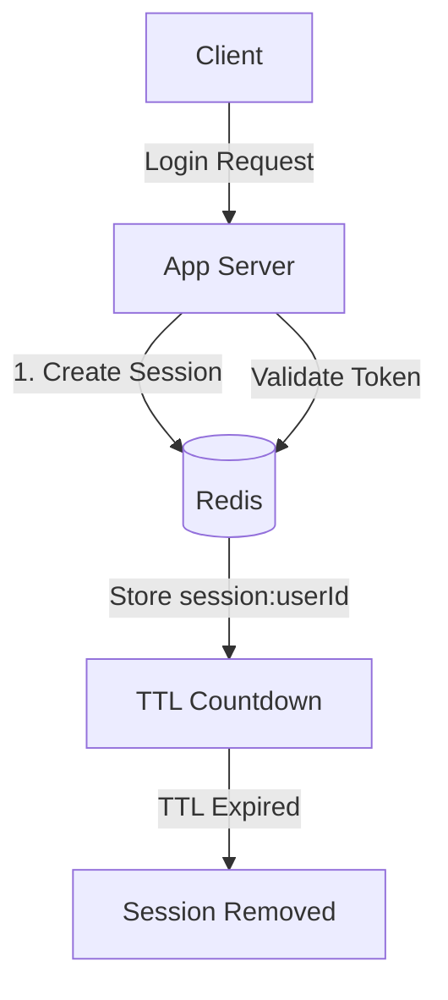

#### 요약

- Redis는 사용자 세션(session) 데이터를 저장하는 **가장 널리 쓰이는 인메모리 저장소**다.  
- 로그인 상태, JWT 블랙리스트, OAuth2 토큰, CSRF 방지 토큰 등을  
  빠르고 안전하게 관리할 수 있다.  
- TTL(만료 시간)과 키 네임스페이스를 이용하면  
  **자동 로그아웃, 중복 로그인 방지, 블랙리스트 관리**를 효과적으로 구현할 수 있다.


Redis는 세션 및 인증 관리에서
**“속도 + 확장성 + TTL 기반 제어”** 를 모두 만족하는 솔루션이다.

특히 다중 서버 환경에서 **세션 동기화 문제를 해결**하고,
JWT나 OAuth2 환경에서도 Redis를 활용한 **토큰 블랙리스트 및 자동 만료 관리**가 가능하다.

보안성과 성능을 모두 고려한 세션 구조 설계는
**Redis 운영의 핵심 성공 포인트**다.


**핵심 요약**
1. Redis 세션 저장 구조 (Key: `session:{userId}`)  
2. 세션 TTL 관리 및 자동 만료  
3. JWT / Access Token 블랙리스트 처리  
4. 프레임워크별 세션 연동 예시  
5. OAuth2 및 다중 로그인 제어 패턴  

---

##### 참고자료  
- [Spring Session Redis](https://docs.spring.io/spring-session/reference/guides/boot-redis.html)  
- [FastAPI Session Middleware](https://fastapi.tiangolo.com/advanced/middleware/)  
- [NestJS Session / CacheStore](https://docs.nestjs.com/techniques/caching)  

##### Redis 세션 구조 다이어그램



---

#### 1. Redis 기반 세션 관리의 장점

| 항목 | 설명 |
|------|------|
| **속도** | 메모리 기반이라 로그인·인증 요청을 실시간 처리 가능 |
| **확장성** | 여러 서버 간 세션 공유 (Sticky Session 불필요) |
| **TTL 자동 만료** | 세션 만료 시간으로 자동 로그아웃 구현 |
| **보안성** | 서버 측 세션 데이터 관리로 클라이언트 조작 방지 |

---

#### 2. 세션 키 구조 설계

| 항목 | 키 네이밍 예시 | 설명 |
|------|----------------|------|
| 사용자 세션 | `session:{userId}` | 로그인 상태 및 토큰 저장 |
| JWT 블랙리스트 | `jwt:blacklist:{tokenId}` | 만료 또는 강제 로그아웃된 토큰 |
| CSRF 토큰 | `csrf:{sessionId}` | 요청 검증용 토큰 |
| Refresh Token | `refresh:{userId}` | 액세스 토큰 재발급용 |

---

#### 3. TTL을 이용한 세션 만료 관리

##### 설정 예시
```bash
SETEX session:1001 3600 '{"user":"ingeun","role":"admin"}'
```

| 명령어                  | 설명          |
| -------------------- | ----------- |
| `EXPIRE key seconds` | TTL 지정      |
| `TTL key`            | 남은 만료 시간 조회 |
| `PERSIST key`        | TTL 제거      |

> TTL은 “자동 로그아웃”이나 “휴면 계정 처리” 같은 시나리오에 유용하다.

---

#### 4. Spring Boot 세션 연동 예시

```java
@Configuration
@EnableRedisHttpSession(maxInactiveIntervalInSeconds = 1800)
public class RedisSessionConfig {

    @Bean
    public LettuceConnectionFactory connectionFactory() {
        return new LettuceConnectionFactory();
    }
}
```

```java
// Controller 예시
@GetMapping("/me")
public ResponseEntity<User> getUser(HttpSession session) {
    return ResponseEntity.ok((User) session.getAttribute("user"));
}
```

| 설정 항목                          | 설명                        |
| ------------------------------ | ------------------------- |
| `@EnableRedisHttpSession`      | Spring Session을 Redis로 저장 |
| `maxInactiveIntervalInSeconds` | 세션 TTL 지정 (초 단위)          |

---

#### 5. FastAPI 세션 예시

```python
from fastapi import FastAPI, Request
from fastapi.middleware.sessions import SessionMiddleware
import aioredis, json

app = FastAPI()
app.add_middleware(SessionMiddleware, secret_key="supersecret")

@app.post("/login")
async def login(request: Request):
    session = request.session
    session["user"] = "ingeun"
    redis = await aioredis.from_url("redis://localhost")
    await redis.setex(f"session:{session['user']}", 3600, json.dumps(session))
    return {"message": "login success"}
```

> Redis를 세션 저장소로 사용하면 **다중 인스턴스 서버 간 로그인 상태를 공유**할 수 있다.

---

#### 6. Node.js / Express 세션 예시

```js
import express from "express";
import session from "express-session";
import connectRedis from "connect-redis";
import { createClient } from "redis";

const RedisStore = connectRedis(session);
const redisClient = createClient();

const app = express();
app.use(session({
  store: new RedisStore({ client: redisClient }),
  secret: "supersecret",
  resave: false,
  saveUninitialized: false,
  cookie: { maxAge: 600000 }
}));

app.get("/login", (req, res) => {
  req.session.user = "ingeun";
  res.send("Logged in!");
});
```

| 설정 항목           | 설명                     |
| --------------- | ---------------------- |
| `connect-redis` | Express용 Redis 세션 미들웨어 |
| `cookie.maxAge` | 세션 만료 시간               |
| `store`         | Redis 연결 설정            |

---

#### 7. NestJS 세션 및 인증 예시

```ts
import { Injectable } from "@nestjs/common";
import { InjectRedis } from "@nestjs-modules/ioredis";
import { Redis } from "ioredis";

@Injectable()
export class AuthService {
  constructor(@InjectRedis() private readonly redis: Redis) {}

  async setSession(userId: string, token: string) {
    await this.redis.set(`session:${userId}`, token, "EX", 3600);
  }

  async validateSession(userId: string, token: string) {
    const stored = await this.redis.get(`session:${userId}`);
    return stored === token;
  }
}
```

---

#### 8. JWT 블랙리스트 관리

JWT는 Stateless하므로 서버가 직접 폐기 상태를 관리해야 한다.
Redis에 “블랙리스트 키”를 등록하여 만료된 토큰을 추적한다.

```bash
SETEX jwt:blacklist:{jti} 3600 "revoked"
```

##### 검증 로직 (FastAPI 예시)

```python
def verify_token(jti: str):
    revoked = redis.get(f"jwt:blacklist:{jti}")
    if revoked:
        raise HTTPException(status_code=401, detail="Token revoked")
```

---

#### 9. 다중 로그인 제어 (Single Session Enforcement)

1. 로그인 시 기존 세션이 있으면 삭제
2. 새로운 세션으로 교체 저장

```js
const oldSession = await redis.get(`session:${userId}`);
if (oldSession) await redis.del(`session:${userId}`);
await redis.set(`session:${userId}`, token, "EX", 3600);
```

> 이를 통해 한 사용자가 동시에 여러 기기에서 로그인하는 것을 제한할 수 있다.

---

