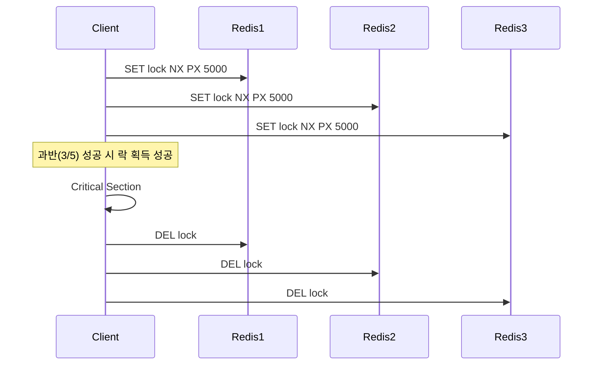

#### 요약

- Redis는 **MULTI / EXEC / WATCH** 명령어를 통해 기본적인 트랜잭션(ACID 유사 동작)을 제공한다.  
- 단일 노드 내에서는 원자적 연산을 보장하지만, 분산 환경에서는 **RedLock** 같은 알고리즘을 이용해야 한다.  
- 실무에서는 데이터 동시 수정, 중복 처리, 재시도 정책 등과 함께 사용되어야 안정성이 확보된다.


Redis 트랜잭션은 단일 노드 내에서는 강력하지만,
분산 환경에서는 별도의 락 메커니즘이 필요하다.

* **WATCH + MULTI**: 단일 노드 낙관적 트랜잭션
* **Lua Script**: 원자적 연산 구현
* **SET NX PX / RedLock**: 분산 락 관리

Redis의 트랜잭션과 락은 단순한 데이터 보호가 아니라,
**“동시성 제어의 핵심 구성요소”** 로써
안정적이고 예측 가능한 시스템 운영을 가능하게 한다.

**핵심 요약**
1. 트랜잭션 구성: MULTI / EXEC / DISCARD / WATCH  
2. Lua Script 기반 원자 연산  
3. 분산 락(Distributed Lock) 개념 및 구현  
4. RedLock 알고리즘 구조  
5. 프레임워크별 락 적용 예시 (Spring, FastAPI, Node.js, NestJS)  

---

##### 참고자료  
- [Redis Transactions](https://redis.io/docs/latest/develop/reference/transactions/)  
- [Redisson Lock Documentation](https://github.com/redisson/redisson/wiki)  
- [Redis Pipelining & Lua Script](https://redis.io/docs/interact/programmability/eval-intro/)  

---

#### 1. Redis 트랜잭션 개요

Redis 트랜잭션은 여러 명령을 하나의 **원자적 실행 단위(Atomic Unit)** 로 묶는 기능이다.  
트랜잭션은 `MULTI`로 시작해 `EXEC`으로 커밋되며,  
모든 명령은 순차적으로 실행된다.

| 명령어 | 설명 |
|--------|------|
| `MULTI` | 트랜잭션 시작 |
| `EXEC` | 모든 명령 실행 |
| `DISCARD` | 트랜잭션 취소 |
| `WATCH` | 특정 키 변경 감시 (낙관적 락) |

---

#### 2. 트랜잭션 기본 사용 예시

```bash
MULTI
SET user:1:name "ingeun"
INCR user:1:login_count
EXEC
````

> 위 명령어들은 한 번의 실행 단위로 처리되며, 중간에 오류가 발생하면 전체 취소되지 않고
> 나머지 명령은 계속 실행된다. (Redis는 부분 롤백을 지원하지 않음)

---

#### 3. WATCH를 이용한 낙관적 락(Optimistic Lock)

`WATCH` 명령은 트랜잭션 수행 전 특정 키를 감시하여
다른 클라이언트가 값을 변경하면 `EXEC`이 실패하게 한다.

```bash
WATCH balance:user1
val = GET balance:user1
if val > 100:
  MULTI
  DECRBY balance:user1 100
  INCRBY balance:user2 100
  EXEC
else:
  UNWATCH
```

##### 예시 (Python - FastAPI)

```python
async with redis.client() as conn:
    await conn.watch("balance:user1")
    bal = int(await conn.get("balance:user1"))
    if bal > 100:
        pipe = conn.multi_exec()
        pipe.decrby("balance:user1", 100)
        pipe.incrby("balance:user2", 100)
        await pipe.execute()
```

---

#### 4. Lua Script 기반 원자 연산

Redis는 **Lua Script (`EVAL`)** 로 복잡한 연산을 원자적으로 처리할 수 있다.

```bash
EVAL "local bal=redis.call('GET','balance:user1'); 
if tonumber(bal)>=100 then 
  redis.call('DECRBY','balance:user1',100); 
  redis.call('INCRBY','balance:user2',100); 
  return 'ok'; 
else return 'fail'; end" 0
```

##### 장점

* 모든 명령이 단일 스레드 내에서 실행 → 완전한 원자성 보장
* WATCH보다 빠르고 단순

---

#### 5. 분산 락 (Distributed Lock)

분산 환경에서는 다중 인스턴스가 동시에 데이터를 수정할 수 있으므로
**락(Lock)** 으로 임계 구역(Critical Section)을 보호해야 한다.

##### 단일 노드 기준 구현

```bash
SET lock:order:123 "locked" NX PX 5000
```

| 옵션   | 설명                   |
| ---- | -------------------- |
| `NX` | 키가 존재하지 않을 때만 설정     |
| `PX` | TTL(만료 시간) 밀리초 단위 지정 |

##### 해제

```bash
DEL lock:order:123
```

---

#### 6. RedLock 알고리즘 개요

> Redis 창시자 Salvatore Sanfilippo가 제안한 **분산 락 표준 알고리즘**

**구성 원칙**

1. 5개의 독립적인 Redis 노드 사용
2. 클라이언트는 과반(3/5)의 노드에서 락 획득 시 성공으로 간주
3. 전체 TTL 내에서만 유효, 만료 시 자동 해제
4. 시계 동기화 필요 없음 (상대적 시간 기반)

##### Mermaid 다이어그램



---

#### 7. Spring Boot Redisson 예시

```java
@Autowired
private RedissonClient redissonClient;

public void executeCriticalSection() {
    RLock lock = redissonClient.getLock("lock:order:123");
    try {
        if (lock.tryLock(5, 10, TimeUnit.SECONDS)) {
            // 임계 구역 실행
            processOrder();
        }
    } catch (Exception e) {
        e.printStackTrace();
    } finally {
        lock.unlock();
    }
}
```

| 설정 항목                          | 설명                |
| ------------------------------ | ----------------- |
| `tryLock(waitTime, leaseTime)` | 락 시도 시간, TTL 설정   |
| `RLock`                        | Redisson의 분산 락 객체 |

---

#### 8. FastAPI 분산 락 예시

```python
import aioredis, asyncio

async def acquire_lock(redis, key, ttl=5000):
    result = await redis.set(key, "locked", nx=True, px=ttl)
    return result is not None

async def release_lock(redis, key):
    await redis.delete(key)

# 사용 예시
if await acquire_lock(redis, "lock:task", 5000):
    try:
        print("locked")
    finally:
        await release_lock(redis, "lock:task")
```

---

#### 9. Node.js / NestJS 분산 락 예시

```ts
import { Injectable } from "@nestjs/common";
import { Redis } from "ioredis";

@Injectable()
export class LockService {
  constructor(private readonly redis: Redis) {}

  async acquireLock(key: string, ttl = 5000): Promise<boolean> {
    const result = await this.redis.set(key, "locked", "NX", "PX", ttl);
    return result === "OK";
  }

  async releaseLock(key: string) {
    await this.redis.del(key);
  }
}
```

---

#### 10. 트랜잭션 & 락의 실무적 결합

| 상황             | 해결 방식                   |
| -------------- | ----------------------- |
| 다중 사용자 포인트 차감  | WATCH + MULTI           |
| 주문 결제 동시성 제어   | SET NX PX 락 사용          |
| 메시지 큐 중복 처리 방지 | Lua Script로 원자적 삽입      |
| 임계 구역 보호       | Redisson / ioredis 기반 락 |

---

