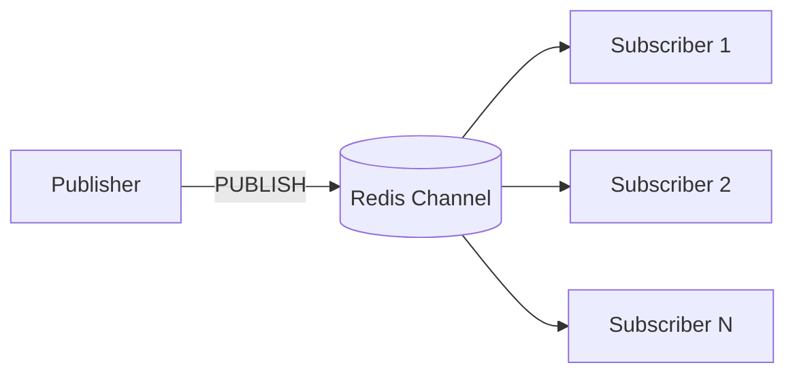
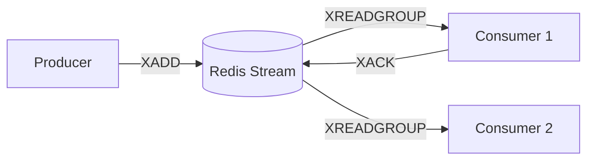
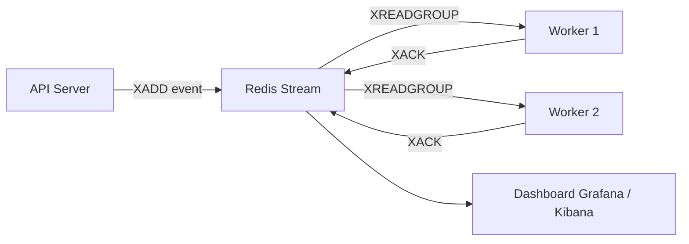

#### 요약

- Redis는 **비동기 이벤트 기반 통신**을 위한 두 가지 주요 기능을 제공한다:  
  **Pub/Sub (단순 메시징)** 과 **Stream (지속형 메시징)**.  
- Pub/Sub은 즉시 전송되는 실시간 이벤트용,  
  Stream은 소비자 그룹과 오프셋 관리를 지원하는 **내구성 있는 메시지 큐**로 사용된다.  
- Stream은 Kafka, RabbitMQ를 대체할 수 있는 **경량 이벤트 브로커**로 각광받고 있다.

* Pub/Sub은 **속도 중심**, Stream은 **내구성 중심**.
* Stream은 Redis 내부에서 Kafka 대체용으로 사용 가능하며,
  Consumer Group을 이용하면 고신뢰 메시지 처리 파이프라인 구축이 가능하다.
* 실무에서는 Pub/Sub으로 **경량 알림 처리**,
  Stream으로 **비동기 큐 및 이벤트 로그 처리**를 결합하는 것이 이상적이다.


**핵심 요약**
1. Pub/Sub 구조 및 명령어  
2. Stream 구조와 Consumer Group  
3. 실시간 이벤트, 로그, 알림, 큐 처리 예시  
4. Kafka 등 MQ 시스템과 비교  
5. Spring Boot / FastAPI / Node.js / NestJS 예시  

---

##### 참고자료  
- [Redis Pub/Sub](https://redis.io/docs/latest/develop/interact/pubsub/)  
- [Redis Streams Guide](https://redis.io/docs/latest/develop/data-types/streams/)  
- [Redisson Topic API](https://github.com/redisson/redisson/wiki/12.-distributed-collections)  

---

#### 1. Pub/Sub 구조 개요

Redis의 **Publish / Subscribe** 모델은  
하나의 채널(Channel)에 다수의 클라이언트가 구독(Subscribe)하고,  
발행(Publish)된 메시지를 동시에 수신하는 구조다.

| 명령어 | 설명 | 예시 |
|--------|------|------|
| `SUBSCRIBE channel` | 채널 구독 | `SUBSCRIBE news` |
| `PUBLISH channel message` | 메시지 발행 | `PUBLISH news "Hello!"` |
| `UNSUBSCRIBE` | 구독 해제 | `UNSUBSCRIBE news` |

##### Pub/Sub 구조 (Mermaid)


---

#### 2. Pub/Sub 기본 사용 예시

##### CLI 예시

```bash
# 터미널 1
SUBSCRIBE notice

# 터미널 2
PUBLISH notice "Server Maintenance at 03:00"
```

##### Node.js 예시

```js
import Redis from "ioredis";
const pub = new Redis();
const sub = new Redis();

sub.subscribe("notice", () => console.log("Subscribed!"));
sub.on("message", (ch, msg) => console.log(`Message: ${msg}`));

pub.publish("notice", "Hello Subscribers!");
```

##### FastAPI 예시

```python
import asyncio, aioredis

async def pubsub():
    redis = await aioredis.from_url("redis://localhost")
    pub = redis
    sub = redis.pubsub()
    await sub.subscribe("news")
    asyncio.create_task(listen(sub))
    await pub.publish("news", "Breaking News")

async def listen(sub):
    async for msg in sub.listen():
        print(msg)

asyncio.run(pubsub())
```

---

#### 3. Pub/Sub의 특징과 한계

| 항목          | 설명                              |
| ----------- | ------------------------------- |
| **장점**      | 단순하고 빠른 실시간 이벤트 처리              |
| **단점**      | 메시지가 저장되지 않음 (오프라인 클라이언트 수신 불가) |
| **적합한 사례**  | 채팅, 알림, 실시간 모니터링 등              |
| **부적합한 사례** | 메시지 유실이 허용되지 않는 업무 큐            |

---

#### 4. Redis Streams 개요

Redis 5.0부터 도입된 **Stream**은
메시지를 저장하고 오프셋을 관리하는 구조로,
Kafka와 유사한 **Persistent Log** 모델을 지원한다.

| 명령어          | 설명           | 예시                                          |
| ------------ | ------------ | ------------------------------------------- |
| `XADD`       | 메시지 추가       | `XADD mystream * user ingeun msg "hi"`      |
| `XRANGE`     | 범위 조회        | `XRANGE mystream - +`                       |
| `XREADGROUP` | 그룹별 메시지 읽기   | `XREADGROUP GROUP g1 c1 STREAMS mystream >` |
| `XACK`       | 메시지 소비 완료 확인 | `XACK mystream g1 164321-0`                 |

##### Stream 구조 (Mermaid)



---

#### 5. Stream 기본 사용 예시

##### CLI 예시

```bash
XADD mystream * user ingeun message "Hello Redis Stream"
XRANGE mystream - +
```

##### Python (FastAPI)

```python
await redis.xadd("events", {"type": "login", "user": "ingeun"})
events = await redis.xread({"events": "0-0"})
```

##### Node.js (NestJS)

```ts
await redis.xadd("queue:task", "*", "task", "email_send");
const data = await redis.xread("BLOCK", 0, "STREAMS", "queue:task", "0");
```

---

#### 6. Stream Consumer Group

Streams는 **소비자 그룹(Consumer Group)** 을 지원한다.
각 그룹은 오프셋을 기억하고, 소비한 메시지를 개별적으로 관리할 수 있다.

```bash
# 그룹 생성
XGROUP CREATE mystream group1 $
# 메시지 소비
XREADGROUP GROUP group1 consumer1 COUNT 1 STREAMS mystream >
# 처리 완료 확인
XACK mystream group1 17123-0
```

##### 특징

* **자동 오프셋 관리**
* **메시지 재처리 가능 (XCLAIM)**
* **병렬 처리 및 소비자 분리**

---

#### 7. Pub/Sub vs Stream 비교

| 구분         | Pub/Sub    | Stream              |
| ---------- | ---------- | ------------------- |
| **메시지 저장** | ❌ (비지속성)   | ✅ (지속성 있음)          |
| **소비자 그룹** | ❌          | ✅                   |
| **오프셋 관리** | ❌          | ✅                   |
| **속도**     | 매우 빠름      | 빠름(약간 오버헤드 있음)      |
| **사용 사례**  | 실시간 알림, 채팅 | 로그 처리, 큐, 이벤트 파이프라인 |

---

#### 8. Spring Boot (Redisson) 예시

##### Pub/Sub

```java
RTopic topic = redissonClient.getTopic("alert");
topic.addListener(String.class, (ch, msg) -> {
    System.out.println("Received: " + msg);
});
topic.publish("System Alert: High CPU");
```

##### Stream (Spring Data Redis)

```java
Record<String, String> record = StreamRecords.string(Collections.singletonMap("event", "login")).withStreamKey("user-events");
redisTemplate.opsForStream().add(record);
```

---

#### 9. 실무 활용 시나리오

| 시나리오          | 권장 방식   | 설명             |
| ------------- | ------- | -------------- |
| **실시간 알림/채팅** | Pub/Sub | 휘발성 메시지, 빠른 전달 |
| **로그/이벤트 큐**  | Stream  | 메시지 저장, 재처리 가능 |
| **결제/주문 처리**  | Stream  | 데이터 유실 방지 필요   |
| **모니터링 알림**   | Pub/Sub | 일회성 알림 전송용     |

---

#### 10. Redis Stream 파이프라인 예시 (Mermaid)



---

