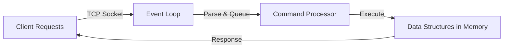
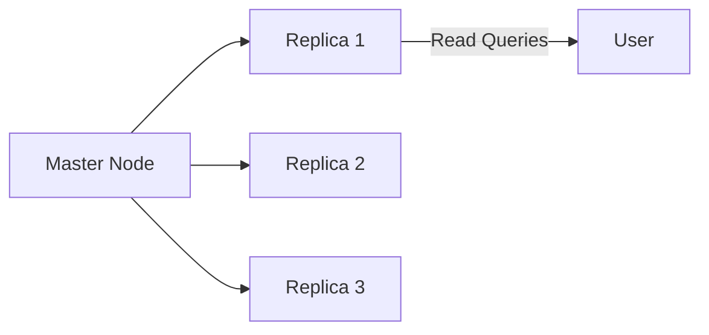
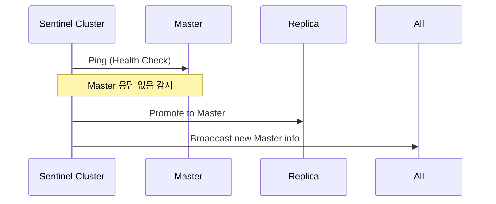
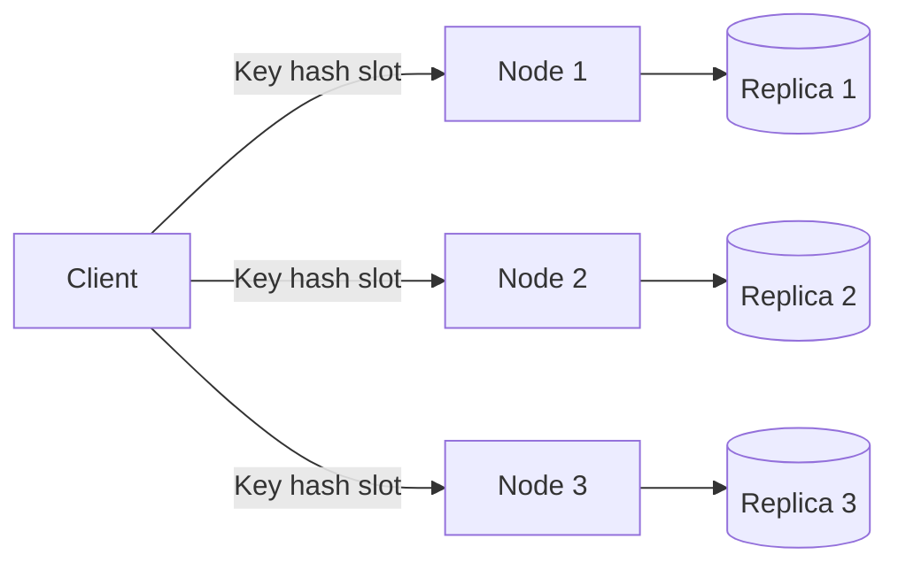

#### 요약

- Redis는 단일 스레드 구조지만 **I/O 멀티플렉싱(Event Loop)** 기반으로 매우 높은 처리량을 제공한다.  
- 성능 최적화의 핵심은 **네트워크 튜닝, 메모리 관리, 파이프라인 처리, 클러스터 구성**에 있다.  
- 확장성은 **샤딩(Sharding)** 과 **레플리카(Replication)**, **Sentinel** 및 **Cluster 모드**로 구현할 수 있다.

Redis는 단일 스레드 기반임에도 불구하고,
**이벤트 루프 + 비동기 I/O + 파이프라인**을 통해 고성능을 유지한다.

성능 최적화는 단순한 튜닝이 아니라
**데이터 구조 선택, 클러스터 설계, 메모리 정책, 복제 전략**이 조합된 종합적인 접근이 필요하다.

> 안정적이고 빠른 Redis 운영의 핵심은
> “**메모리 효율성과 분산 확장성의 균형**”이다.


**핵심 요약**
1. Redis 성능 구조 이해 (I/O 모델, 단일 스레드)  
2. 메모리 관리 및 Eviction 정책  
3. 파이프라인과 Lua Script 기반 최적화  
4. 복제(Replication)와 Sentinel 구조  
5. Redis Cluster 구성 및 샤딩 전략  

---

##### 참고자료  
- [Redis Performance Tuning Guide](https://redis.io/docs/latest/operate/oss_and_stack/management/optimization/)  
- [Redis Cluster Specification](https://redis.io/docs/latest/operate/oss_and_stack/management/scaling/)  
- [Redis Memory Optimization](https://redis.io/docs/latest/operate/oss_and_stack/management/memory/)  

---

#### 1. Redis 성능 모델 개요

Redis는 **단일 스레드 + 이벤트 루프(Event Loop)** 구조로 동작한다.  
모든 클라이언트 요청은 하나의 스레드에서 순차적으로 처리되며,  
비동기 I/O로 동시성을 확보한다.

| 항목 | 설명 |
|------|------|
| **Event Loop** | epoll/kqueue 기반 비동기 I/O |
| **Single Thread** | 요청 순차 처리, Context Switching 없음 |
| **Pipeline** | 다중 명령 병렬 전송 |
| **I/O Multiplexing** | 수천 개의 클라이언트 연결 관리 가능 |

##### Redis 내부 구조 (Mermaid)


---

#### 2. 메모리 관리 및 최적화

##### (1) 메모리 제한 설정

```conf
maxmemory 512mb
maxmemory-policy allkeys-lru
```

| 항목                 | 설명                     |
| ------------------ | ---------------------- |
| `maxmemory`        | Redis가 사용할 최대 메모리 크기   |
| `maxmemory-policy` | 초과 시 삭제 정책 (LRU/LFU 등) |

##### (2) 문자열 압축 및 공유

* Redis는 내부적으로 동일 문자열을 공유(`SDS 구조`)하여 메모리 낭비를 최소화
* 짧은 문자열은 `int`로 자동 변환되어 저장됨

##### (3) Hash 구조 최적화

* 작은 해시(`hash-max-ziplist-entries`, `hash-max-ziplist-value`)는 압축 리스트(ziplist)로 저장되어 공간 절약

---

#### 3. 파이프라인(Pipelining) 기반 최적화

파이프라인은 여러 명령을 한 번에 전송하여 RTT(Round Trip Time)를 최소화한다.

##### Python 예시

```python
pipe = redis.pipeline(transaction=False)
for i in range(1000):
    pipe.set(f"user:{i}", f"name{i}")
pipe.execute()
```

##### Node.js 예시

```js
const pipeline = redis.pipeline();
for (let i = 0; i < 1000; i++) pipeline.set(`key:${i}`, `val${i}`);
await pipeline.exec();
```

| 장점          | 설명                |
| ----------- | ----------------- |
| 네트워크 왕복 최소화 | 1회 요청으로 N개 명령 전송  |
| 처리량 향상      | CPU I/O 병목 감소     |
| 트랜잭션 병합 가능  | MULTI/EXEC와 결합 가능 |

---

#### 4. Lua Script 기반 최적화

`EVAL` 명령을 사용하면 **여러 명령을 원자적이고 효율적으로 실행**할 수 있다.
특히 조건 검증 → 데이터 변경 → 로그 기록 같은 복합 로직에서 효과적이다.

```bash
EVAL "redis.call('SET','counter',1); redis.call('INCR','counter');" 0
```

| 장점           | 설명               |
| ------------ | ---------------- |
| 네트워크 오버헤드 감소 | 서버 내부에서 모든 로직 실행 |
| 원자성 보장       | 트랜잭션보다 빠름        |
| 반복 연산 최적화    | 조건/루프 처리 가능      |

---

#### 5. 복제(Replication) 구조

Redis는 기본적으로 **Master-Replica 복제**를 지원한다.
Master는 쓰기를 담당하고, Replica는 읽기 전용으로 복제한다.

```bash
# Replica 설정
replicaof 192.168.0.10 6379
```

##### 특징

* **비동기 복제** (기본)
* **자동 재동기화** 지원
* **읽기 분산** 가능

##### 다이어그램



---

#### 6. Sentinel 구성 (고가용성)

Sentinel은 Redis의 **자동 장애 감지 및 Failover 시스템**이다.

| 구성 요소             | 설명                       |
| ----------------- | ------------------------ |
| **Sentinel 프로세스** | Master/Replica 상태 감시     |
| **Quorum (과반수)**  | 장애 판정 기준                 |
| **Failover**      | Replica를 자동으로 Master로 승격 |

##### 예시 구성 (sentinel.conf)

```conf
sentinel monitor mymaster 127.0.0.1 6379 2
sentinel auth-pass mymaster myPass
sentinel down-after-milliseconds mymaster 5000
```

##### 동작 흐름



---

#### 7. Redis Cluster 구성 (샤딩 및 수평 확장)

Cluster 모드는 데이터를 16,384개의 **슬롯(Slot)** 으로 나누어 저장한다.
각 노드는 슬롯 일부를 관리하며, 자동으로 분산 처리가 이루어진다.

##### 클러스터 초기화

```bash
redis-cli --cluster create \
  192.168.0.10:7000 192.168.0.11:7001 192.168.0.12:7002 \
  --cluster-replicas 1
```

| 항목       | 설명                       |
| -------- | ------------------------ |
| **슬롯 수** | 16,384개                  |
| **라우팅**  | 클라이언트가 자동으로 적절한 노드로 리디렉션 |
| **장점**   | 수평 확장(Scale-Out), 고가용성   |
| **단점**   | 복잡한 구성 및 네트워크 관리 필요      |

##### 다이어그램



---

#### 8. 네트워크 및 I/O 튜닝

| 항목                             | 설정                        | 설명             |
| ------------------------------ | ------------------------- | -------------- |
| **TCP backlog**                | `tcp-backlog 511`         | 대기 큐 크기 증가     |
| **TCP keepalive**              | `tcp-keepalive 60`        | 연결 유지 시간 설정    |
| **I/O 스레드**                    | `io-threads 4` (Redis 6+) | 멀티코어 병렬 처리 가능  |
| **client-output-buffer-limit** | 제한값 조정                    | 대규모 Pub/Sub 대비 |

---

#### 9. 성능 측정 명령어

| 명령어              | 설명          |
| ---------------- | ----------- |
| `INFO stats`     | 서버 통계       |
| `MONITOR`        | 실시간 명령 모니터링 |
| `SLOWLOG get`    | 느린 쿼리 기록    |
| `LATENCY doctor` | 지연 원인 분석    |
| `MEMORY stats`   | 메모리 사용량 분석  |

---

#### 10. 실무 최적화 요약

| 구분             | 주요 포인트                   |
| -------------- | ------------------------ |
| **데이터 구조 최적화** | Hash, List 압축 구조 사용      |
| **메모리 관리**     | LRU 정책, TTL 설정           |
| **네트워크 효율**    | 파이프라인, Lua Script 활용     |
| **확장성**        | Cluster & Sentinel 병행 구성 |
| **읽기 부하 분산**   | Replica 사용               |

---

