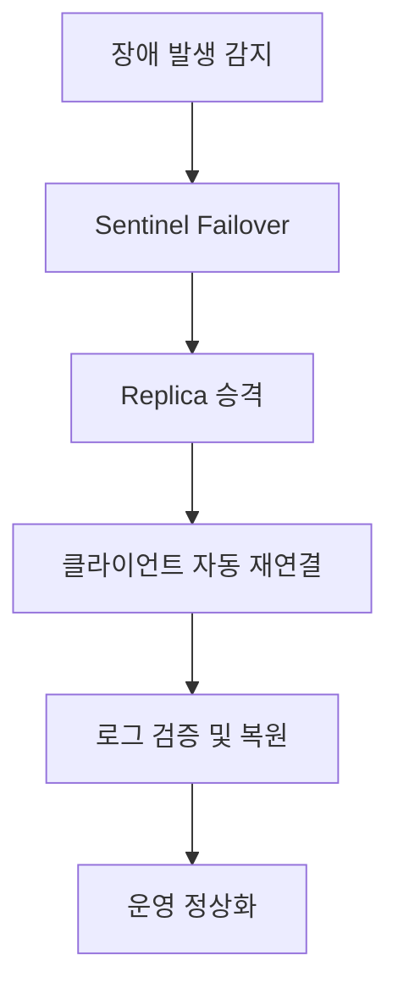

#### 요약

- Redis는 인메모리 기반 시스템이므로 **모니터링과 복구 전략**이 매우 중요하다.  
- 운영자는 **성능 상태(INFO, SLOWLOG, LATENCY)** 를 정기적으로 점검하고,  
  장애 발생 시 **AOF/RDB 복원**, **Sentinel Failover** 등을 통해 즉시 복구할 수 있어야 한다.  
- RedisInsight, Prometheus, Grafana 같은 도구를 이용하면  
  실시간으로 Redis 상태를 시각화하고 알림을 자동화할 수 있다.

Redis는 “**빠르지만 취약한 시스템**”이기 때문에
운영 중 발생하는 메모리, 네트워크, 복제 지연 문제를 꾸준히 관찰해야 한다.

* 장애 감지: **Sentinel + Prometheus + Grafana**
* 복원 전략: **AOF + RDB 병행 백업**
* 실시간 점검: **RedisInsight / SLOWLOG / INFO**

> “Redis는 튜닝보다 모니터링이 먼저다.”
> — 안정적인 Redis 운영의 핵심 원칙.


**핵심 요약**
1. 모니터링 도구 및 명령어  
2. 메모리/성능/네트워크 지표 분석  
3. RedisInsight, Prometheus, Grafana 연동  
4. 장애 원인 진단 및 복구 절차  
5. AOF/RDB 백업 및 복원 전략  

---

##### 참고자료  
- [Redis Monitoring Tools](https://redis.io/docs/latest/operate/oss_and_stack/management/monitoring/)  
- [RedisInsight by Redis Labs](https://redis.io/insight/)  
- [Redis Persistence & Recovery](https://redis.io/docs/latest/operate/oss_and_stack/management/persistence/)  

---

#### 1. Redis 모니터링의 필요성

Redis는 고속 처리 특성상 문제가 생겨도 초기에는 티가 나지 않는다.  
그러나 메모리 한도 초과, 느린 쿼리, I/O 병목이 누적되면  
**응답 지연(latency)과 데이터 유실**로 이어질 수 있다.

| 모니터링 항목 | 설명 |
|----------------|------|
| **Memory Usage** | 메모리 점유량, key 개수, eviction 발생 여부 |
| **CPU & Command Stats** | 명령어별 처리 비율, QPS(Query per Second) |
| **Latency** | 평균 응답시간 및 지연 원인 |
| **Persistence** | RDB/AOF 백업 상태 |
| **Replication** | Replica 동기화 여부 |
| **Network** | 연결 수, 클라이언트 블로킹 상태 |

---

#### 2. 주요 모니터링 명령어

| 명령어 | 설명 | 활용 예시 |
|--------|------|-----------|
| `INFO` | 전체 서버 상태 요약 | `INFO memory`, `INFO stats` |
| `MONITOR` | 실시간 명령 로그 출력 | `MONITOR` |
| `SLOWLOG get` | 느린 명령어 기록 조회 | `SLOWLOG get 10` |
| `LATENCY doctor` | 지연 분석 보고서 | `LATENCY doctor` |
| `CLIENT LIST` | 연결된 클라이언트 목록 | `CLIENT LIST` |
| `KEYS *` | 전체 키 스캔(주의 필요) | 진단용 제한적 사용 |

##### 예시
```bash
127.0.0.1:6379> INFO memory
used_memory_human:256.73M
maxmemory_human:512.00M
evicted_keys:123
```

---

#### 3. RedisInsight 대시보드 예시

**RedisInsight**는 Redis Labs가 제공하는 공식 GUI 관리 도구로,
명령 실행, 메모리 구조 분석, 모니터링을 한눈에 볼 수 있다.

| 기능                   | 설명               |
| -------------------- | ---------------- |
| **Command Explorer** | 실시간 명령 실행 및 시각화  |
| **Memory Analyzer**  | 키별 메모리 점유량 분석    |
| **Slowlog Viewer**   | 느린 쿼리 분석         |
| **Stream Viewer**    | Stream 데이터 구조 확인 |

##### 실행

```bash
docker run -d \
  --name redisinsight \
  -p 8001:8001 \
  redis/redisinsight:latest
```

> 브라우저에서 `http://localhost:8001` 접속 후 Redis 인스턴스 등록

---

#### 4. Prometheus + Grafana 통합

##### (1) Redis Exporter 설치

```bash
docker run -d \
  --name redis-exporter \
  -p 9121:9121 \
  oliver006/redis_exporter --redis.addr=redis://host.docker.internal:6379
```

##### (2) Prometheus 설정

```yaml
scrape_configs:
  - job_name: redis
    static_configs:
      - targets: ['redis-exporter:9121']
```

##### (3) Grafana 대시보드 예시

* Metric: `redis_memory_used_bytes`, `redis_commands_processed_total`
* Dashboard ID: **763 (Redis Exporter Official)**

---

#### 5. 메모리 및 성능 이상 감지

| 증상         | 원인              | 조치                          |
| ---------- | --------------- | --------------------------- |
| 메모리 급증     | TTL 누락, 캐시 폭주   | `MEMORY USAGE`, TTL 점검      |
| 응답 지연      | 느린 쿼리, 네트워크 병목  | `SLOWLOG`, `LATENCY doctor` |
| Replica 지연 | 대용량 RDB 전송      | 복제 버퍼 및 네트워크 점검             |
| CPU 100%   | Lua Script 오버로드 | Script 분리 또는 Pipeline 사용    |

##### 느린 쿼리 예시

```bash
127.0.0.1:6379> SLOWLOG get 5
1) (integer) 23
   2) (integer) 1709000000
   3) (integer) 5123
   4) 1) "LRANGE"
      2) "queue:log"
      3) "0"
      4) "100000"
```

---

#### 6. 장애 발생 시 진단 절차

| 단계 | 점검 항목         | 명령/조치                              |            |
| -- | ------------- | ---------------------------------- | ---------- |
| ①  | Redis 프로세스 확인 | `systemctl status redis-server`    |            |
| ②  | 메모리 및 디스크 사용량 | `free -h`, `df -h`                 |            |
| ③  | 포트 점검         | `netstat -tuln                     | grep 6379` |
| ④  | 로그 확인         | `/var/log/redis/redis-server.log`  |            |
| ⑤  | 복제 상태 확인      | `INFO replication`                 |            |
| ⑥  | 장애 원인 분류      | OOM, Disk I/O, Sentinel Failover 등 |            |

---

#### 7. 데이터 복원 (RDB / AOF)

##### (1) RDB 복원

```bash
cp dump.rdb /var/lib/redis/
chown redis:redis /var/lib/redis/dump.rdb
systemctl restart redis-server
```

##### (2) AOF 복원

```bash
cp appendonly.aof /var/lib/redis/
redis-check-aof --fix appendonly.aof
systemctl restart redis-server
```

##### (3) Hybrid 모드 사용 권장

RDB + AOF 병행 시 빠른 복구 + 데이터 안정성 확보 가능

```conf
appendonly yes
aof-use-rdb-preamble yes
```

---

#### 8. Sentinel 장애 감지 및 Failover

Sentinel은 장애를 자동 감지하고 **Replica를 Master로 승격**시킨다.

##### 로그 예시

```
+switch-master mymaster 127.0.0.1 6379 127.0.0.1 6380
```

##### 복구 절차

1. 장애 노드 점검 (`redis-cli -p 6379 ping`)
2. Sentinel 클러스터 정상 여부 (`sentinel ckquorum mymaster`)
3. 신규 Master 자동 승격 확인 (`INFO replication`)
4. 기존 Master 복구 시 Replica로 재등록

---

#### 9. 데이터 손실 방지 전략

| 전략               | 설명                |
| ---------------- | ----------------- |
| **AOF 사용**       | 모든 명령을 로그로 기록     |
| **RDB 주기적 백업**   | `save 900 1` 설정   |
| **Replication**  | 실시간 복제            |
| **Cold Backup**  | cron으로 외부 스토리지 백업 |
| **Cluster Mode** | 데이터 샤딩 및 장애 격리    |

##### Cron 백업 예시

```bash
0 * * * * cp /var/lib/redis/dump.rdb /backup/redis_$(date +\%F_\%H).rdb
```

---

#### 10. Redis 장애 복구 흐름 (Mermaid)




