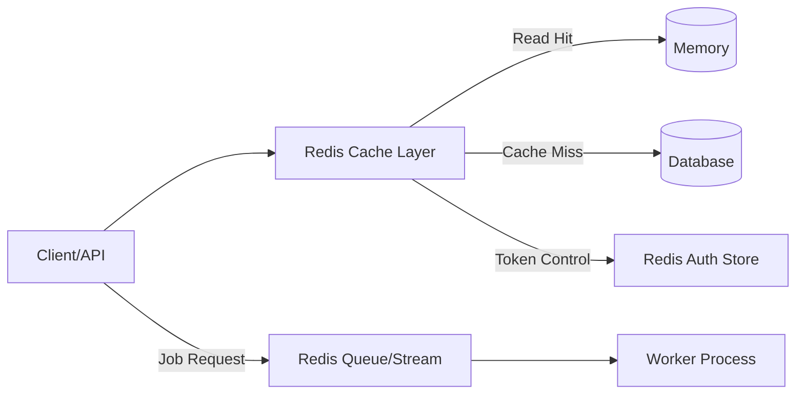
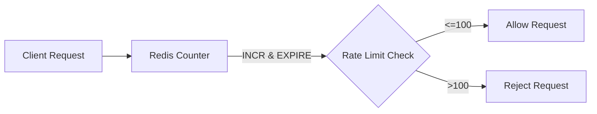
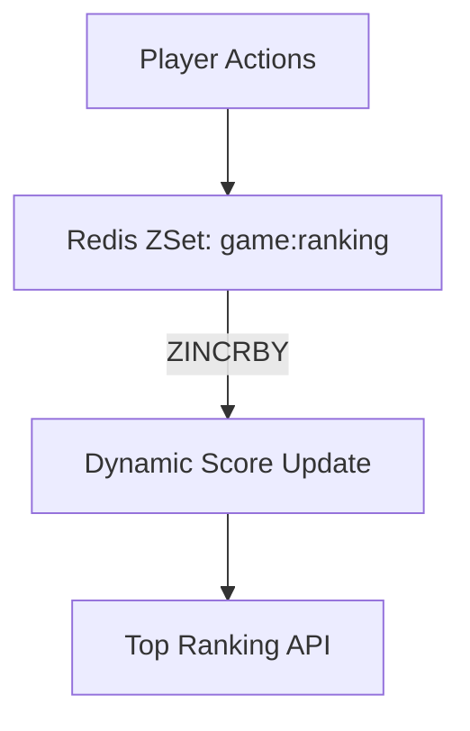

#### 요약

- Redis는 단순 캐시나 세션 저장소를 넘어 **실시간 처리, 큐, 랭킹, 토큰 제어 등 다양한 패턴**으로 활용된다.  
- 실무에서는 TTL 관리, 분산 락, 데이터 동기화, Rate Limiter 등과 함께  
  Docker Compose나 Kubernetes 기반으로 일관된 인프라 구성을 유지한다.  
- 이 문서는 Redis를 실제 백엔드 서비스에서 활용하는 주요 패턴과 코드 예시를 정리한 것이다.


Redis는 단순한 데이터 저장소가 아니라
**“성능, 확장성, 이벤트, 동시성”을 모두 해결하는 실시간 처리 플랫폼**이다.

서비스 요구에 맞게 자료구조와 패턴을 조합하면,
**데이터 일관성 + 고성능 + 복구성**을 동시에 달성할 수 있다.

> “Redis는 데이터베이스가 아니라, 시스템의 속도를 설계하는 기술이다.”

**핵심 요약**
1. Rate Limiter / Throttling 패턴  
2. Queue & Job 처리 패턴  
3. Leaderboard (ZSet 기반 랭킹)  
4. Cache-DB 싱크 및 이벤트 트리거  
5. Docker Compose 및 Helm 운영 예시  

---

##### 참고자료  
- [Redis Design Patterns](https://redis.io/docs/latest/develop/use/patterns/)  
- [BullMQ (Redis Queue)](https://docs.bullmq.io/)  
- [Redisson Patterns](https://github.com/redisson/redisson/wiki/7.-distributed-collections-and-patterns)  


##### Redis 활용 아키텍처 (Mermaid)


---

#### 1. Rate Limiter (요청 제한)

API 서버에서 특정 사용자 또는 IP의 요청 빈도를 제한하기 위해  
**Redis의 INCR + EXPIRE 조합**을 이용할 수 있다.

##### 구현 예시 (Node.js)
```js
const limitKey = `rate:${ip}`;
const reqCount = await redis.incr(limitKey);
if (reqCount === 1) await redis.expire(limitKey, 60);
if (reqCount > 100) throw new Error("Too Many Requests");
```

| 항목         | 설명                |
| ---------- | ----------------- |
| **INCR**   | 요청 카운트 증가         |
| **EXPIRE** | TTL을 이용한 제한 주기 설정 |
| **TTL 관리** | 매 분마다 자동 초기화      |

##### Mermaid 다이어그램



---

#### 2. Queue / Job 처리

Redis **List** 또는 **Stream**을 이용하여
비동기 작업 큐(Job Queue)를 구성할 수 있다.

##### 예시 (BullMQ - NestJS)

```ts
import { Queue } from "bullmq";
const emailQueue = new Queue("email", { connection: { host: "localhost", port: 6379 } });
await emailQueue.add("send", { to: "user@example.com" });
```

##### Worker 예시

```ts
import { Worker } from "bullmq";
new Worker("email", async job => {
  console.log("Sending email to", job.data.to);
});
```

| 특징           | 설명                 |
| ------------ | ------------------ |
| **내장 Retry** | 실패 시 자동 재시도        |
| **병렬 처리**    | 다중 Worker 구성 가능    |
| **지속성 보장**   | Stream 기반 큐는 유실 없음 |

---

#### 3. Leaderboard (Sorted Set 기반 랭킹)

ZSet은 점수 기반 정렬이 가능해 실시간 랭킹 서비스에 적합하다.

##### 예시 (FastAPI)

```python
await redis.zadd("game:ranking", {"playerA": 5000, "playerB": 8000})
rank = await redis.zrevrange("game:ranking", 0, 2, withscores=True)
print(rank)
```

| 기능       | 명령어                            | 설명      |
| -------- | ------------------------------ | ------- |
| 점수 증가    | `ZINCRBY`                      | 점수 누적   |
| 랭킹 조회    | `ZRANK`, `ZREVRANK`            | 순위 확인   |
| 상위 N명 조회 | `ZREVRANGE key 0 N WITHSCORES` | 리더보드 출력 |

##### 시각화



---

#### 4. Cache-DB 동기화 패턴

DB 데이터 변경 시 Redis 캐시를 최신 상태로 유지하기 위해
**더블 삭제(Double Deletion) + TTL 조합**을 자주 사용한다.

##### 예시 (Spring Boot)

```java
@CacheEvict(value = "userCache", key = "#id")
public void updateUser(Long id, User user) {
    userRepository.save(user);
    redisTemplate.delete("user:" + id);
}
```

##### 예시 (Node.js)

```js
await db.updateUser(id, data);
await redis.del(`user:${id}`);
setTimeout(() => redis.del(`user:${id}`), 200);
```

| 전략                | 설명                |
| ----------------- | ----------------- |
| **Double Delete** | 캐시와 DB 일시적 불일치 방지 |
| **Versioned Key** | 변경 시 새 키로 교체      |
| **TTL 병행**        | 주기적 캐시 갱신 유도      |

---

#### 5. Token / Session 블랙리스트

JWT나 세션 토큰을 블랙리스트에 등록해
만료 전 강제 무효화 처리를 할 수 있다.

##### 예시

```bash
SETEX jwt:blacklist:{jti} 3600 "revoked"
```

##### 검증 (FastAPI)

```python
if await redis.get(f"jwt:blacklist:{jti}"):
    raise HTTPException(status_code=401, detail="Token revoked")
```

| 장점           | 설명                 |
| ------------ | ------------------ |
| 실시간 토큰 폐기    | Access Token 제어 가능 |
| TTL 기반 자동 만료 | 불필요한 키 자동 정리       |

---

#### 6. 분산 락 기반 중복 방지

동일 요청이 동시에 여러 번 처리되지 않도록
Redis의 `SET NX PX` 명령을 이용한다.

##### 예시 (Node.js)

```js
const lockKey = `lock:order:${orderId}`;
const locked = await redis.set(lockKey, "locked", "NX", "PX", 5000);
if (!locked) throw new Error("Duplicate order request");
try {
  processOrder();
} finally {
  await redis.del(lockKey);
}
```

| 항목    | 설명            |
| ----- | ------------- |
| `NX`  | 존재하지 않을 때만 설정 |
| `PX`  | TTL (밀리초 단위)  |
| 자동 해제 | TTL 만료 시 락 해제 |

---

#### 7. Docker Compose 구성 예시

##### docker-compose.yml

```yaml
version: "3.9"
services:
  redis:
    image: redis:7.2-alpine
    container_name: redis
    ports:
      - "6379:6379"
    volumes:
      - ./data:/data
    command: redis-server --appendonly yes --maxmemory 512mb --maxmemory-policy allkeys-lru
  redisinsight:
    image: redis/redisinsight:latest
    ports:
      - "8001:8001"
```

> Docker Compose를 사용하면 Redis + RedisInsight를 한 번에 실행 가능하며,
> 로컬 개발 환경에서 빠르게 테스트 가능하다.

---

#### 8. Kubernetes Helm 구성 예시

##### values.yaml (요약)

```yaml
replica:
  replicaCount: 2

auth:
  enabled: true
  password: myRedis123

persistence:
  enabled: true
  size: 1Gi

resources:
  limits:
    memory: 512Mi
```

##### 설치 명령

```bash
helm repo add bitnami https://charts.bitnami.com/bitnami
helm install redis bitnami/redis -f values.yaml
```

---

#### 9. Redis 활용 패턴 요약 표

| 패턴                     | 자료구조          | 주요 명령        | 활용 사례       |
| ---------------------- | ------------- | ------------ | ----------- |
| **Rate Limiter**       | String        | INCR, EXPIRE | 요청 제한       |
| **Job Queue**          | List / Stream | LPUSH, XADD  | 비동기 작업      |
| **Leaderboard**        | ZSet          | ZADD, ZRANK  | 게임 랭킹       |
| **Session Store**      | Hash / String | SETEX        | 로그인 세션      |
| **Cache Invalidation** | Any           | DEL, TTL     | DB-Cache 싱크 |
| **Token Blacklist**    | String        | SETEX        | 인증 보안       |

---

#### 10. 운영 베스트 프랙티스

| 구분              | 권장 설정 / 방법                        |
| --------------- | --------------------------------- |
| **TTL 관리**      | 명시적 설정 (EXPIRE, SETEX)            |
| **Key 네이밍 규칙**  | 서비스명:모듈명:리소스ID                    |
| **Eviction 정책** | allkeys-lru 권장 (캐시 전용 서버)         |
| **보안 설정**       | requirepass, TLS                  |
| **백업 및 복원**     | RDB + AOF 병행                      |
| **모니터링**        | RedisInsight, Grafana, Prometheus |

---


