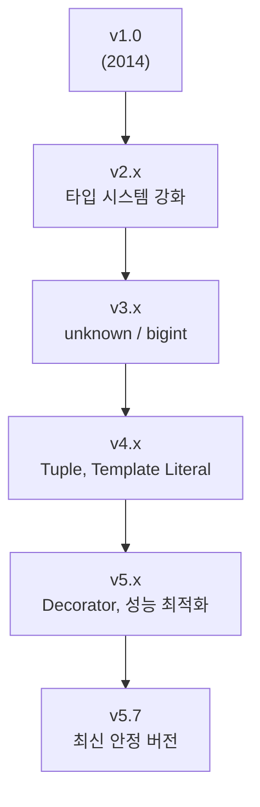

#### 요약
- **TypeScript**는 **JavaScript의 상위 확장 언어(Superset)** 로, 정적 타입 검사(Static Type Checking)와 객체지향 프로그래밍 개념(Class, Interface 등)을 지원한다.  
- 런타임이 아닌 **컴파일 시점(Compile Time)** 에 오류를 탐지할 수 있어 **대규모 애플리케이션 개발에 최적화**되어 있다.  
- 모든 TypeScript 코드는 **JavaScript로 트랜스파일(transpile)** 되어 브라우저 및 Node.js 환경에서 실행된다.  

**핵심 요약**
1. **정적 타입 시스템(Static Typing)** 으로 런타임 오류 예방  
2. **ESNext 문법 지원** 및 다운컴파일 가능  
3. **IDE 자동완성(IntelliSense)** 을 통한 생산성 향상  
4. **점진적 마이그레이션**: 기존 JS 프로젝트에 단계적으로 도입 가능  
5. **프레임워크 친화적**: React, Vue, Next.js, Node.js 완벽 호환  

TypeScript는 “개발 효율성과 코드 안정성”을 동시에 확보하는 것을 목표로 하며,  
현대 프론트엔드 개발에서 **사실상 표준 언어로 자리잡은 타입 안전 JavaScript**이다.


| 항목                  | 요약                               |
| ------------------- | -------------------------------- |
| **핵심 목표**           | 타입 안정성을 통한 코드 신뢰성 확보             |
| **도입 난이도**          | 낮음 (JS 프로젝트와 병행 가능)              |
| **대표 활용 분야**        | React, Next.js, Node.js, Express |
| **생산성 효과**          | 코드 자동완성 + 리팩토링 안정성               |
| **현재 안정 버전 (2025)** | TypeScript **v5.7.x**            |

TypeScript는 단순한 프로그래밍 언어가 아닌,
**대규모 자바스크립트 애플리케이션을 체계적으로 관리하기 위한 핵심 기술 기반**이다.

##### 참고자료
- [TypeScript 공식 문서](https://www.typescriptlang.org/docs/)
- [Microsoft TypeScript GitHub](https://github.com/microsoft/TypeScript)
- [Release Notes (All Versions)](https://www.typescriptlang.org/docs/handbook/release-notes/overview.html)

---

#### 1. TypeScript란?

TypeScript는 Microsoft가 2012년에 발표한 오픈소스 언어로,  
JavaScript에 **정적 타입(Type System)** 과 **컴파일러(tsc)** 를 추가하여 안정성을 강화한 언어이다.

| 비교 항목 | TypeScript | JavaScript |
|------------|-------------|-------------|
| 언어 유형 | 정적 타입 언어 | 동적 타입 언어 |
| 타입 검사 | 컴파일 시점 | 런타임 시점 |
| 오류 감지 | 개발 중 (IDE에서 실시간 감지) | 실행 중 |
| 문법 기반 | ESNext + 타입 문법 | ECMAScript 표준 |
| 실행 환경 | 트랜스파일 후 JS 실행 | 바로 실행 가능 |

> 💡 **요약:** TypeScript = JavaScript + Type System + Compile-time Safety

---

#### 2. 설치 및 기본 명령어

| 명령어 | 설명 |
|--------|------|
| `npm install -g typescript` | 전역 TypeScript 설치 |
| `tsc --init` | `tsconfig.json` 생성 |
| `tsc` | TypeScript → JavaScript 컴파일 |
| `tsc --watch` | 파일 변경 시 자동 컴파일 |
| `npx tsc` | 로컬 프로젝트 단위로 실행 |

```bash
# 설치
npm install -g typescript

# 프로젝트 초기화
tsc --init

# 컴파일
tsc
```

---

#### 3. TypeScript 버전 이력 및 주요 변화

| 버전                       | 릴리스 연도                                                                 | 주요 특징 |
| ------------------------ | ---------------------------------------------------------------------- | ----- |
| **v1.0 (2014)**          | 최초 정식 릴리스, Interface / Class / Module 지원                               |       |
| **v2.x (2016~2017)**     | `strictNullChecks`, `readonly`, `object`, `keyof`, `Partial` 등 추가      |       |
| **v3.x (2018~2019)**     | `unknown`, `const assertions`, `bigint`, Project References 지원         |       |
| **v4.0 (2020)**          | Variadic Tuple, Labeled Tuple Element, Editor 성능 향상                    |       |
| **v4.5~4.9 (2021~2022)** | Template Literal Types, `satisfies` 연산자, Node16 Module Resolution      |       |
| **v5.0 (2023)**          | Decorator 표준화, `const type parameters`, `ESM 지원 강화`                    |       |
| **v5.5~5.6 (2024)**      | JSX 개선, import attributes, 성능 최적화, Incremental Build 향상                |       |
| **v5.7 (2025)**          | Type Narrowing 알고리즘 개선, JSX namespace 자동 해석, `isolatedDeclarations` 추가 |       |



> 📘 **참고:**
> 최신 TypeScript는 Node.js 18+ / React 18+ 환경에서 완벽히 호환되며,
> 대부분의 프레임워크(Vite, Next.js, NestJS)에서 기본 내장되어 있음.

---

#### 4. tsconfig.json 핵심 설정 예시

```jsonc
{
  "compilerOptions": {
    "target": "es6",
    "module": "esnext",
    "strict": true,
    "jsx": "preserve",
    "moduleResolution": "node",
    "esModuleInterop": true,
    "skipLibCheck": true,
    "forceConsistentCasingInFileNames": true
  },
  "include": ["src/**/*"],
  "exclude": ["node_modules", "build"]
}
```

| 옵션                | 설명                  | 권장값        |
| ----------------- | ------------------- | ---------- |
| `strict`          | 모든 엄격한 타입 검사 활성화    | `true`     |
| `esModuleInterop` | CommonJS ↔ ES 모듈 호환 | `true`     |
| `skipLibCheck`    | 외부 라이브러리 타입 검사 생략   | `true`     |
| `jsx`             | React JSX 처리 방식     | `preserve` |

---

#### 5. 코드 예시

```ts
// 기본 타입 정의
let username: string = "Ingeun";
let age: number = 32;
let isAdmin: boolean = true;

// 함수 반환 타입
function greet(name: string): string {
  return `안녕하세요, ${name}님!`;
}

// 객체 인터페이스
interface User {
  id: number;
  name: string;
  active: boolean;
}

const user: User = { id: 1, name: "Ingeun", active: true };
```

---

#### 6. React와 TypeScript 통합 예시

```tsx
import React from "react";

interface ButtonProps {
  label: string;
  onClick?: () => void;
}

export default function Button({ label, onClick }: ButtonProps) {
  return <button onClick={onClick}>{label}</button>;
}
```

> React에서는 Props, State, useReducer 등의 타입 정의를 통해
> 컴포넌트 재사용성과 유지보수성을 크게 향상시킬 수 있다.

---

