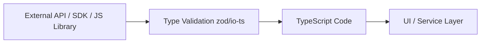

#### 요약
- 실무에서는 TypeScript 코드가 **순수 JS 코드, API 응답, 외부 SDK** 등과 상호작용하는 경우가 많다.  
- 이때 타입이 명시되지 않은 데이터는 런타임 오류의 주요 원인이 되므로,  
  **타입 안전성(Type Safety)** 을 유지하면서 상호 연동하는 패턴이 필요하다.  
- 본 문서에서는 **JS ↔ TS 상호 작용, JSON 파싱, REST API 응답 모델링, 외부 SDK 타입 보강** 등  
  다양한 통합 시나리오를 다룬다.  

**핵심 요약**
1. `any` 대신 `unknown`을 사용해 불명확한 외부 입력을 안전하게 처리한다.  
2. JSON 파싱 시 타입 단언보다는 **런타임 검증(zod, io-ts)** 을 결합한다.  
3. REST API 응답은 `ApiResponse<T>` 구조로 모델링해 일관성 있게 관리한다.  
4. 외부 JS SDK나 라이브러리는 `declare module`을 통해 보강(augmentation)할 수 있다.  
5. Node.js, 브라우저, Third-party 환경 간 타입 차이를 고려해야 한다.  

| 항목                  | 요약             |
| ------------------- | -------------- |
| **unknown**         | 외부 입력 안전 처리    |
| **zod/io-ts**       | 런타임 + 타입 검증 병행 |
| **declare module**  | JS 라이브러리 보강    |
| **ApiResponse<T>**  | 통합 응답 모델       |
| **환경 변수 타입화**       | ProcessEnv 확장  |
| **type-safe fetch** | API 호출 안전성 확보  |

> TypeScript의 진정한 강점은
> **내부 로직뿐 아니라 외부 세계와의 경계를 안전하게 만드는 데 있다.**
> 즉, “타입은 시스템 간 계약(Contract)의 언어”이며,
> 안전한 상호 운용이야말로 TypeScript 아키텍처의 완성이다.

##### 참고자료
- [TypeScript Docs – Interoperability](https://www.typescriptlang.org/docs/handbook/declaration-files/templates/module-d-ts.html)
- [zod Validation Library](https://zod.dev)
- [io-ts Functional Runtime Types](https://gcanti.github.io/io-ts/)

##### 통합 아키텍처 다이어그램


> TypeScript Code -->| ApiResponse<T> | Type Validation zod/io-ts <br/>
> ⚙️ 외부 → 내부로 들어오는 모든 데이터는
> **Validation → Inference → Usage** 순으로 처리해야 한다.

---

#### 1. JS ↔ TS 상호 작용의 원칙

> “JS는 실행 중심, TS는 타입 중심 — 두 언어의 경계에서 안전성을 확보해야 한다.”

| 구분 | 원칙 |
|------|------|
| **JS → TS** | 외부 데이터는 항상 검증 후 사용 (`unknown` → 타입 가드) |
| **TS → JS** | 타입 정보는 컴파일 시 제거되므로, 런타임 의존 금지 |
| **ESM ↔ CJS** | `esModuleInterop: true` 설정으로 호환성 확보 |
| **동적 import** | `import()` 문법으로 타입 안전하게 처리 가능 |

```ts
// JS 모듈 import 예시
import legacy from "./legacy.js";

// 타입 단언
const result = (legacy as { init: () => void }).init();
```

> ⚙️ JS 코드를 직접 불러올 때는 반드시 **타입 단언(type assertion)** 이나
> **보강(declare module)** 선언으로 타입 구조를 명시해야 한다.

---

#### 2. `unknown`을 활용한 안전한 외부 데이터 처리

```ts
function parseData(data: unknown) {
  if (typeof data === "object" && data !== null && "id" in data) {
    return (data as { id: number }).id;
  }
  throw new Error("Invalid data format");
}
```

| 비교                              | 설명                   |
| ------------------------------- | -------------------- |
| `any`                           | 타입 검증 생략 → 런타임 오류 가능 |
| `unknown`                       | 검증 전 사용 불가 → 안전한 처리  |
| `typeof`, `in`, `Array.isArray` | 기본적인 런타임 검증 도구       |

> 💡 **“불확실한 데이터는 unknown부터 시작하라.”**
> 그 후 좁혀나가며 타입을 안전하게 확정해야 한다.

---

#### 3. JSON 데이터 변환 시 주의사항

> API 응답 등 외부 JSON을 다룰 때 가장 흔한 오류는
> “타입 단언만으로 구조를 신뢰하는 것”이다.

```ts
// ❌ 나쁜 예시
const user = JSON.parse(data) as { id: number; name: string };

// ✅ 안전한 방식
import { z } from "zod";

const UserSchema = z.object({
  id: z.number(),
  name: z.string()
});

type User = z.infer<typeof UserSchema>;
const user = UserSchema.parse(JSON.parse(data));
```

| 방법              | 설명                 |
| --------------- | ------------------ |
| `as` 단언         | 런타임 검증 없음          |
| `zod` / `io-ts` | 타입 + 런타임 스키마 병행 검증 |
| `z.infer`       | TS 타입 자동 추론        |

> ⚙️ 런타임 검증을 도입하면 외부 API 변경으로 인한 타입 오류를 조기에 감지할 수 있다.

---

#### 4. REST API 응답 타입 모델링

```ts
export type ApiResponse<T> = {
  success: boolean;
  data?: T;
  error?: {
    code: string;
    message: string;
  };
};
```

```ts
type User = { id: number; name: string };

async function fetchUser(id: number): Promise<ApiResponse<User>> {
  const res = await fetch(`/api/users/${id}`);
  const json = await res.json();
  return { success: true, data: json };
}
```

| 장점          | 설명                           |
| ----------- | ---------------------------- |
| 구조적 일관성     | 모든 API 응답 형식 통일              |
| 타입 기반 에러 처리 | `data`/`error` 구분            |
| 재사용성        | `ApiResponse<T>` 제네릭으로 확장 가능 |

> 💡 Front–Back 간 API 연동 시, `ApiResponse<T>` 구조는 “계약의 표준화” 역할을 한다.

---

#### 5. 외부 SDK 타입 보강 (`declare module`)

> 타입이 포함되지 않은 외부 SDK나 JS 라이브러리는 직접 보강할 수 있다.

```ts
// types/legacy-sdk.d.ts
declare module "legacy-sdk" {
  export interface LegacyConfig {
    apiKey: string;
    debug?: boolean;
  }

  export function initialize(config: LegacyConfig): void;
  export function getVersion(): string;
}
```

```ts
// 사용 예시
import { initialize } from "legacy-sdk";

initialize({ apiKey: "12345" });
```

| 특징                 | 설명                  |
| ------------------ | ------------------- |
| `declare module`   | 타입 정의가 없는 모듈 보강     |
| `export interface` | 옵션 객체 구조 정의         |
| 유지보수               | SDK 업데이트 시 직접 수정 가능 |

> ⚙️ **SDK가 JS-only인 경우**, 타입 선언 파일을 `/types` 폴더에 포함시켜 관리해야 한다.

---

#### 6. Node.js 외부 환경 변수 안전 관리

> `.env` 파일의 값은 전부 문자열(string)로 주입되므로
> TypeScript에서 명시적으로 형 변환과 검증이 필요하다.

```ts
declare namespace NodeJS {
  interface ProcessEnv {
    NODE_ENV: "development" | "production" | "test";
    PORT?: string;
    DATABASE_URL: string;
  }
}
```

```ts
const port = Number(process.env.PORT ?? 3000);
```

| 주의점          | 설명                   |
| ------------ | -------------------- |
| 모든 값은 string | 숫자/불린 변환 필요          |
| `!` 단언 사용 자제 | 기본값 또는 검증 추가         |
| `dotenv`     | 런타임 환경 로드 시 타입 적용 불가 |

> 💡 환경 변수 타입은 `global.d.ts`에 정의하고,
> 코드에서는 “명시적 변환”을 통해 안전하게 사용한다.

---

#### 7. 브라우저 객체 확장 (Window, Navigator)

```ts
declare global {
  interface Window {
    __APP_VERSION__: string;
    currentUser?: { id: number; name: string };
  }
}
```

```ts
if (window.currentUser) {
  console.log(window.currentUser.name);
}
```

| 항목               | 설명                  |
| ---------------- | ------------------- |
| `declare global` | 전역 브라우저 객체 확장       |
| `window.` 속성     | 앱 상태, 빌드 정보 주입 시 사용 |
| `optional` 속성    | 초기화 전 안전한 접근 보장     |

> ⚙️ 이 패턴은 SPA 환경에서 “전역 런타임 컨텍스트”를 모델링할 때 유용하다.

---

#### 8. Type-Safe Fetch 래퍼 구현

> Fetch API를 타입 안전하게 감싸는 패턴

```ts
type Fetcher<T> = (url: string) => Promise<ApiResponse<T>>;

async function safeFetch<T>(url: string): Promise<ApiResponse<T>> {
  try {
    const res = await fetch(url);
    const data: T = await res.json();
    return { success: true, data };
  } catch (err: any) {
    return { success: false, error: { code: "FETCH_ERR", message: err.message } };
  }
}
```

```ts
const result = await safeFetch<{ id: number; name: string }>("/api/user/1");
if (result.success) console.log(result.data.name);
```

| 장점       | 설명                     |
| -------- | ---------------------- |
| 제네릭 사용   | 응답 데이터 타입 지정 가능        |
| 에러 구조 통일 | `success: false` 패턴 유지 |
| 안전성      | 런타임 에러 최소화             |

> 🎯 실제 백엔드와의 통신에서도 동일한 타입 구조(`ApiResponse<T>`)를 사용하면
> 프론트–백 간 타입 불일치를 방지할 수 있다.

---

#### 9. JS → TS 마이그레이션 단계별 접근

| 단계  | 설명                          | 비고            |
| --- | --------------------------- | ------------- |
| 1️⃣ | `.js` 파일에 `// @ts-check` 추가 | 타입 오류 감지 시작   |
| 2️⃣ | `.d.ts` 파일 작성               | 외부 타입 정의      |
| 3️⃣ | 파일 확장자 `.ts`로 변경            | 점진적 변환        |
| 4️⃣ | strict 옵션 활성화               | 완전한 타입 안전성 확보 |

> 💡 “모든 JS를 한 번에 TS로 바꾸지 말고, 점진적으로 검증하며 확장하라.”

---

#### 10. 서드파티 라이브러리 통합 시 주의사항

| 항목                     | 설명                                                  |
| ---------------------- | --------------------------------------------------- |
| **React / Next.js**    | 타입 자동 지원 (`@types/react`)                           |
| **Firebase / AWS SDK** | Promise 기반 응답 → 제네릭 래핑 필요                           |
| **Stripe / Twilio 등**  | 일부 SDK는 Any 기반 → Custom `.d.ts` 작성                  |
| **GraphQL / gRPC**     | 코드 생성기로 타입 자동 생성 (`graphql-codegen`, `protobuf-ts`) |

> ⚙️ 가능하다면 **공식 SDK + 타입 생성기** 조합을 활용하라.
> 직접 작성 시엔 `declare module` 파일을 프로젝트에 포함해야 한다.

---


