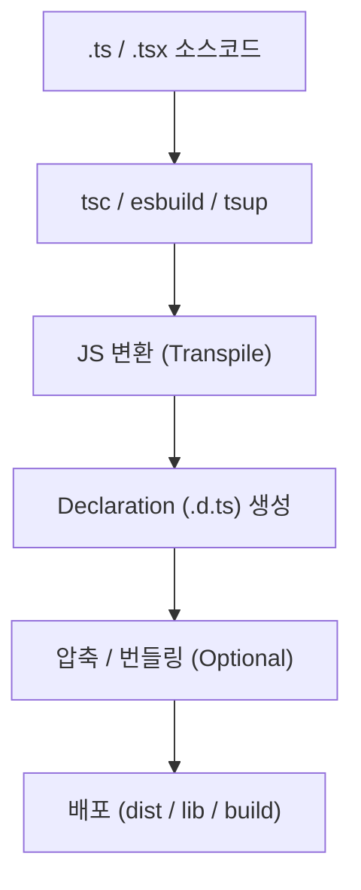

#### 요약
- TypeScript 프로젝트의 빌드와 배포 과정은 **컴파일러 설정(tsc)**, **번들러(esbuild, swc, tsup, vite)**,  
  그리고 **출력 구조(dist, declaration, sourceMap)** 에 의해 결정된다.  
- 올바른 빌드 파이프라인은 “타입 안전성”을 유지하면서도 **프로덕션 환경에서 최적의 성능**을 보장한다.  
- 본 문서는 환경별 빌드 방식 비교와, 배포 시 고려해야 할 설정 항목을 종합적으로 정리한다.  

**핵심 요약**
1. `tsc`는 타입 검사 + 컴파일의 표준 도구이다.  
2. `tsup`, `swc`, `esbuild`는 빠른 번들링 대안이다.  
3. 라이브러리 배포 시에는 `emitDeclarationOnly` 옵션을 사용한다.  
4. 서버/프론트 빌드는 **출력 구조(outDir, rootDir)** 를 분리해야 한다.  
5. CI/CD 환경에서는 **빌드 캐시 + 타입 검사 분리**가 효율적이다.  

##### 참고자료
- [TypeScript Compiler Docs](https://www.typescriptlang.org/docs/handbook/compiler-options.html)
- [esbuild](https://esbuild.github.io/)
- [swc Project](https://swc.rs/)
- [tsup](https://tsup.egoist.dev/)
- [Vite Build Config](https://vitejs.dev/config/)

| 항목                       | 핵심 요약              |
| ------------------------ | ------------------ |
| **tsc**                  | 표준 빌드 (안정성 중심)     |
| **tsup / esbuild / swc** | 고속 빌드 대안           |
| **emitDeclarationOnly**  | 라이브러리용 선언 파일 생성    |
| **sourcemap**            | 디버깅 편의             |
| **CI/CD 구성**             | 타입 검사 → 빌드 → 배포 순서 |

> TypeScript 빌드는 단순한 변환이 아니라,
> **품질 보장과 배포 신뢰성의 교차점**이다.
> 올바른 빌드 파이프라인은 코드의 안정성과 배포 효율을 동시에 극대화한다.

---

#### 1. 빌드 프로세스 개요

> “TypeScript 빌드는 코드 품질 보장과 배포 효율의 교차점이다.”



| 단계         | 역할                |
| ---------- | ----------------- |
| Transpile  | TS → JS 변환        |
| Type Check | 컴파일 시 타입 검사       |
| Bundle     | 모듈 통합 및 압축        |
| Deploy     | 실행 또는 배포용 아티팩트 생성 |

> ⚙️ “컴파일”과 “타입 검사”는 분리 가능하며, CI 환경에서 각각 최적화할 수 있다.

---

#### 2. `tsc` 기반 빌드 (표준 방식)

> TypeScript 공식 컴파일러로, 타입 검사와 코드 변환을 함께 수행한다.

```bash
npx tsc --project tsconfig.build.json
```

```jsonc
// tsconfig.build.json
{
  "extends": "./tsconfig.json",
  "compilerOptions": {
    "outDir": "dist",
    "rootDir": "src",
    "declaration": true,
    "sourceMap": true,
    "noEmitOnError": true
  },
  "include": ["src/**/*"]
}
```

| 옵션              | 설명                 |
| --------------- | ------------------ |
| `noEmitOnError` | 타입 오류 시 JS 출력 방지   |
| `declaration`   | 타입 정의(.d.ts) 파일 생성 |
| `sourceMap`     | 디버깅용 맵 파일 생성       |
| `outDir`        | 빌드 결과 저장 위치        |

> 💡 단점은 빌드 속도가 느리다는 점 — **타입 검사 + 컴파일 병행** 때문

---

#### 3. `tsup` 기반 빌드 (가장 범용적)

> 내부적으로 esbuild를 사용하여 **초고속 빌드**와 **다양한 출력 포맷**을 지원한다.

```bash
npm install --save-dev tsup
```

```jsonc
// package.json
{
  "scripts": {
    "build": "tsup src/index.ts --format esm,cjs --dts --clean"
  }
}
```

| 옵션                 | 설명              |
| ------------------ | --------------- |
| `--format esm,cjs` | 두 모듈 포맷 동시 출력   |
| `--dts`            | .d.ts 파일 생성     |
| `--clean`          | 빌드 전 dist 폴더 정리 |
| `--sourcemap`      | 소스맵 생성 (옵션)     |

**출력 예시**

```
dist/
 ├── index.js
 ├── index.cjs
 ├── index.mjs
 └── index.d.ts
```

> ⚙️ **라이브러리 빌드** 또는 **멀티 모듈 지원 패키지**에 이상적이다.

---

#### 4. `swc` 기반 빌드 (Rust 컴파일러)

> TypeScript를 Rust로 트랜스파일 → 매우 빠르지만 타입 검사는 수행하지 않는다.

```bash
npm install --save-dev @swc/core @swc/cli
```

```jsonc
// .swcrc
{
  "jsc": {
    "parser": { "syntax": "typescript", "tsx": true },
    "target": "es2020"
  },
  "module": { "type": "es6" },
  "sourceMaps": true
}
```

```bash
npx swc src -d dist
```

| 장점          | 단점          |
| ----------- | ----------- |
| 매우 빠른 빌드 속도 | 타입 검사 미지원   |
| Rust 기반 안정성 | tsc 병행 필요   |
| ESM, JSX 지원 | 일부 TS 문법 제한 |

> 💡 실무에서는 `swc` + `tsc --noEmit` 조합으로 “검사 + 빌드”를 분리한다.

---

#### 5. `esbuild` 기반 빌드 (초고속 번들러)

> Go 언어로 작성된 고성능 번들러로, 개발 서버(HMR) 및 배포용으로 사용된다.

```bash
npm install --save-dev esbuild
```

```bash
npx esbuild src/index.ts --bundle --platform=node --outfile=dist/index.js
```

| 옵션                | 설명             |
| ----------------- | -------------- |
| `--bundle`        | 모든 모듈을 하나로 병합  |
| `--platform=node` | Node.js 런타임 대상 |
| `--minify`        | 압축             |
| `--sourcemap`     | 디버그 지원         |

> ⚙️ 빠른 스타트업 서비스, 서버리스 함수, Lambda 환경에 적합

---

#### 6. Vite 기반 프론트엔드 빌드

> Vite는 내부적으로 esbuild를 사용하며, **React, Vue, Svelte 등 프론트엔드 프레임워크**에서 사용된다.

```bash
npm install --save-dev vite typescript
```

```ts
// vite.config.ts
import { defineConfig } from "vite";
import react from "@vitejs/plugin-react";
import tsconfigPaths from "vite-tsconfig-paths";

export default defineConfig({
  plugins: [react(), tsconfigPaths()],
  build: {
    outDir: "build",
    sourcemap: true
  }
});
```

| 특징          | 설명                            |
| ----------- | ----------------------------- |
| ESM 기반      | 모듈 즉시 로드 및 캐싱                 |
| tsconfig 연동 | `vite-tsconfig-paths` 플러그인 필요 |
| 빠른 개발 서버    | HMR 지원                        |

> 💡 `vite build`는 타입 검사 없이 트랜스파일만 수행하므로,
> 별도 `tsc --noEmit` 명령어 병행 권장

---

#### 7. 빌드 및 배포 구분 전략

| 구분           | 목적           | 명령어                         |
| ------------ | ------------ | --------------------------- |
| **개발용 빌드**   | 빠른 피드백, 디버그용 | `tsc --watch` / `vite dev`  |
| **프로덕션 빌드**  | 최종 배포용       | `tsup` / `tsc`              |
| **타입 검사 전용** | CI / Test 단계 | `tsc --noEmit`              |
| **선언 파일 전용** | 라이브러리 배포용    | `tsc --emitDeclarationOnly` |

> ⚙️ **출력 파일 구조**를 명확히 분리(`src → dist`)하면 CI/CD 관리가 쉬워진다.

---

#### 8. 배포 구조 예시

```
project/
 ├── src/
 │   ├── index.ts
 │   └── utils/
 │       └── format.ts
 ├── dist/
 │   ├── index.js
 │   ├── index.d.ts
 │   └── utils/
 │       ├── format.js
 │       └── format.d.ts
 ├── package.json
 ├── tsconfig.build.json
 └── .npmignore
```

**.npmignore**

```
src/
tsconfig.json
test/
__tests__/
```

> 💡 `.npmignore`를 통해 **빌드 결과물(dist)** 만 배포 대상에 포함시킨다.

---

#### 9. CI/CD 파이프라인 구성 예시

```yaml
# .github/workflows/build.yml
name: Build & Deploy

on:
  push:
    branches: [main]

jobs:
  build:
    runs-on: ubuntu-latest
    steps:
      - uses: actions/checkout@v4
      - uses: actions/setup-node@v4
        with:
          node-version: 20
      - run: npm ci
      - run: npm run check  # 타입 검사
      - run: npm run build  # 빌드 실행
      - run: npm publish --access public
```

| 단계              | 설명              |
| --------------- | --------------- |
| `npm run check` | `tsc --noEmit`  |
| `npm run build` | `tsup` 또는 `tsc` |
| `npm publish`   | dist 폴더 배포      |

> ⚙️ 배포 전에는 **lint + test + type-check** 단계를 반드시 통과해야 한다.

---

#### 10. 소스맵 및 디버깅

> `sourceMap: true` 옵션을 통해
> 런타임에서 원본 TS 코드의 디버깅이 가능하다.

```ts
// package.json
{
  "scripts": {
    "dev": "node --enable-source-maps dist/index.js"
  }
}
```

| 옵션                     | 설명                   |
| ---------------------- | -------------------- |
| `--enable-source-maps` | JS 런타임에서 TS 파일 경로 매핑 |
| `sourceMap: true`      | 컴파일 단계에서 소스맵 생성      |
| `inlineSources`        | 원본 코드 포함 (선택)        |

> 💡 NestJS, Node 환경에서 **Sentry** 연동 시 필수 설정

---

#### 11. 성능 및 최적화 팁

| 항목                      | 전략             | 설명          |
| ----------------------- | -------------- | ----------- |
| **skipLibCheck**        | true           | 외부 타입 검사 생략 |
| **incremental**         | true           | 증분 빌드       |
| **isolatedModules**     | true           | 병렬 컴파일 지원   |
| **emitDeclarationOnly** | true           | d.ts만 생성    |
| **bundle**              | esbuild / tsup | 압축 + 병합     |
| **sourcemap**           | true           | 디버깅 편의      |

> ⚙️ 라이브러리 배포 시에는 “타입 선언 파일 + ESM/CJS 번들” 조합이 이상적이다.

---


