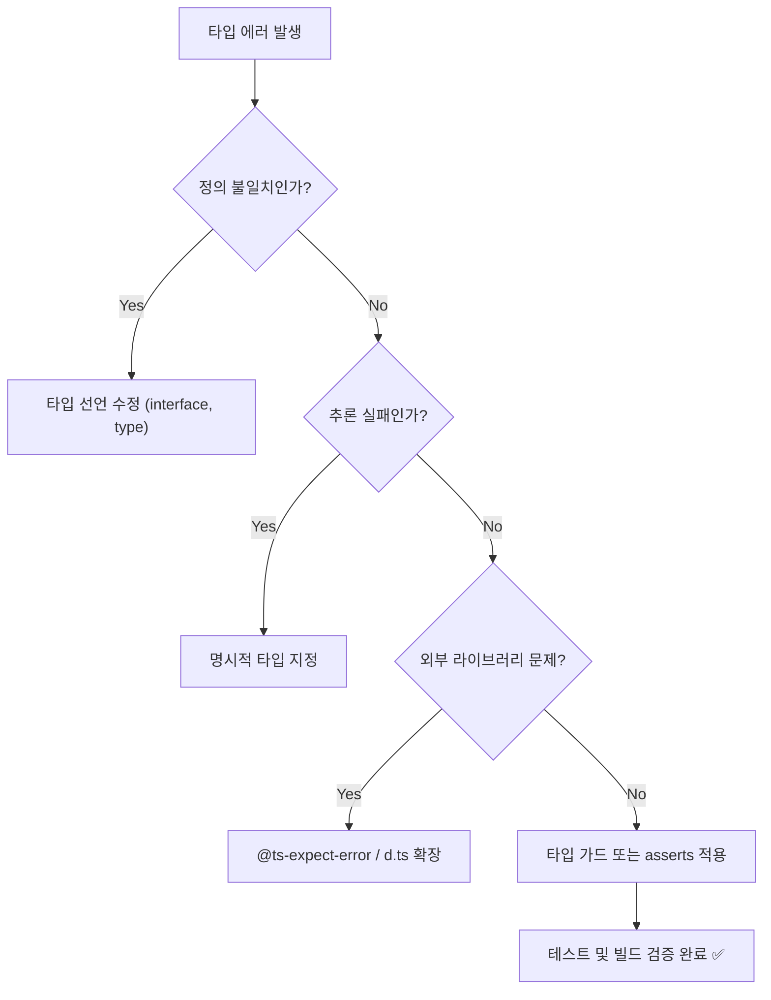

#### 요약
- TypeScript의 타입 시스템은 **에러를 런타임 이전(컴파일 시점)** 에 감지하여 안정성을 확보한다.  
- 하지만 실무에서는 복잡한 타입 구조나 외부 모듈로 인해 “의도된 오류”와 “진짜 오류”가 혼재하기 쉽다.  
- 본 장에서는 **타입 에러의 원인 분류**, **디버깅 기법**, **안전한 무시 전략(ts-ignore, expect-error)**,  
  그리고 **IDE·빌드 단계에서의 문제 추적 방법**을 다룬다.  

**핵심 요약**
1. 타입 에러는 대부분 **정의 불일치, 추론 실패, null 안전성 위반**에서 발생한다.  
2. `unknown`, `never`, `asserts` 등은 에러 제어에 유용하다.  
3. `@ts-expect-error`는 명시적으로 “허용된 예외”를 표현하는 안전한 방식이다.  
4. 타입 오류는 IDE에서 즉시 확인하고, 빌드 환경에서는 `noEmitOnError`로 방지한다.  
5. 장기적으로는 **strict 모드 유지 + 유틸리티 타입 활용**이 근본적인 해결책이다.  

##### 참고자료
- [TypeScript Handbook – Error Handling](https://www.typescriptlang.org/docs/handbook/2/narrowing.html#assertion-functions)
- [Microsoft TypeScript Wiki – Common Errors](https://github.com/microsoft/TypeScript/wiki/FAQ#common-errors)


| 항목                   | 요약                 |
| -------------------- | ------------------ |
| **unknown**          | 안전한 타입 미지정 처리      |
| **never**            | 불가능한 상태 검증         |
| **asserts**          | 타입 보증 함수로 런타임 검증   |
| **@ts-expect-error** | 명시적 예외 허용          |
| **noEmitOnError**    | 타입 에러 시 빌드 차단      |
| **IDE 활용**           | tsserver 기반 빠른 디버깅 |

> 타입 에러는 피할 수 없지만, **구조적으로 관리**할 수 있다.
> 단순 무시는 위험하고, “예측 가능한 예외 관리 체계”가
> TypeScript 실무 품질의 차이를 만든다.

---

#### 1. 타입 에러의 주요 원인

| 유형 | 예시 | 설명 |
|------|------|------|
| 정의 불일치 | `"string"` 할당 → `number` 변수 | 타입 간 호환성 문제 |
| null 안전성 | `value.toUpperCase()` (value가 null) | `strictNullChecks` 위반 |
| 타입 추론 실패 | `const x = JSON.parse(data)` | `any` 추론으로 인한 불안정 |
| 외부 라이브러리 | 잘못된 `.d.ts` 파일 | 외부 타입 선언 불일치 |
| 제네릭 오용 | `function<T>(x: T): T[]` → T가 never | 제약 조건 누락 |

```ts
// ❌ 예시: 타입 불일치
let count: number = "42"; // Type 'string' is not assignable to type 'number'
```

> ⚙️ 가장 빈번한 원인은 **명시적 타입 선언 누락 + 추론 실패**의 조합이다.

---

#### 2. 에러 유형별 디버깅 접근법

| 유형              | 해결 전략                        |
| --------------- | ---------------------------- |
| **타입 불일치**      | 타입 단언(as) 대신 올바른 인터페이스 정의    |
| **any 오염**      | `noImplicitAny` 활성화 및 타입 명시  |
| **제네릭 오용**      | `<T extends object>` 등 제약 추가 |
| **라이브러리 오류**    | `@types` 버전 일치 확인            |
| **Union 타입 혼동** | 타입 가드 / narrowing 적용         |

```ts
function printId(id: string | number) {
  if (typeof id === "string") {
    console.log(id.toUpperCase());
  } else {
    console.log(id.toFixed(0));
  }
}
```

> 💡 에러는 **추론된 타입 vs 기대 타입**의 불일치를 해석하면 해결의 실마리가 보인다.

---

#### 3. `unknown`을 활용한 안전한 타입 처리

> `unknown`은 “아직 알 수 없는 타입”으로, `any`보다 안전하다.

```ts
function safeParse(json: string): unknown {
  return JSON.parse(json);
}

const data = safeParse('{"name":"Ingeun"}');
// console.log(data.name); // ❌ 오류
if (typeof data === "object" && data !== null && "name" in data) {
  console.log((data as { name: string }).name); // ✅ 안전 접근
}
```

| 비교        | 설명                  |
| --------- | ------------------- |
| `any`     | 모든 연산 가능 (타입 검사 무시) |
| `unknown` | 사용 전 타입 검증 필요       |
| 장점        | 런타임 안전성 향상          |

> ⚙️ “확신이 없는 값”에는 `unknown`을,
> “의도적 미검증 값”에는 `any`를 최소한으로 사용하라.

---

#### 4. `never`를 활용한 불가능 상태 감지

> `never`는 도달할 수 없는 코드나 불가능한 상태를 표현한다.

```ts
type Shape = "circle" | "square";

function draw(shape: Shape) {
  switch (shape) {
    case "circle":
      return "🟢";
    case "square":
      return "🟥";
    default:
      const _exhaustive: never = shape; // 오류 감지
      return _exhaustive;
  }
}
```

| 특징                | 설명           |
| ----------------- | ------------ |
| 타입 분기 누락 검증       | 컴파일 시점에서 경고  |
| Unreachable 코드 탐지 | 실수 방지        |
| Exhaustive check  | 모든 유니언 처리 확인 |

> 💡 `never`는 “논리적 불가능성”을 표현하는 **디버깅 보조 장치**이다.

---

#### 5. `asserts` 함수로 런타임 타입 보증

> 사용자 정의 타입 가드의 확장 형태로, 타입 검증을 **함수로 캡슐화**한다.

```ts
function assertIsString(value: unknown): asserts value is string {
  if (typeof value !== "string") throw new Error("Not a string");
}

function printUpper(value: unknown) {
  assertIsString(value);
  console.log(value.toUpperCase()); // ✅ string으로 인식됨
}
```

| 문법                      | 설명                    |
| ----------------------- | --------------------- |
| `asserts value is Type` | 타입 보증 함수 선언           |
| `throw` 발생 시            | 함수 종료 (안전하게 타입 확정)    |
| 활용                      | 런타임 검증 + 컴파일 타임 타입 확정 |

> 🎯 **테스트, API 응답 검증, 데이터 파싱 로직**에서 유용하다.

---

#### 6. 안전한 예외 무시 — `@ts-expect-error`

> “예상되는 오류를 명시적으로 허용”하는 방법

```ts
// @ts-expect-error: 외부 라이브러리 타입 오류 임시 무시
import external from "old-lib";
```

| 구분                 | 설명                           |
| ------------------ | ---------------------------- |
| `@ts-ignore`       | 모든 오류 무시 (비권장)               |
| `@ts-expect-error` | 특정 오류만 명시적으로 허용              |
| 장점                 | 명시적 예외 처리 (빌드 경고 발생 시 검증 가능) |

> ⚠️ `@ts-ignore`는 유지보수 시 숨겨진 버그의 원인이 되므로
> 반드시 `@ts-expect-error`로 대체하는 것이 좋다.

---

#### 7. 타입 오류 방지를 위한 컴파일러 옵션

| 옵션                 | 설명                | 권장값    |
| ------------------ | ----------------- | ------ |
| `noImplicitAny`    | 암시적 any 금지        | `true` |
| `strictNullChecks` | null/undefined 구분 | `true` |
| `noImplicitThis`   | this 타입 검사        | `true` |
| `noUnusedLocals`   | 사용되지 않은 변수 경고     | `true` |
| `noEmitOnError`    | 에러 시 빌드 중단        | `true` |

> ⚙️ **`noEmitOnError: true`** 는 “타입 에러가 있는 코드의 빌드 방지”에 필수이다.

---

#### 8. IDE 기반 디버깅 패턴 (VSCode)

| 도구                                                | 기능                    |
| ------------------------------------------------- | --------------------- |
| Hover Info                                        | 변수에 마우스 → 타입 추론 결과 확인 |
| Quick Fix (`Ctrl+.`)                              | 타입 변환 / import 자동 수정  |
| Go to Definition                                  | 선언부로 이동 (`F12`)       |
| Problems 패널                                       | 타입 오류 목록 표시           |
| Command Palette → `TypeScript: Restart TS Server` | IntelliSense 리셋       |

> 💡 **tsserver 캐시 오류 발생 시**,
> “Restart TS Server”가 가장 빠른 해결 방법이다.

---

#### 9. 타입 오류 해결 흐름도 (Mermaid)



> 🎯 이 흐름은 “타입 에러를 단순 무시하지 않고 구조적으로 해결하는” 기준이다.

---

#### 10. 실무에서 자주 발생하는 에러 유형

| 에러 메시지                                                | 원인           | 해결책                         |
| ----------------------------------------------------- | ------------ | --------------------------- |
| `Type 'undefined' is not assignable to type 'string'` | null 안전성 미보장 | `strictNullChecks` + 초기값 지정 |
| `Type 'number' is not assignable to type 'string'`    | 타입 불일치       | 변수 타입 수정                    |
| `Object is possibly 'null'`                           | null 처리 누락   | 조건문 / 옵셔널 체이닝               |
| `Property does not exist on type`                     | 잘못된 객체 접근    | 인터페이스 재정의                   |
| `A spread argument must either have a tuple type`     | 잘못된 Spread   | Tuple 타입 보완                 |

---

#### 11. 실무 예시 — 외부 라이브러리 타입 보강

> 라이브러리의 `.d.ts`가 불완전한 경우, 직접 확장할 수 있다.

```ts
// types/axios.d.ts
declare module "axios" {
  interface AxiosRequestConfig {
    retry?: number;
  }
}
```

> 💡 `declare module` 문법을 활용하면 **타입 확장(augmentation)** 이 가능하다.
> 단, 파일은 반드시 `typeRoots` 또는 `include` 경로에 존재해야 한다.

---
