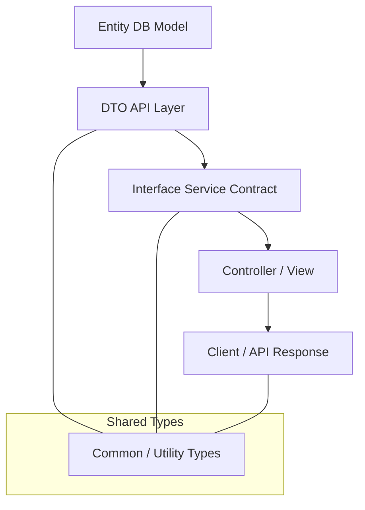

#### 요약
- 프로젝트 규모가 커질수록 **타입의 재사용성과 구조화**는 필수적이다.  
- 대규모 TypeScript 코드베이스에서는 **도메인 단위 분리**, **공용 타입 계층화**,  
  **API / DTO / Entity의 명확한 구분**이 유지보수성과 협업 효율을 결정한다.  
- 본 문서는 실무 기준으로 **Monorepo / Multi-package / Layered Architecture** 환경에서의  
  타입 설계 전략을 체계적으로 다룬다.  

**핵심 요약**
1. 도메인 단위로 타입을 모듈화하라 (User, Order, Auth 등).  
2. 전역 타입(`global.d.ts`) 사용은 최소화하고, 명시적 import를 유지하라.  
3. `types/`, `interfaces/`, `dto/` 폴더를 목적별로 구분하라.  
4. Monorepo에서는 **Base TSConfig + References** 구조를 활용하라.  
5. Entity ↔ DTO ↔ Response 간 변환을 **매핑 타입(Mapped Type)** 으로 관리하라.  

| 항목                              | 요약                             |
| ------------------------------- | ------------------------------ |
| **도메인 분리**                      | User, Order, Auth 등 단위별 타입 구조화 |
| **공용 타입 계층화**                   | `types/common/` 중심 통합 관리       |
| **Entity ↔ DTO ↔ Interface 분리** | 데이터 변환 경계 명확화                  |
| **Monorepo 호환 구조**              | Base TSConfig + Reference 기반   |
| **type-only import**            | 순환 의존성 방지                      |

> 타입 아키텍처는 단순한 선언이 아니라,
> **시스템의 계약(Contract)** 을 명확히 규정하는 설계 행위다.
> 잘 설계된 타입 구조는 대규모 팀 협업에서
> “문서보다 강력한 진실의 원천(Single Source of Truth)”이 된다.


##### 참고자료
- [TypeScript Docs – Project References](https://www.typescriptlang.org/docs/handbook/project-references.html)
- [Nx / Turborepo Type Sharing Guide](https://nx.dev/packages/js)
- [Domain-Driven Design & TypeScript Patterns](https://khalilstemmler.com/)

##### 타입 아키텍처 다이어그램



> 🎯 데이터 흐름의 각 단계에서 타입의 역할이 명확해야
> 구조적 일관성과 유지보수성이 확보된다.


---

#### 1. 타입 아키텍처의 목표

> “모든 타입은 재사용 가능하고, 명확히 경계를 가져야 한다.”

| 목표 | 설명 |
|------|------|
| **모듈화(Modularity)** | 도메인 단위로 타입을 분리 |
| **일관성(Consistency)** | 공용 규칙과 네이밍 유지 |
| **가시성(Visibility)** | import 기반 명확한 의존성 |
| **유지보수성(Maintainability)** | 타입 변경의 영향 최소화 |

> 💡 규모가 커질수록 “모든 타입이 global로 섞여 있는 구조”는 최악의 상황이다.  

---

#### 2. 폴더 구조 예시

```

src/
├── types/                    # 전역 또는 공용 타입
│    ├── index.d.ts
│    ├── global.d.ts
│    └── common/
│         ├── api-response.ts
│         ├── pagination.ts
│         └── error.ts
├── domains/
│    ├── user/
│    │    ├── user.entity.ts
│    │    ├── user.dto.ts
│    │    ├── user.interface.ts
│    │    └── index.ts
│    ├── order/
│    │    ├── order.entity.ts
│    │    ├── order.dto.ts
│    │    └── order.interface.ts
│    └── ...
├── shared/
│    ├── constants/
│    ├── utils/
│    └── hooks/
└── main.ts

```

| 디렉토리 | 역할 |
|-----------|------|
| `types/` | 공통 유틸 타입 및 글로벌 정의 |
| `domains/` | 도메인별 Entity, DTO, Interface 분리 |
| `shared/` | 모듈 간 공유 리소스 (상수, 헬퍼 등) |
| `global.d.ts` | 전역 확장 (Express, Window 등) |

> ⚙️ 도메인 단위 분리 구조는 **DDD(Domain-Driven Design)** 패턴과도 호환된다.

---

#### 3. 타입 계층 설계 원칙

| 계층 | 설명 | 예시 |
|------|------|------|
| **Entity** | DB / ORM 모델의 타입 | `UserEntity`, `OrderEntity` |
| **DTO** | API 요청/응답 데이터 | `UserDTO`, `OrderResponse` |
| **Interface** | 서비스/리포지토리 내부 계약 | `UserService`, `UserRepository` |
| **Utility Types** | 공용 기능 | `Paginated<T>`, `ApiResponse<T>` |

> 💡 `Entity ↔ DTO ↔ Response` 변환 시 **매핑 타입(Partial, Omit, Pick)** 을 적극 활용한다.

---

#### 4. 예시 — Entity, DTO, Interface 구분

```ts
// user.entity.ts
export interface UserEntity {
  id: number;
  name: string;
  email: string;
  passwordHash: string;
  createdAt: string;
}
```

```ts
// user.dto.ts
import { UserEntity } from "./user.entity";

export type UserDTO = Omit<UserEntity, "passwordHash">;
```

```ts
// user.interface.ts
import { UserDTO } from "./user.dto";

export interface IUserService {
  create(user: UserDTO): Promise<UserDTO>;
  findByEmail(email: string): Promise<UserDTO | null>;
}
```

> ⚙️ **Entity → DTO → Service Interface** 흐름은
> 유지보수 시 영향 범위를 최소화한다.

---

#### 5. 타입 의존성 관리 전략

| 패턴                   | 설명                            | 예시                              |
| -------------------- | ----------------------------- | ------------------------------- |
| **단방향 의존성**          | DTO → Entity는 가능, 반대는 금지      | `UserDTO` ← `UserEntity`        |
| **중앙화된 유틸 타입**       | 공용 타입은 `types/common/`에서 관리   | `Paginated<T>`, `ErrorResponse` |
| **모듈 외부 import 최소화** | 도메인 내에서만 타입 참조                | `user` 내부에서만 `user.entity` 참조   |
| **경로 별칭 사용**         | `@domains/user` 형태로 통합 import | tsconfig `paths` 설정             |

> 🎯 “타입도 의존성 규칙을 따라야 한다” — 즉, 비즈니스 계층의 경계 원칙을 깨지 말 것.

---

#### 6. 글로벌 타입 최소화 원칙

> 전역 타입(`global.d.ts`)은 “예외적인 상황”에서만 사용해야 한다.

```ts
// types/global.d.ts
declare namespace NodeJS {
  interface ProcessEnv {
    NODE_ENV: "development" | "production";
    DATABASE_URL: string;
  }
}
```

| 규칙          | 설명                        |
| ----------- | ------------------------- |
| 최소 전역 확장    | 런타임 환경변수, 전역 Window 등만 허용 |
| 모듈 전용 타입 우선 | import 가능한 구조로 설계         |
| 중복 방지       | 동일 이름 전역 타입 금지            |

> ⚠️ “import 없이 접근 가능한 타입”은 관리 비용을 기하급수적으로 증가시킨다.

---

#### 7. Monorepo 타입 공유 전략

> 여러 패키지가 있는 환경에서는 `composite` 옵션과 `paths` 별칭을 결합한다.

```
/packages
 ├── core/                # 공통 유틸/타입
 │    ├── src/
 │    │    └── types/
 │    └── tsconfig.json
 ├── api/                 # Backend (NestJS)
 ├── web/                 # Frontend (React)
 └── tsconfig.base.json
```

```jsonc
// tsconfig.base.json
{
  "compilerOptions": {
    "baseUrl": ".",
    "paths": {
      "@core/*": ["packages/core/src/*"]
    },
    "composite": true,
    "skipLibCheck": true
  }
}
```

| 특징                  | 설명          |
| ------------------- | ----------- |
| `composite`         | 빌드 캐시 공유    |
| `paths`             | 패키지 간 타입 참조 |
| `projectReferences` | 의존 관계 명시    |

> ⚙️ `@core` 패키지에 공통 타입을 배치하고,
> 각 서비스(`web`, `api`)에서 가져다 쓰는 구조가 이상적이다.

---

#### 8. 타입 이름 규칙 (Naming Convention)

| 범주        | 규칙                  | 예시                            |
| --------- | ------------------- | ----------------------------- |
| Entity    | PascalCase + Entity | `UserEntity`, `OrderEntity`   |
| DTO       | PascalCase + DTO    | `UserDTO`, `LoginRequestDTO`  |
| Interface | I + PascalCase      | `IUserService`, `IRepository` |
| Utility   | PascalCase          | `Paginated<T>`, `Result<T>`   |
| Enum      | PascalCase, 단수형     | `enum Role { Admin, User }`   |

> 💡 일관된 네이밍은 검색성과 자동완성 품질을 극대화한다.

---

#### 9. 공용 타입 유틸 예시

```ts
// types/common/api-response.ts
export type ApiResponse<T> = {
  success: boolean;
  data?: T;
  error?: string;
};
```

```ts
// types/common/pagination.ts
export type Paginated<T> = {
  items: T[];
  total: number;
  page: number;
  size: number;
};
```

```ts
// types/common/error.ts
export interface ErrorResponse {
  code: string;
  message: string;
  timestamp: string;
}
```

> ⚙️ 모든 API Response 구조를 표준화하면
> 프론트엔드와 백엔드의 타입 일관성을 유지할 수 있다.

---

#### 10. 실무 예시 — 서비스 계층 타입 조합

```ts
// user.service.ts
import type { UserDTO } from "@domains/user/user.dto";
import type { ApiResponse } from "@types/common/api-response";

export interface IUserService {
  register(user: UserDTO): Promise<ApiResponse<UserDTO>>;
  getProfile(id: number): Promise<ApiResponse<UserDTO>>;
}
```

> 💡 각 계층은 **입출력 타입을 명확히 명시**함으로써
> 런타임에서의 계약 오류를 원천 차단한다.

---

#### 11. 타입 변경 시 영향 최소화 전략

| 문제                  | 원인                 | 해결책                       |
| ------------------- | ------------------ | ------------------------- |
| 하위 서비스 오류           | DTO 변경 시 종속 모듈 영향  | 중앙 DTO export 관리          |
| 중복 선언               | 비슷한 구조 반복          | 제네릭 유틸 사용                 |
| Circular Dependency | 상호 import          | `type-only import` 사용     |
| 버전 관리 문제            | Monorepo 내 패키지 불일치 | Project Reference + CI 검사 |

> ⚙️ `type-only import/export` (`import type`)를 적극 활용하면
> 순환 의존성(Circular Import)을 방지할 수 있다.

---


