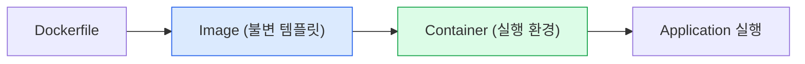
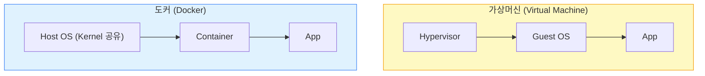

#### 요약  
Docker는 애플리케이션을 **컨테이너(Container)** 라는 독립된 환경에서 실행할 수 있도록 하는 오픈소스 플랫폼이다.  
컨테이너는 운영체제 위에서 프로세스로 동작하지만, 마치 별도의 시스템처럼 격리된 공간에서 실행된다.  
이를 통해 개발자는 “어디서나 동일하게 동작하는 실행 환경”을 만들 수 있다.  
Docker는 가상머신보다 훨씬 가볍고 빠르며, 현대의 DevOps 및 CI/CD 환경에서 핵심적인 표준 도구로 사용된다.  

**핵심 정리**
- Docker는 **애플리케이션 실행 환경을 코드로 정의**하는 기술이다.  
- VM보다 **더 빠르고 경량화된 실행 환경**을 제공한다.  
- 컨테이너는 이미지에서 실행되며, **일관된 환경 재현성**을 보장한다.  
- **이미지 → 컨테이너 실행 → 재배포**의 순환 구조로 동작한다.  
- DevOps, MLOps, 클라우드 네이티브 환경에서 **표준 인프라 도구**로 사용된다.  

##### 참고자료
- [Docker 공식 문서 – What is Docker?](https://docs.docker.com/get-started/overview/)
- [Wikipedia – Docker (software)](https://en.wikipedia.org/wiki/Docker_(software))
- [Red Hat Developer – Introduction to Containers](https://developers.redhat.com/articles/introduction-containers)
- [IBM Cloud Docs – Containers vs VMs](https://www.ibm.com/cloud/blog/containers-vs-vms)

---

#### 1. 개요
Docker는 애플리케이션을 빌드·배포·실행하기 위한 경량 가상화 플랫폼이다.  
컨테이너 기반으로 작동하며, 각 컨테이너는 코드, 라이브러리, 설정 파일을 포함한 완전한 실행 단위를 제공한다.  
즉, “개발 환경과 운영 환경의 차이로 인한 문제”를 제거해준다.

---

#### 2. 핵심 구성 요소

| 구성 요소 | 설명 |
|:--|:--|
| **이미지(Image)** | 컨테이너 실행에 필요한 모든 요소(코드, 라이브러리, 설정 등)를 포함한 불변 스냅샷 |
| **컨테이너(Container)** | 이미지를 실제로 실행한 인스턴스. 독립적인 프로세스로 동작하며 필요 시 즉시 생성·삭제 가능 |
| **Dockerfile** | 이미지를 자동으로 생성하기 위한 스크립트 파일 |
| **레지스트리(Registry)** | 이미지를 저장·공유하는 중앙 저장소 (예: Docker Hub, Harbor) |
| **Docker 엔진(Engine)** | 컨테이너를 실행·관리하는 핵심 데몬(`dockerd`) |



---

#### 3. 주요 특징

1. **일관된 환경 제공**
   개발자, 테스터, 운영자가 동일한 이미지로 작업하므로 환경 불일치 문제가 없다.

2. **가볍고 빠름**
   컨테이너는 호스트 OS의 커널을 공유하므로 VM보다 훨씬 빠르게 실행된다.

3. **이식성 및 자동화**
   Dockerfile을 통해 환경 구성이 코드로 정의되어, 어떤 플랫폼에서도 재현 가능하다.

4. **모듈화와 확장성**
   하나의 서비스를 여러 컨테이너로 분리해 마이크로서비스(MSA) 구조를 구성할 수 있다.

---

#### 4. Docker vs Virtual Machine

| 구분     | Docker          | Virtual Machine             |
| :----- | :-------------- | :-------------------------- |
| 실행 구조  | 호스트 OS 커널 공유    | 하이퍼바이저 위에 독립 OS 실행          |
| 부팅 속도  | 수 초 내           | 수 분                         |
| 자원 효율  | 프로세스 단위 격리, 가벼움 | OS 단위, 무거움                  |
| 이미지 크기 | 수백 MB           | 수 GB                        |
| 대표 기술  | Docker, Podman  | VMware, VirtualBox, Hyper-V |



> VM은 완전한 OS를 포함해 무겁지만, Docker는 커널을 공유하므로 훨씬 가볍고 효율적이다.

---

#### 5. 간단한 실습 예시

```bash
# 최신 Ubuntu 이미지 다운로드
docker pull ubuntu:24.04

# 컨테이너 실행 및 쉘 접속
docker run -it ubuntu:24.04 /bin/bash

# 컨테이너 종료 및 삭제
exit
docker ps -a
docker rm <container_id>
```

