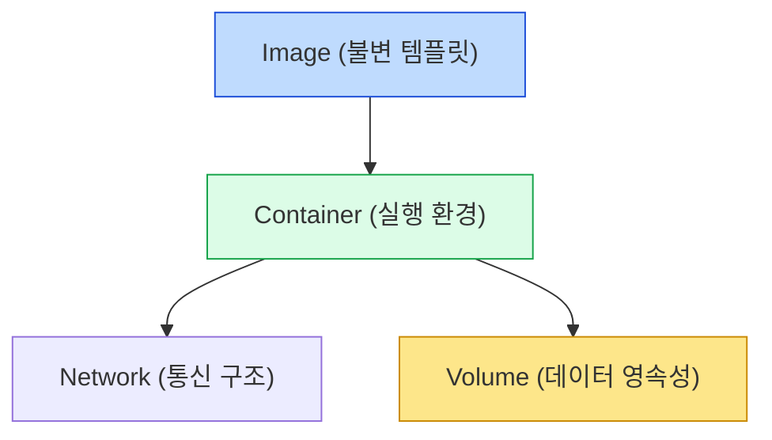

#### 요약  
Docker는 **이미지(Image)** 와 **컨테이너(Container)** 라는 두 가지 핵심 개념을 중심으로 동작한다.  
이미지는 실행 가능한 환경의 설계도이며, 컨테이너는 그 이미지를 실제로 구동한 인스턴스이다.  
이 둘을 통해 애플리케이션을 **일관된 방식으로 빌드, 실행, 배포**할 수 있다.  
또한 Docker는 **레이어(Layer) 기반 구조**로 효율적인 저장과 빌드 캐시를 지원하며,  
**네트워크(Network)** 와 **볼륨(Volume)** 을 통해 컨테이너 간 통신과 데이터 영속성을 보장한다.  

**핵심 정리**
Docker의 모든 구성요소는 **모듈형 구조로 유기적으로 연결**되어 있다.
- **이미지(Image)**: 실행 환경의 불변 템플릿, 컨테이너 실행의 기반이 되는 불변 스냅샷이다.  
- **컨테이너(Container)**: 이미지를 실행한 독립된 프로세스, 실제로 동작하는 애플리케이션 인스턴스이다.
- **레이어(Layer)**: 변경 사항을 누적하여 효율적으로 관리, 구조 통해 효율적인 캐시 관리가 가능하다.  
- **네트워크(Network)**: 컨테이너 간 통신 및 외부 접근 제어, 컨테이너 간 연결성과 데이터 영속성을 보장한다  
- **볼륨(Volume)**: 데이터 영속화 및 컨테이너 간 공유 지원  

##### 참고자료
- [Docker Docs – Understand the basics](https://docs.docker.com/get-started/overview/)
- [Docker Docs – Storage Overview](https://docs.docker.com/storage/)
- [Docker Docs – Networking Overview](https://docs.docker.com/network/)
- [Docker Reference – Images and Layers](https://docs.docker.com/build/guide/layers/)

---

#### 1. 이미지 (Image)

이미지는 애플리케이션을 실행하기 위한 **모든 요소(코드, 라이브러리, 설정 등)** 를 포함하는 불변(Immutable) 템플릿이다.  
컨테이너 실행 시 항상 이미지를 기반으로 인스턴스가 만들어진다.

| 명령어 | 설명 |
|:--|:--|
| `docker images` | 로컬에 저장된 이미지 목록 확인 |
| `docker pull nginx:latest` | 원격 레지스트리에서 이미지 다운로드 |
| `docker rmi <이미지명>` | 이미지 삭제 |

> 이미지는 보통 **Dockerfile** 을 기반으로 `docker build` 명령을 통해 생성된다.

```bash
docker build -t myapp:1.0 .
docker run -d myapp:1.0
```

---

#### 2. 컨테이너 (Container)

컨테이너는 이미지를 실제로 **실행한 프로세스**이다.
운영체제 커널을 공유하지만, 파일 시스템·네트워크·프로세스 공간은 격리되어 독립적으로 동작한다.

| 명령어                              | 설명                  |
| :------------------------------- | :------------------ |
| `docker ps -a`                   | 실행 중인 및 종료된 컨테이너 목록 |
| `docker run -d -p 8080:80 nginx` | Nginx 웹 서버 실행       |
| `docker stop <id>`               | 컨테이너 정지             |
| `docker rm <id>`                 | 컨테이너 삭제             |


> 컨테이너는 가볍고 빠르게 생성·삭제되므로, “불변 인프라(Immutable Infrastructure)” 구현에 적합하다.

---

#### 3. 레이어 (Layer)

Docker는 **Union File System** 기반의 레이어 구조를 사용한다.
각 Dockerfile 지시어(FROM, RUN, COPY 등)는 하나의 레이어를 생성하고,
이 레이어들이 쌓여 최종 이미지를 구성한다.

| 레이어 구조 예시                    | 설명                         |
| :--------------------------- | :------------------------- |
| `FROM ubuntu:24.04`          | 베이스 OS 이미지                 |
| `RUN apt install -y python3` | 새로운 패키지 추가 레이어             |
| `COPY . /app`                | 소스 코드 복사 레이어               |
| `CMD ["python3", "main.py"]` | 실행 명령 설정 (변경되지 않는 최상위 레이어) |

> 동일한 레이어는 여러 이미지 간 공유되어 **스토리지 절약 및 빌드 속도 향상**에 도움을 준다.

---

#### 4. 네트워크 (Network)

컨테이너는 기본적으로 Docker 네트워크를 통해 통신한다.
Docker는 `bridge`, `host`, `none`, `overlay` 등 다양한 네트워크 드라이버를 지원한다.

| 네트워크 모드     | 설명                                 |
| :---------- | :--------------------------------- |
| **bridge**  | 기본 네트워크. 동일 호스트 내 컨테이너 간 통신 허용     |
| **host**    | 호스트 네트워크 직접 사용 (고성능, 격리 없음)        |
| **none**    | 네트워크 미할당 (완전 격리)                   |
| **overlay** | 다중 호스트 간 컨테이너 네트워크 연결 (Swarm/K8s용) |

```bash
docker network ls
docker network inspect bridge
```

> `docker run --network <network_name>` 으로 특정 네트워크를 지정할 수 있다.

---

#### 5. 볼륨 (Volume)

컨테이너는 기본적으로 **휘발성 파일시스템**을 사용한다.
따라서 데이터를 영속적으로 저장하려면 **볼륨(Volume)** 을 사용해야 한다.

| 명령어                                         | 설명          |
| :------------------------------------------ | :---------- |
| `docker volume create data_volume`          | 새로운 볼륨 생성   |
| `docker run -v data_volume:/app/data nginx` | 볼륨 마운트 후 실행 |
| `docker volume ls`                          | 볼륨 목록 조회    |
| `docker volume inspect data_volume`         | 볼륨 상세 정보 확인 |

> 볼륨은 호스트 경로나 외부 스토리지(NFS, GlusterFS, EBS 등)와 연결될 수 있다.

---

#### 6. 이미지, 컨테이너, 볼륨 관계 요약



> 이미지는 실행을 위한 설계도, 컨테이너는 실제 프로세스,
> 볼륨은 데이터를 보존하기 위한 저장소 역할을 수행한다.

---


