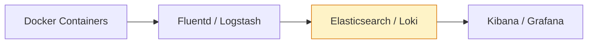

#### 요약  
Docker는 각 컨테이너의 표준 출력(stdout/stderr)을 로그로 수집한다.  
이 로그는 `docker logs` 명령 또는 중앙 로그 시스템(ELK, Loki 등)을 통해 확인할 수 있다.  
운영 환경에서는 수많은 컨테이너의 로그를 **수집·집중화·시각화** 하는 구조가 필요하다.  

* 컨테이너 로그는 기본적으로 표준출력을 기반으로 한다.
* 로그 드라이버를 통해 중앙 시스템으로 전송 가능하다.
* ELK, Loki, Fluentd 스택을 통해 통합 모니터링을 구성한다.

**핵심 정리**
- 컨테이너 로그는 `stdout` / `stderr` 를 통해 수집된다.  
- `docker logs` 로 직접 조회 가능하지만, 운영 환경에서는 중앙집중식 수집이 필요하다.  
- 대표 스택: **ELK (Elasticsearch + Logstash + Kibana)**, **Grafana Loki**.  

##### 참고자료
- [Docker Docs – Logging overview](https://docs.docker.com/config/containers/logging/)
- [Grafana Loki Documentation](https://grafana.com/docs/loki/latest/)
- [Elastic Stack Guide](https://www.elastic.co/guide/en/elastic-stack/)

---

#### 1. 기본 로그 확인
```bash
docker logs -f <container_id>
docker logs --since 1h nginx
```

> `--since`, `--tail`, `--follow` 옵션을 조합해 실시간 로그를 모니터링할 수 있다.

---

#### 2. 로그 드라이버

Docker는 다양한 로그 드라이버를 제공한다.

| 로그 드라이버     | 설명                                               |
| :---------- | :----------------------------------------------- |
| `json-file` | 기본 드라이버. `/var/lib/docker/containers/<id>/*.log` |
| `syslog`    | 호스트 syslog로 전송                                   |
| `journald`  | systemd 기반 로그 통합                                 |
| `gelf`      | Graylog/Logstash용 포맷                             |
| `fluentd`   | Fluentd 서버로 전송                                   |
| `loki`      | Grafana Loki로 직접 수집                              |

```bash
docker run -d --log-driver=fluentd nginx
```

---

#### 3. Compose 기반 로그 전송

```yaml
services:
  web:
    image: nginx
    logging:
      driver: "json-file"
      options:
        max-size: "10m"
        max-file: "3"
```

> 로그 파일 회전(rotation)을 설정하여 저장 공간을 효율적으로 사용한다.

---

#### 4. 중앙 로그 수집 구조



---
