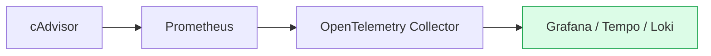

#### 요약  
컨테이너 환경의 성능을 가시화하려면 CPU, 메모리, I/O 등의 **메트릭(metrics)** 과  
트레이싱 데이터를 함께 수집해야 한다.  
Docker는 Prometheus, cAdvisor, OpenTelemetry(OTel)와 연동하여  
메트릭 기반 모니터링을 구성할 수 있다.  

* cAdvisor → Prometheus → Grafana 구조는 Docker 모니터링의 표준이다.
* OTel Collector를 추가하면 애플리케이션 트레이스까지 통합 가능하다.
* 컨테이너 단위 메트릭과 트레이싱을 결합해 완전한 관측성을 확보한다.


**핵심 정리**
- Prometheus는 Docker 메트릭 수집의 표준 도구이다.  
- cAdvisor는 컨테이너별 CPU, Memory, Disk I/O 사용량을 노출한다.  
- OpenTelemetry는 애플리케이션 트레이싱과 메트릭을 통합 수집한다.  

##### 참고자료
- [Docker Metrics overview](https://docs.docker.com/config/containers/runmetrics/)
- [cAdvisor GitHub](https://github.com/google/cadvisor)
- [OpenTelemetry Collector](https://opentelemetry.io/docs/collector/)
- [Prometheus Metrics](https://prometheus.io/docs/introduction/overview/)

---

#### 1. cAdvisor 실행 예시
```bash
docker run -d \
  --name=cadvisor \
  -p 8080:8080 \
  --volume=/:/rootfs:ro \
  --volume=/var/run/docker.sock:/var/run/docker.sock:ro \
  gcr.io/cadvisor/cadvisor:latest
```

> cAdvisor는 `/metrics` 엔드포인트를 통해 Prometheus 호환 메트릭을 제공한다.

---

#### 2. Prometheus 구성 예시

```yaml
scrape_configs:
  - job_name: 'docker'
    static_configs:
      - targets: ['cadvisor:8080']
```

> `cadvisor` 컨테이너에서 노출된 메트릭을 수집한다.

---

#### 3. OpenTelemetry 연동

OTel Collector를 통해 Docker, Prometheus, 애플리케이션 트레이스를 통합할 수 있다.

```yaml
receivers:
  prometheus:
    config:
      scrape_configs:
        - job_name: 'docker'
          static_configs:
            - targets: ['cadvisor:8080']
exporters:
  otlp:
    endpoint: "http://otel-collector:4317"
service:
  pipelines:
    metrics:
      receivers: [prometheus]
      exporters: [otlp]
```

> Prometheus 메트릭을 OTLP(OpenTelemetry Protocol) 포맷으로 변환해 전송한다.

---

#### 4. Grafana 대시보드 예시



> Grafana에서 대시보드로 시각화할 수 있다.

---
