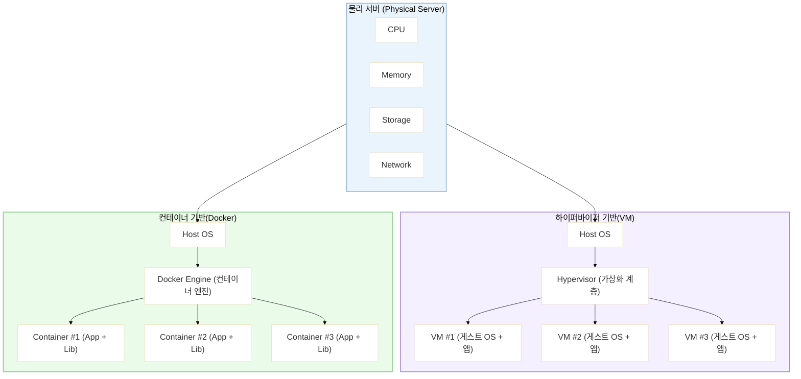

## 정리 요약

* **핵심 개념**: 물리 리소스를 추상화하여 논리적으로 관리하는 기술
* **목표**: 효율성, 유연성, 안정성 향상
* **핵심 기술군**: 하이퍼바이저 기반 (VMware, KVM) + 컨테이너 기반 (Docker)
* **활용 분야**: 서버 통합, 클라우드 인프라, DevOps, 테스트 환경 구축 등
---

---
# 가상화(Virtualization)

가상화는 **물리적인 컴퓨터 자원(CPU, 메모리, 디스크, 네트워크 등)을 논리적으로 분리하거나 통합하여 사용하는 기술**입니다.
즉, 실제 하드웨어를 직접 다루지 않고도 여러 **가상 리소스(가상 서버, 가상 네트워크, 가상 스토리지)**를 효율적으로 운용할 수 있게 합니다.

---

## 1. 개요

* **정의**: 물리적 리소스를 추상화하여 논리적 단위로 분리·통합하는 기술
* **세대 구분**: 컴퓨팅 발전 단계 중 **2세대(가상화 시대)**에 해당

---

## 2. 주요 가상화 유형

| 구분                                    | 설명                               | 대표 기술                                  |
| ------------------------------------- | -------------------------------- | -------------------------------------- |
| **서버 가상화 (Server Virtualization)**    | 하나의 물리 서버를 여러 가상 서버로 분할해 사용하는 기술 | VMware, Hyper-V, KVM                   |
| **스토리지 가상화 (Storage Virtualization)** | 여러 물리 디스크를 하나의 논리 스토리지로 통합       | LVM, Ceph, SAN/NAS                     |
| **네트워크 가상화 (Network Virtualization)** | 물리 네트워크를 논리적으로 분리·제어             | SDN(Software-Defined Networking), VLAN |

---

## 3. 가상화의 장점

| 항목             | 설명                                      |
| -------------- | --------------------------------------- |
| **리소스 활용도 향상** | 물리 자원을 효율적으로 분배하여 낭비 최소화                |
| **비용 절감 효과**   | 적은 물리 서버로 여러 가상 서버 운영 → 하드웨어 및 전력 비용 절감 |
| **유연성·확장성 증가** | 가상 서버 추가·삭제 및 리소스 재할당이 용이               |
| **관리 효율성 향상**  | 중앙 집중식 관리, 자동화 및 오케스트레이션 가능             |
| **재해 복구 용이**   | 장애 발생 시 다른 가상 인스턴스로 즉시 전환 가능            |

---

## 4. 주요 가상화 솔루션

| 솔루션명                                   | 유형                 | 특징                         |
| -------------------------------------- | ------------------ | -------------------------- |
| **VMware vSphere / ESXi**              | 하이퍼바이저 기반          | 기업용 시장 선두, 안정성·성능 우수       |
| **Microsoft Hyper-V**                  | 하이퍼바이저 기반          | Windows 환경과 높은 호환성         |
| **KVM (Kernel-based Virtual Machine)** | 하이퍼바이저 기반 (리눅스 내장) | 오픈소스, 성능 및 커스터마이징 용이       |
| **Docker**                             | 컨테이너 기반            | OS 레벨 격리, 빠른 배포 및 경량 실행 환경 |

---

