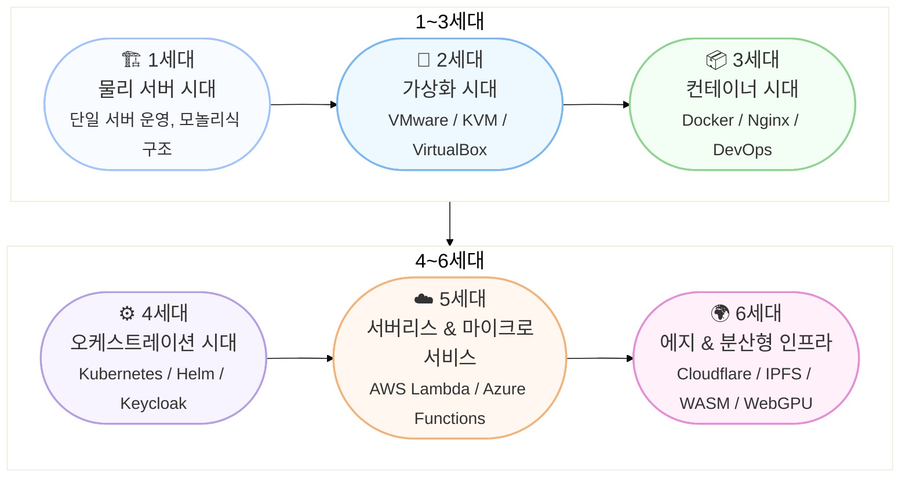

### 다이어그램 설명

| 세대      | 핵심 개념       | 대표 기술                       |
| ------- | ----------- | --------------------------- |
| **1세대** | 물리 서버 단일 운영 | Apache, PHP                 |
| **2세대** | 가상화 (VM)    | VMware, KVM                 |
| **3세대** | 컨테이너 기반 경량화 | Docker, Nginx               |
| **4세대** | 오케스트레이션 자동화 | Kubernetes, Helm            |
| **5세대** | 서버리스 구조     | AWS Lambda, Azure Functions |
| **6세대** | 에지·분산형 인프라  | IPFS, WebGPU, WASM          |

---

#  웹 인프라의 진화

## 1세대: 물리 서버 시대 (Traditional Infrastructure)

### 개요

모든 서비스(웹, DB, 애플리케이션)를 **하나의 물리 서버**에서 운영하던 시기.
확장성, 유지보수성에 한계가 있었음.

### 특징

* 단일 서버에서 모든 구성 요소 동작
* 수작업 배포 및 모놀리식 구조

| 항목     | 내용                     |
| ------ | ---------------------- |
| **장점** | 단순 구조, 관리 용이           |
| **단점** | 확장성 부족, 장애 시 전체 서비스 영향 |

---

## 2세대: 가상화 시대 (Virtualization)

### 개요

**VMware, KVM** 등 가상화 기술을 통해 하나의 물리 서버 위에 여러 개의 가상 머신(VM)을 운영 가능.

### 특징

* 하이퍼바이저를 통한 가상화 계층 도입
* 물리 리소스 활용도 극대화
* 서버 격리 및 자원 관리 개선

| 항목        | 내용                      |
| --------- | ----------------------- |
| **장점**    | 자원 활용도 향상, 격리된 환경 구성 가능 |
| **대표 기술** | VMware, VirtualBox, KVM |

---

## 3세대: 컨테이너 시대 (Containerization)

### 개요

**Docker**의 등장으로 OS 레벨 가상화가 가능해지며, VM보다 **경량화된 격리 환경** 제공.
개발·배포가 빠르고 효율적인 DevOps 기반 인프라 확산.

### 특징

* 이미지 기반 배포, 빠른 롤백 가능
* 애플리케이션 간 환경 일관성 확보
* CI/CD와 DevOps 환경 확립

| 항목        | 내용                    |
| --------- | --------------------- |
| **장점**    | 빠른 배포, 이식성, 경량화       |
| **대표 기술** | Docker, Nginx, Podman |

---

## 4세대: 컨테이너 오케스트레이션 시대 (Orchestration)

### 개요

**Kubernetes(K8s)**의 등장으로 대규모 컨테이너의 **배포·확장·복구 자동화** 가능.
클라우드 네이티브 환경의 핵심 기반이 됨.

### 특징

* 오토스케일링, 헬스체크, 롤링 업데이트 지원
* YAML 기반 선언적 관리
* 서비스 메쉬, 인증/인가 통합 가능

| 항목        | 내용                                |
| --------- | --------------------------------- |
| **장점**    | 자동화, 확장성, 안정성                     |
| **대표 기술** | Kubernetes, Helm, Keycloak, Istio |

---

## 5세대: 서버리스 & 마이크로서비스 시대 (Serverless & Microservices)

### 개요

서버를 직접 관리하지 않고, **이벤트 기반 실행** 구조로 진화.
애플리케이션을 **마이크로 단위 서비스**로 분리하여 독립 배포·운영.

### 특징

* 필요 시점에만 실행 → 비용 효율 극대화
* 서비스별 독립 배포, 장애 격리
* 클라우드 중심 아키텍처

| 항목        | 내용                                   |
| --------- | ------------------------------------ |
| **장점**    | 운영 부담 최소화, 유연한 확장성                   |
| **대표 기술** | AWS Lambda, Azure Functions, Hyproxy |

---

## 6세대: 에지 컴퓨팅 & 분산형 인프라 시대 (Edge & Decentralized)

### 개요

중앙 집중형 클라우드를 벗어나, **사용자 근처(Edge)**에서 데이터 처리 및 실행.
**분산형 웹(DWeb)** 기술과 AI/LLM이 결합되며 새로운 패러다임 형성.

### 특징

* 초저지연 및 사용자 근접 서비스
* 브라우저나 로컬 환경에서도 AI/LLM 실행 가능
* 탈중앙화 및 자율적 인프라 구성

| 항목        | 내용                                                           |
| --------- | ------------------------------------------------------------ |
| **장점**    | 초저지연, 분산성, 보안 강화                                             |
| **대표 기술** | Cloudflare Workers, IPFS, WASM, WebRTC, WebGPU, Fermyon, Bun |

---

## 세대별 요약 비교

| 세대      | 인프라 패러다임 | 핵심 기술               | 주요 장점         |
| ------- | -------- | ------------------- | ------------- |
| **1세대** | 물리 서버    | Apache, PHP         | 단순한 구조        |
| **2세대** | 가상화(VM)  | VMware, KVM         | 자원 활용도 향상     |
| **3세대** | 컨테이너     | Docker, Nginx       | 빠른 배포, 이식성    |
| **4세대** | 오케스트레이션  | Kubernetes, Helm    | 자동화, 확장성      |
| **5세대** | 서버리스     | AWS Lambda, Hyproxy | 관리 최소화, 비용 효율 |
| **6세대** | 에지·분산형   | IPFS, WebGPU, WASM  | 초저지연, 탈중앙화    |

---
