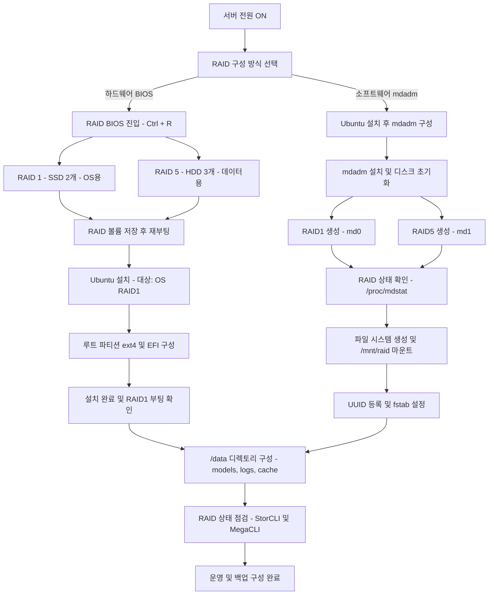

####  예시 


# RAID 구성 가이드 (Ubuntu 24.04 기준)

## 1. RAID 개요

### 1.1 RAID란?

RAID(Redundant Array of Independent Disks)는 여러 개의 디스크를 묶어 **성능 향상**, **데이터 안정성 확보**, 혹은 **두 가지를 동시에** 달성하기 위한 저장 기술이다.
즉, 여러 디스크를 “팀플레이” 시켜 속도를 높이거나, 복제하여 안전성을 강화하는 개념이다.

### 1.2 RAID의 주요 종류

| RAID 종류 | 설명                      | 특징                      |
| ------- | ----------------------- | ----------------------- |
| RAID 0  | 데이터를 나눠 여러 디스크에 저장      | 속도 향상, 복구 불가            |
| RAID 1  | 동일 데이터를 두 디스크에 저장 (미러링) | 안전성 확보, 용량 절반 사용        |
| RAID 5  | 데이터 + 복구용 정보(패리티) 분산 저장 | 성능/안정성 균형, 디스크 1개 고장 허용 |
| RAID 10 | RAID 1 + RAID 0 결합      | 고성능 + 안정성, 4개 이상 필요     |

---

## 2. 본 서버의 RAID 구성 목적

* **운영체제(부팅 디스크)**: SSD 2개로 RAID 1 구성 → 안정적인 부팅과 시스템 복구 용이
* **데이터 저장 디스크**: HDD 3개로 RAID 5 구성 → 대용량 데이터 저장 및 복구 허용

| 용도       | 디스크           | RAID 레벨 | 사용 용량         |
| -------- | ------------- | ------- | ------------- |
| OS / LLM | 480GB SSD × 2 | RAID 1  | 약 480GB (미러링) |
| 데이터      | 12TB HDD × 3  | RAID 5  | 약 20TB 사용 가능  |

※ RAID는 하드웨어 장애에는 강하지만, **백업은 반드시 별도로 구성**해야 한다.

---

## 3. RAID 구성 방법

### 3.1 BIOS를 통한 하드웨어 RAID 구성

1. 서버 부팅 시 RAID BIOS 진입 (`Ctrl + R`, `F12` 등)
2. RAID 1 생성

   * SSD 2개 선택
   * RAID Level: RAID 1
   * 이름: `OS_RAID1`
3. RAID 5 생성

   * HDD 3개 선택
   * RAID Level: RAID 5
   * 이름: `DATA_RAID5`
4. 저장 후 재부팅
   → 이후 운영체제 설치 시 RAID 디스크가 하나의 논리 디스크로 인식됨.

---

### 3.2 소프트웨어 RAID (mdadm) 구성

#### 3.2.1 mdadm 설치

```bash
sudo apt update && sudo apt install mdadm
```

#### 3.2.2 디스크 초기화

```bash
sudo wipefs -a /dev/sdb
sudo wipefs -a /dev/sdc
sudo wipefs -a /dev/sdd
```

#### 3.2.3 RAID 장치 생성

```bash
# RAID 1
sudo mdadm --create /dev/md0 \
  --level=1 \
  --raid-devices=2 /dev/sdb /dev/sdc

# RAID 5
sudo mdadm --create /dev/md1 \
  --level=5 \
  --raid-devices=3 /dev/sdb /dev/sdc /dev/sdd
```

#### 3.2.4 RAID 상태 확인

```bash
cat /proc/mdstat
```

출력 예시:

```
md0 : active raid1 sdb[0] sdc[1]
      976630336 blocks [2/2] [UU]
md1 : active raid5 sdb[0] sdc[1] sdd[2]
      1953260672 blocks level 5 [3/3] [UUU]
```

* `[UU]` : 모든 디스크 정상
* `_` : 장애 디스크

#### 3.2.5 파일시스템 생성 및 마운트

```bash
sudo mkfs.ext4 /dev/md0
sudo mkdir /mnt/raid
sudo mount /dev/md0 /mnt/raid
```

#### 3.2.6 부팅 시 자동 마운트 설정

```bash
blkid /dev/md0
# UUID 확인 후
sudo nano /etc/fstab
# 아래 형식으로 추가
UUID=<확인된-UUID> /mnt/raid ext4 defaults 0 0
```

#### 3.2.7 RAID 설정 저장

```bash
sudo mdadm --detail --scan >> /etc/mdadm/mdadm.conf
```

#### 3.2.8 RAID 해제 및 삭제 (주의)

```bash
sudo umount /mnt/raid
sudo mdadm --stop /dev/md0
sudo mdadm --remove /dev/md0
sudo wipefs -a /dev/sdb /dev/sdc
```

---

## 4. Ubuntu 24.04 설치 시 RAID 구성

1. 설치 미디어 부팅 → 언어 선택 → 설치 시작
2. 스토리지 설정 단계에서 “고급 기능” 선택
3. “이 디스크를 MDADM RAID로 설정” 선택
4. RAID 생성

   * “Create software RAID (md)” 클릭
   * 디스크 선택 후 RAID 레벨(0, 1, 5 등) 지정
   * 마운트 포인트 지정 (예: `/`)
5. EFI 부팅 파티션 생성

   * RAID 외 FAT32 파티션 (512MB~1GB)
   * 마운트 포인트: `/boot/efi`
6. 설치 완료 후 재부팅

### 설치 후 확인

```bash
cat /proc/mdstat
lsblk -o NAME,SIZE,FSTYPE,MOUNTPOINT
```

출력 예시:

```
NAME        SIZE FSTYPE MOUNTPOINT
sda         480G
└─sda1      479G linux_raid_member
  └─md0     479G ext4   /
sdb         480G
└─sdb1      479G linux_raid_member
  └─md0     479G ext4   /
nvme0n1p1   512M vfat   /boot/efi
```

---

## 5. 데이터 디스크 마운트 (/data)

```bash
sudo mkfs.ext4 /dev/sdb
sudo mkdir -p /data
sudo mount /dev/sdb /data
echo '/dev/sdb /data ext4 defaults 0 0' | sudo tee -a /etc/fstab
sudo mkdir -p /data/models /data/cache /data/logs
sudo chown -R ubuntu:ubuntu /data
```

---

## 6. RAID 관리 명령어

### MegaCLI

```bash
sudo apt install -y megacli
sudo megacli -LDInfo -Lall -aALL
```

### StorCLI (추천)

```bash
sudo apt install -y storcli
sudo storcli /c0/vall show
```

---

## 7. 참고 링크

* [Ubuntu 공식 RAID 설명서](https://help.ubuntu.com/community/Installation/SoftwareRAID)
* [StorCLI 명령어 정리](https://www.thomas-krenn.com/en/wiki/StorCLI)
* [RAID 용량 계산기](https://www.raid-calculator.com/)

---
